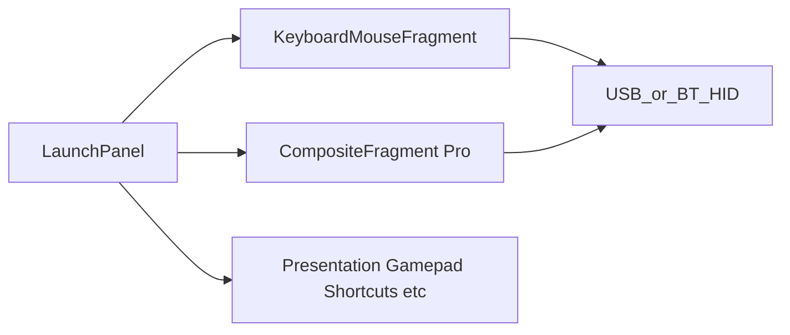

# “Keyboard and Mouse” (new) vs “Keyboard and Mouse Pro” (renamed current)

## Product naming and top-level modes

| Mode (user-visible) | Role |
|---------------------|------|
| **Keyboard and Mouse** | **New** default-friendly mode: **Keyboard**, **NumPad**, **Touchpad**, **Compose** (type / send) sub-modes — full specs in this document. **Independent top-level** entry in launch panel, nav drawer, and `lastMode` prefs (e.g. `MODE_KEYBOARD_MOUSE` in [`LaunchPanelActivity`](Openterface_KeyMod_Android/app/src/main/java/com/openterface/keymod/LaunchPanelActivity.java)). |
| **Keyboard and Mouse Pro** | **Renamed** today’s composite: [`CompositeFragment`](Openterface_KeyMod_Android/app/src/main/java/com/openterface/fragment/CompositeFragment.java), shortcut strips, split landscape, deep IME + strip integration, edge pill cycling, etc. **Own** launch constant (e.g. `MODE_KEYBOARD_MOUSE_PRO`) and strings (`top_mode_label_keyboard_mouse_pro`, …). |

**Peer modes (unchanged list intent):** **Presentation**, **Gamepad**, **Shortcut Hub**, **Macros**, **Voice**, etc. remain **sibling** top-level modes — **Keyboard and Mouse** is **not** nested under Pro.

**Prefs migration (confirmed):** Legacy `lastMode` / intents that meant the **old single “Keyboard and Mouse”** → map to **`MODE_KEYBOARD_MOUSE`** (new standard mode) **silently** after upgrade — users who need the old composite discover **Keyboard and Mouse Pro** in the launch panel / drawer. **New installs:** default **`MODE_KEYBOARD_MOUSE`**. If a user had explicitly chosen to remember **Pro** once that exists, honor **`MODE_KEYBOARD_MOUSE_PRO`**.

**Compose launch card (confirmed):** **Remove** the standalone **[`MODE_COMPOSE`](Openterface_KeyMod_Android/app/src/main/java/com/openterface/keymod/LaunchPanelActivity.java)** top-level entry; **all** compose-type entry is **`MODE_KEYBOARD_MOUSE`** with **`KbMouseSubMode.COMPOSE`**. Deep links / old intents that referenced compose → resolve to **`MODE_KEYBOARD_MOUSE`** + compose sub-mode (or equivalent intent extras).

## UI/UX decoupling (standard vs Pro)

- **Keyboard and Mouse** sub-surfaces (**keyboard**, **numpad**, **touchpad**, **compose**) are **not** implemented as alternate branches inside **`CompositeFragment`** with a hidden “tier” flag. They use a **dedicated host** (working name **`KeyboardMouseFragment`**) and **separate layout roots** (e.g. `fragment_keyboard_mouse.xml`, `fragment_keyboard_mouse_touchpad.xml`, `fragment_keyboard_mouse_compose.xml`) so **navigation, chrome, and state** never bleed into Pro’s strip / split / pill model.
- **Keyboard and Mouse Pro** **continues** to own **`CompositeFragment`** and its UX unchanged in **structure** (only **labels** and **routing** reflect “Pro”).
- **Shared layer (allowed):** USB/BT HID send pipeline, [`ConnectionManager`](Openterface_KeyMod_Android/app/src/main/java/com/openterface/keymod/ConnectionManager.java), [`ThemeManager`](Openterface_KeyMod_Android/app/src/main/java/com/openterface/keymod/ThemeManager.java), [`ImeTextForwarder`](Openterface_KeyMod_Android/app/src/main/java/com/openterface/keymod/util/ImeTextForwarder.java), optional reuse of **drawing helpers** from [`CustomKeyboardView`](Openterface_KeyMod_Android/app/src/main/java/com/openterface/keymod/CustomKeyboardView.java) — **not** embedding the full Pro keyboard surface as the standard mode body.
- **Row 1 “Submode: Compose”** user copy may also read **Type & send** to avoid confusion with Android “IME” alone.

**Internal enum (code):** `KbMouseSubMode { KEYBOARD, NUMPAD, TOUCHPAD, COMPOSE }` (alias `IME` in comments if desired).

## Is the direction legitimate?

Yes. Today’s **Keyboard and Mouse** implementation is **power-user dense**; renaming it **Keyboard and Mouse Pro** and introducing a **separate top-level Keyboard and Mouse** mode (this spec) matches user expectations and **clean architecture** (two launch targets, two fragment hosts). Both can share HID/connection/theme **services** without sharing **composite UI**.

## Keyboard and Mouse — sub-mode: Keyboard (authoritative layout)

**Constraints (your spec):**

- **Landscape only**, **one** layout option: **full-screen keyboard** (no split keyboard + center touchpad, no portrait variant for this sub-mode).
- **No Pro “top menu”**: omit the swipeable favorites row and multi-page fixed shortcut strip. **Row 1** is a **utility + mode row**: app chrome, **explicit sub-mode switches** (Touchpad / NumPad / Compose), spare **TBC** keys, **Target OS**, **connection** — not the Pro shortcut strip.

**Row map (full-size style + utilities):**

| Row | Keys (left → right) |
|-----|---------------------|
| **1** | App **menu / sidebar** · **Submode: Touchpad** · **Submode: NumPad** · **Submode: Compose** · *TBC* · … · *TBC* · **Target OS** (selector / indicator) · **Connection** indication |
| **2** | **Esc** · **F1** · **F2** · **F3** · **F4** · **F5** · **F6** · **F7** · **F8** · **F9** · **F10** · **F11** · **F12** |
| **3** | `` ` `` · `1` · `2` · `3` · `4` · `5` · `6` · `7` · `8` · `9` · `0` · `-` · `=` · **Bksp** |
| **4** | **Tab** · **Q** · **W** · **E** · **R** · **T** · **Y** · **U** · **I** · **O** · **P** · `[` · `]` · `\` |
| **5** | **Caps** · **A** · **S** · **D** · **F** · **G** · **H** · **J** · **K** · **L** · `;` · `'` · **Enter** |
| **6** | **Shift** · **Z** · **X** · **C** · **V** · **B** · **N** · **M** · `,` · `.` · `/` · **Shift** |
| **7 (mac)** | **Control** · **Option** · **Command** · **Space** · **Command** · **Option** · **←** · **↓** · **↑** · **→** |
| **7 (Win / Linux)** | **Ctrl** · **Win** · **Alt** · **Space** · **Alt** · **List** · **Ctrl** · **↓** · **↑** · **→** |

**Shift labels and corner hints (Keyboard sub-mode — visual only, US QWERTY shift layer):**

These are **static small glyphs** (typically **top-right** on each keycap), not long-press **popup character pickers**. They teach what **Shift + key** produces; behavior still sends standard HID chords. Host software keyboard layout may differ; document US assumption like Pro.

- **Row 3** (` `` ` `` … `=` · Bksp): each key shows its **shift alternate** as a **top-right label**, left → right:
  **~** · **!** · **@** · **#** · **$** · **%** · **^** · **&** · **\*** · **(** · **)** · **\_** · **+** · *(Bksp: optional hint or blank)*  
  Mapping: `` ` ``→`~`, `1`→`!`, … `0`→`)`, `-`→`_`, `=`→`+`.

- **Rows 4–6** — **Top-right corner** on the base key shows the **shifted** character (same placement style as Pro **`keyCornerHint`** / corner glyph drawing in [`CustomKeyboardView`](Openterface_KeyMod_Android/app/src/main/java/com/openterface/keymod/CustomKeyboardView.java)):
  - **`[`** → **`{`** · **`]`** → **`}`** · **`\`** → **`|`**
  - **`;`** → **`:`** · **`'`** → **`"`**
  - **`,`** → **`<`** · **`.`** → **`>`** · **`/`** → **`?`**

- **Letters (Q–P, A–L, Z–M)**: Optional subtle **Shift** hints are **not** required for **Keyboard and Mouse** unless you want parity with row 3; default is **hints only on the keys above** to stay clean.

- **Contrast with “no popups”**: **Keyboard and Mouse** still **excludes** letter-key **popup alternate grids**; **fixed corner labels** for punctuation and row 3 are **in scope** and align with a **physical keyboard** mental model.

**Modifier keys — tap vs long-press lock (Keyboard sub-mode rows 6–7):**

Applies to **modifier-class** keys: **Shift** (left/right), **Control** / **Ctrl**, **Option** / **Alt**, **Command** / **Win** (and **List** / Menu if treated as modifier-style), **Fn** if ever added to this mode — same rules for each instance.

| Interaction | Behavior |
|---------------|----------|
| **Short tap** (single, double, or repeated taps, each **release before ~1s**) | Mimic a **physical** modifier: **press then release** on each tap (momentary), suitable for **chords** with the next key (e.g. tap Ctrl, tap C → Ctrl+C). **Do not** enter **locked** state from short taps alone. If the app already uses a short timeout for “sticky next key” for Shift, keep that consistent with Pro where it exists; otherwise prefer strict **down+up per tap** like a quick physical tap. |
| **Long press** (**hold ≥ ~1 second** before release) | Enter **locked** state: modifier behaves as **held down** (HID **keydown** stays active / latch flag set) until explicitly released. Threshold: **1000 ms** (tunable constant; avoid conflicting with generic `ViewConfiguration.getLongPressTimeout()` if that differs). |
| **While locked** | Show clear **visual latched** state (e.g. keycap **outline / fill** using **theme accent** or `ThemeManager` — see **Keyboard and Mouse — UI and theming**). |
| **Unlock** | **One short tap** on the **same** locked modifier → **release** (keydown/keyup or clear latch), back to idle. |

**Edge cases (implementation):**

- **Several modifiers locked**: Track **per-key** latch; **tap** releases **only** the modifier tapped (unless UX testing prefers “tap any locked modifier clears all” — default **per-key**).
- **Reconcile with Pro**: Pro already documents **long-press modifier lock** on some strip keys ([`USER_GUIDE.md`](Openterface_KeyMod_Android/docs/USER_GUIDE.md)); **Keyboard and Mouse** should **reuse or align** the same HID/latch **helpers** in [`CustomKeyboardView`](Openterface_KeyMod_Android/app/src/main/java/com/openterface/keymod/CustomKeyboardView.java) (or extracted shared module) so behavior is predictable across modes.

**Design notes for implementation:**

- **Row 1 sub-mode keys**: **Local navigation within `KeyboardMouseFragment`** (`KbMouseSubMode`: `KEYBOARD` / `TOUCHPAD` / `NUMPAD` / `COMPOSE`); **active** sub-mode highlighted. Default entry: **Keyboard**. Optional explicit **“Keyboard”** return via a TBC slot if testing shows users get stuck off the typing surface.
- **Row 7 switching**: Entire bottom row swaps from **mac** to **Win/Linux** table using existing **Target OS** preference (same approach as Pro keyboard labels / scan codes). **List** = Windows **Menu / Application** key (context menu); map to the HID the app already uses for that role on PC targets.
- **Win/Linux row 7 vs Mac**: Your Win/Linux spec ends with **↓ ↑ →** but **no ←** (Mac row includes full arrows). Treat as **spec gap** — implementation should likely add **←** for parity or confirm intentional omission.
- **Row 1 “TBC”**: F-keys now occupy **row 2**; TBC slots are free for e.g. **brightness**, **screenshot**, **“…”** overflow.
- **Shift labels**: Implement row 3 + punctuation corner hints with **theme-aligned** secondary/muted color (see **Keyboard and Mouse — UI and theming**); reuse Pro corner-hint layout constants where possible.
- **Modifiers**: Implement **tap vs long-press lock** per **Modifier keys — tap vs long-press lock**; **1s** hold threshold; latched styling from theme.
- **No long-press character popup grids** on **letter** keys in **Keyboard and Mouse**; **fixed** shift corner hints on row 3 and listed punctuation only (see **Shift labels and corner hints** above).
- **`KeyboardMouseFragment`** (not `CompositeFragment`): **Keyboard** sub-mode → **landscape** full layout · **not** Pro `SPLIT`. **NumPad** → **portrait**. **Touchpad** / **Compose** → see sections below. Internal navigation may still use a local `DisplayMode`-style enum for pad visibility if useful, but **host fragment is standard-only**.

## Keyboard and Mouse — sub-mode: NumPad (authoritative layout)

**Constraints:**

- **Portrait (vertical) only**, **full-screen** (phone-thumb numpad layout).
- **Row 1** identical to **Keyboard** sub-mode **row 1** (same keys, same **horizontal scroll** behavior when needed) so sub-mode switching stays consistent across **Keyboard and Mouse** surfaces.

**Row map (navigation + numpad cluster):**

| Row | Keys (left → right) |
|-----|---------------------|
| **1** | App **menu / sidebar** · **Submode: Touchpad** · **Submode: NumPad** · **Submode: Compose** · *TBC* · … · *TBC* · **Target OS** · **Connection** indication |
| **2** | **Prt Sc** · **Scr Lk** · **Pause** · **Home** · **End** |
| **3** | **Pg Up** · **Num Lock** · **`/`** · **`*`** · **`-`** |
| **4** | **Pg Dn** · **7** · **8** · **9** · **`+`** |
| **5** | **Ins** · **4** · **5** · **6** · **`+`** |
| **6** | **Del** · **1** · **2** · **3** · **Enter** |
| **7** | *TBC* · **00** · **0** · **`.`** · **Enter** |

**Design notes for implementation:**

- **Large `+` and `Enter`**: Rows 4–5 both show **`+`**; rows 6–7 both show **Enter** — match a **physical extended numpad** using **tall / double-height keys** (spanning rows in `GridLayout` or merged cells), not two independent small keys unless UX prefers that.
- **00**: Send **double zero** or **two Keypad 0 events**; confirm host expectations in QA.
- **Row 7 TBC**: Reserve for **comma** (locale numpad), **Tab**, or **equals** on keypad.
- Reuse or extend existing numpad / navigation HID paths in [`CustomKeyboardView`](Openterface_KeyMod_Android/app/src/main/java/com/openterface/keymod/CustomKeyboardView.java) / key maps where keys already exist for Pro.

## Keyboard and Mouse — sub-mode: Touchpad (authoritative layout)

**Constraints:**

- **Portrait (vertical) only**, **full-screen** (same tier as **Keyboard** sub-mode; no Pro composite chrome except what you place in row 1).
- **Top key area** (fixed height strip): same logical keys as **Keyboard** sub-mode **row 1** — **menu / sidebar** · **Submode: Touchpad** · **Submode: NumPad** · **Submode: Compose** · *TBC* · … · *TBC* · **Target OS** · **connection**. The strip **scrolls horizontally** when content overflows (e.g. `HorizontalScrollView` + `LinearLayout`, or horizontal `RecyclerView`), so narrow phones do not squash key targets.

**Main pointer + scroll region (below top strip):**

- **Width ratio** (left → right): **vertical scroll strip** (wheel up/down gestures) **:** **main touchpad** (cursor movement) = **1 : 5** — i.e. scroll strip occupies **1/6** of total width, pointer area **5/6**. Place the scroll strip on the **left** (per your spec); mirror for RTL locales only if you add explicit RTL support later.
- Reuse existing [`TouchPadView`](Openterface_KeyMod_Android/app/src/main/java/com/openterface/keymod/TouchPadView.java) for the large pane; the **scroll strip** is a sibling view (dedicated vertical drag → `RELATIVE` wheel reports or existing scroll pipeline — align with how Pro/gamepad already emits wheel if present).

**Mouse buttons (below pointer region):**

- Three buttons in one row: **left** · **middle** · **right** (same semantics as existing bundled mouse buttons in composite / touchpad help flows).

**Vertical height ratios (portrait stack):**

Interpret your **1 : 5 : 2** as the three major vertical bands:

| Band | Weight | Contents |
|------|--------|----------|
| **Top** | **1** | Horizontally scrollable row-1 keys |
| **Middle** | **5** | Left scroll strip + main touchpad (same row, 1:5 width split) |
| **Bottom** | **2** | Left / middle / right mouse buttons row |

Use `LinearLayout` weights or `ConstraintLayout` **vertical** chains with `layout_height="0dp"` + `layout_weight` so the ratio holds across devices. If you instead meant **only** “touchpad block vs button row” = **5:2** with the **1** reserved for something else, adjust during implementation — the table above is the default plan reading.

**Implementation notes:**

- **Touchpad** sub-mode uses a **dedicated layout** (e.g. `fragment_keyboard_mouse_touchpad.xml`) inside **`KeyboardMouseFragment`** when `KbMouseSubMode == TOUCHPAD` — **not** `CompositeFragment` portrait “BOTH” numpad+tiny-touchpad.
- **Submode: Touchpad** in the top row shows **selected** state when this surface is visible; tapping **NumPad** / **Compose** swaps the full-screen body while keeping the same top strip component for consistency.
- **Scroll strip UX**: vertical drag = wheel; optional inertia; haptics consistent with [`TouchPadHaptics`](Openterface_KeyMod_Android/app/src/main/java/com/openterface/keymod/util/TouchPadHaptics.java) / existing touchpad feedback.

## Keyboard and Mouse — sub-mode: Compose (IME capture; authoritative layout)

**Intent:**

- Same **behavior** as **Pro** “IME capture / sub-compose” (multiline host-bound text, **Compose** vs **Direct HID** toggle, **Send** pipeline, **Clear**, snapshot **Undo**, **Touchpad** affordance such as pop-out or focus-friendly control) — but **without any shortcut / favorites / fixed-strip area** above the editor.
- **Portrait and landscape** (same **behavior** as Pro IME capture; copy **`WindowInsets` / IME padding** patterns from Pro into **`KeyboardMouseFragment`** roots — **not** by embedding `CompositeFragment`).

**Vertical stack (top → bottom):**

1. **Row 1 (chrome)** — Same as other **Keyboard and Mouse** sub-modes: **menu / sidebar** · **Submode: Touchpad** · **Submode: NumPad** · **Submode: Compose** · *TBC* · … · *TBC* · **Target OS** · **Connection**. Horizontally **scrollable** when needed.

2. **Long text field** — Multiline **`EditText`** (or equivalent) that consumes **most of the vertical space** between row 1 and the toolbar. Use **`layout_height="0dp"`** + **large `layout_weight`** (or `ConstraintLayout` vertical bias) so it **grows/shrinks** with orientation and remaining space; keep **scroll inside** the field for long paste. Mirror Pro’s **capture / sub-compose** text behavior, not a second app-specific strip.

3. **Toolbar row** — Same **actions** as Pro’s IME / sub-compose toolbar (wire to existing handlers where possible):
   - **Touchpad** — Same as Pro (e.g. pop-out touchpad or show pointer control; reuse [`PopOutTouchPadDialog`](Openterface_KeyMod_Android/app/src/main/java/com/openterface/keymod/util/PopOutTouchPadDialog.java) / existing toolbar button behavior).
   - **Toggle Compose vs Direct send** — Same as Pro’s **compose vs direct HID** mode (`imeSubComposeModeToggle` semantics).
   - **Undo** — Same as Pro’s **undo** for the text field (your message said “redo for the text field clear”; interpret as **Undo** after clear / restore snapshot — align with Pro **`imeCaptureUndoButton`**; confirm copy in strings).
   - **Clear** — Same as Pro **`imeCaptureClearButton`**.
   - **Send** — Same as Pro **`imeCaptureSendButton`** / `ImeTextForwarder` send path.

4. **System IME** — Reserved **bottom** region: when the soft keyboard is shown, apply **`WindowInsetsCompat.Type.ime()`** padding (or the same root-padding approach Pro uses) so the text field + toolbar stay usable; **no** `CustomKeyboardView` letter grid in this sub-mode (only system keyboard for character entry).

**Design notes for implementation:**

- **Layout**: Prefer **`fragment_keyboard_mouse_compose.xml`** (or `ComposePanel` inside **`KeyboardMouseFragment`**) that **omits** Pro-only rows (`imeCaptureShortcutsRow`, expanded strip, profile hub). **Do not** host this inside **`CompositeFragment`**. **Do not** set `shortcutsStripOnly`; **inflate a thinner tree** than Pro (“Pro compose minus strip”).
- **State**: Reuse **one** `EditText` + prefs for compose/direct and undo snapshot if Pro already stores them on the same prefs keys; avoid duplicating two editors unless lifecycle forces a split.
- **Submode: Compose** on row 1 shows **selected** when this surface is active; switching to **Keyboard** returns to the full hardware-style layout.

## Keyboard and Mouse — UI and theming (all four sub-modes)

**Product direction:** Every **Keyboard and Mouse** surface (**Keyboard**, **NumPad**, **Touchpad**, **Compose**) should feel **simplistic, clean, and sleek** — fewer visual layers than Pro, but **not** a separate visual language: same app identity, spacing discipline, and **color system** as the rest of KeyMod.

**Theme and colors (must align with application settings):**

- Resolve colors from the **active app theme**, not ad-hoc hex in standard-mode-only XML. Use [`ThemeManager`](Openterface_KeyMod_Android/app/src/main/java/com/openterface/keymod/ThemeManager.java) (`getColorPrimary`, container / surface helpers, `PREF_THEME_COLOR_FAMILY`, light–dark / follow-system prefs) and **theme attributes** (`?attr/colorPrimary`, `?attr/colorSurface`, `?attr/colorOnSurface`, etc.) so **General → theme** changes (accent family, light/dark) apply instantly to **Keyboard and Mouse** layouts.
- **Selected sub-mode** (row 1: Touchpad / NumPad / Compose) and **focused** states: use **primary / accent** from theme; unselected chrome: **surface / outline** tokens consistent with Pro’s keyboard chrome.
- **Locked modifiers** (Keyboard sub-mode long-press ≥1s): distinct **latched** keycap treatment (accent outline or fill) so locked Shift/Ctrl/Alt/Command is obvious at a glance; **one tap** clears latch (see **Modifier keys — tap vs long-press lock**).
- **Avoid** hardcoding `R.color.*` for accents unless they are the **same** `theme_accent_*` resources already tied to the color family (see `ThemeManager` mapping). Prefer **`ContextThemeWrapper`** / correct `android:theme` on inflated **`KeyboardMouseFragment`** roots so `?attr/*` resolves.

**Layout and component consistency:**

- **Shared row 1** across all four sub-modes: **identical height**, horizontal padding, icon/text scale, and scroll behavior so switching sub-modes does not “jump” the chrome.
- **Keyboard / NumPad keys**: Reuse or mirror **`CustomKeyboardView`** key rendering / padding so keycaps, corner radius, and pressed states match Pro keyboard **where intentional**; **Keyboard and Mouse** may use slightly larger touch targets but same **stroke, shadow, and label** conventions.
- **Touchpad**: Neutral **surface** for pad + scroll strip; **accent** only for active scroll drag or optional subtle edge; mouse buttons match existing touchpad button styling from composite (same drawable/tint pipeline if applicable).
- **Compose**: **`TextInputLayout` / Material `EditText`** (or match Pro IME field styling line-for-line), toolbar as a **single slim row** of icon buttons with **`?attr/colorControlNormal`** / primary tint on active; dividers use **`?attr/dividerVertical`** (or project equivalent).

**Sleek / clean checklist:**

- Generous **whitespace**, aligned grids, **no** decorative clutter this mode does not need.
- **One** elevation level for chrome vs content (avoid stacked shadows).
- Respect **dynamic type** / font scale where the rest of the app does; keep row 1 icons readable at small widths (scroll rather than shrink below min touch target).

**QA:** After theme change in Settings, snapshot **all four** **Keyboard and Mouse** sub-modes in light and dark to confirm no stray colors.

## How it already maps to the code (important discovery)

**Keyboard and Mouse (new)** has **no** existing host: add **`KeyboardMouseFragment`** + layouts; **do not** overload [`CompositeFragment`](Openterface_KeyMod_Android/app/src/main/java/com/openterface/fragment/CompositeFragment.java) for this product mode.

[`CompositeFragment`](Openterface_KeyMod_Android/app/src/main/java/com/openterface/fragment/CompositeFragment.java) (**Keyboard and Mouse Pro** — current implementation) already has an internal `DisplayMode { BOTH, KEYBOARD, TOUCHPAD, SPLIT }` and orientation-specific behavior:

- **Landscape**: `normalizeDisplayModeForOrientation()` forces combined layouts toward **SPLIT** (split keyboard + center touchpad) or **KEYBOARD** (keyboard-only, touchpad hidden). See `cycleDisplayMode()` / `applyDisplayMode()` around lines 1294–1370.
- **Portrait “numpad”**: **KEYBOARD** mode shows the compact grid with `setShowExtraPortraitKeys(true)` and keeps a **small touchpad band above** the numpad (not touchpad-only).
- **`DisplayMode.TOUCHPAD`**: `applyDisplayMode()` can hide the keyboard and show touchpad-only (`touchpadSection` visible, `keyboardView` gone), **but `cycleDisplayMode()` never assigns `TOUCHPAD`** — only `BOTH`, `KEYBOARD`, and `SPLIT` appear in transitions. So **full-screen touchpad in portrait is mostly latent today**; your “Touchpad sub-mode” is both a UX win and a small wiring fix.

[`CustomKeyboardView`](Openterface_KeyMod_Android/app/src/main/java/com/openterface/keymod/CustomKeyboardView.java) already has knobs that overlap a simpler typing profile, e.g. `KEYBOARD_ALTERNATES_HINTS_ENABLED` / `keyboardAlternatesHintsEnabled` (long-press alternates vs repeat, hints hidden). **`KeyboardMouseFragment`** can drive a **small set of flags** when embedding or mirroring that view for **Keyboard and Mouse** only — **without** affecting **Pro**’s `CompositeFragment` instance.

## Critique and ways to design it better

**1) Orientation rules — prefer guidance over hard failure**

Locking **Keyboard → landscape**, **Touchpad/Numpad → portrait** matches thumb ergonomics and your current layout strengths, but a **hard lock** (black screen or no input) when rotated the “wrong” way will feel broken. Better:

- **Soft lock**: keep the sub-mode, show a compact banner: “Rotate to landscape for full keyboard” with optional one-tap “Switch to Touchpad” if they stay in portrait.
- Optionally **auto-switch** sub-mode on rotate using a predictable mapping (e.g. portrait → Touchpad, landscape → Keyboard) with a one-time toast so users learn the pairing.

**2) Sub-mode discovery (row 1 vs extra chrome)**

Your **row 1** keys (**Touchpad / NumPad / Compose**) largely replace a separate **bottom tab bar** for **Keyboard and Mouse**. Still consider: (a) a **one-line hint** on first launch (“Use the top row to switch touchpad, numpad, or type-to-send”); (b) user-facing label **“Type & send”** on the Compose key while the keycap might stay compact. **Pro** keeps the edge pill / dense cycling.

**3) Keyboard and Mouse vs Pro keyboard (checklist beyond the row map)**

The **Keyboard** sub-mode table above is the **positive** spec for **Keyboard and Mouse**. For **Pro**, keep today’s strip, profiles, IME sub-compose, split landscape, and long-press alternates.

- **Keyboard and Mouse omits**: multi-page shortcut strip, profile hub slots, **DISPLAY** strip mode cycling, long-press **popup character grids** on letters (unless you later add one narrow “symbols” key).
- **Edge case**: **Accents / symbols** — with no popups, document that users switch to **Compose** sub-mode or **Pro** for rare characters.

**4) “Compose” naming**

On Android, “IME” reads as “the system keyboard.” Use user-facing **Compose** / **Type & send** for the **in-mode** surface. **Standalone `MODE_COMPOSE` is removed** (see **Prefs migration**): a single compose story under **Keyboard and Mouse → Compose**.

**5) Launch panel structure**

[`LaunchPanelActivity`](Openterface_KeyMod_Android/app/src/main/java/com/openterface/keymod/LaunchPanelActivity.java) and nav drawer gain **two sibling entries**: **Keyboard and Mouse** (new, default for new installs per product policy) and **Keyboard and Mouse Pro** (renamed current [`CompositeFragment`](Openterface_KeyMod_Android/app/src/main/java/com/openterface/fragment/CompositeFragment.java) experience), alongside **Presentation**, **Gamepad**, **Shortcut Hub**, etc. Update [`activity_launch_panel.xml`](Openterface_KeyMod_Android/app/src/main/res/layout/activity_launch_panel.xml) / [`MainActivity`](Openterface_KeyMod_Android/app/src/main/java/com/openterface/keymod/MainActivity.java) routing: **`MODE_KEYBOARD_MOUSE`** vs **`MODE_KEYBOARD_MOUSE_PRO`** (exact constant names to finalize in code).

**Prefs:** Migrate legacy `lastMode` “keyboard_mouse” → **`MODE_KEYBOARD_MOUSE`** (silent, per product decision); remove / redirect **`MODE_COMPOSE`**; new installs default **Keyboard and Mouse**.

**6) Implementation shape (when you build it)**

- **Two launch modes**, not a `composite_tier` flag inside one fragment: `MODE_KEYBOARD_MOUSE` → **`KeyboardMouseFragment`**; `MODE_KEYBOARD_MOUSE_PRO` → existing **`CompositeFragment`** (unchanged structure, new strings only).
- **Keyboard and Mouse** (`KeyboardMouseFragment`):
  - **Keyboard** sub-mode: **landscape full-screen** per tables (rows 1–7, row 7 OS branch); **no** Pro strip; **not** `SPLIT`; **modifier tap / 1s long-press lock / tap unlock**.
  - **NumPad** sub-mode: **portrait full-screen**; shared scrollable **row 1** with other sub-modes.
  - **Touchpad** sub-mode: **portrait** — scrollable row 1, **5:1** pointer vs left scroll strip, **1:5:2** vertical weights, **L/M/R**; wheel strip HID.
  - **Compose** sub-mode: **row1** + **weighted `EditText`** + **toolbar parity with Pro IME actions** (no shortcut strip) + **system IME** insets; [`ImeTextForwarder`](Openterface_KeyMod_Android/app/src/main/java/com/openterface/keymod/util/ImeTextForwarder.java) reuse.
  - **Row 1** → `KbMouseSubMode` (`KEYBOARD`, `TOUCHPAD`, `NUMPAD`, `COMPOSE`) → swap child layouts / `ViewFlipper` / navigation inside **`KeyboardMouseFragment`** only.
  - Layout resources: e.g. `layout_keyboard_mouse_keyboard.xml`, `…_numpad.xml`, `…_touchpad.xml`, `…_compose.xml`; theme via [`ThemeManager`](Openterface_KeyMod_Android/app/src/main/java/com/openterface/keymod/ThemeManager.java) (see **Keyboard and Mouse — UI and theming**).
- **Keyboard and Mouse Pro**: [`CompositeFragment`](Openterface_KeyMod_Android/app/src/main/java/com/openterface/fragment/CompositeFragment.java) + current nav wiring, relabeled.
- **Strings/docs**: new **Keyboard and Mouse** vs **Keyboard and Mouse Pro** copy; [`USER_GUIDE.md`](Openterface_KeyMod_Android/docs/USER_GUIDE.md) top-level modes table.

## Pre-build review (gaps, risks, hardenings)

**Strengths:** Clear **two top-level modes**, **decoupled fragment host**, concrete **row maps**, **modifier latch** rules, **theme alignment**, explicit **Compose** vs Pro strip omission, **prefs migration** called out.

**Clarify before coding (product / UX):**

- **Upgrade default (confirmed):** Legacy remembered **keyboard_mouse** → **`MODE_KEYBOARD_MOUSE`** **silently** (not Pro).
- **Standalone Compose (confirmed):** **`MODE_COMPOSE` removed**; compose only via **`MODE_KEYBOARD_MOUSE` + `COMPOSE`**; migrate intents.
- **`MainActivity.handleLaunchMode`**: **`MODE_NUMPAD`** (and any compose/numpad shortcuts) → **`MODE_KEYBOARD_MOUSE`** with **`KbMouseSubMode`** extra (or normalize in `LaunchPanelActivity`). **`MODE_KEYBOARD_MOUSE_PRO`** unchanged for composite.

**Technical hardenings (add to implementation pass):**

- **Compose prefs / `EditText` state:** “Reuse same prefs as Pro” risks **cross-talk** when user alternates **Keyboard and Mouse Compose** and **Pro** in one session. Prefer **namespaced prefs keys** (`km_compose_*`) or document **intentional** shared state + clear on mode switch.
- **Persist `KbMouseSubMode`:** Save last sub-mode under **`MODE_KEYBOARD_MOUSE`** so cold start restores **Touchpad** vs **Keyboard**, etc.
- **Wheel strip:** Confirm existing HID **wheel** path in codebase before committing UX; add **fallback** if hardware stack differs by connection (USB vs BT).
- **Tablet / large screens:** **Keyboard** sub-mode is **landscape-only** — define behavior for **tablet held portrait** (banner only vs allow rotated layout).
- **Accessibility:** `contentDescription` for row-1 chips, locked modifiers, scroll strip “scroll wheel”.
- **Tests:** Add **UI/instrumentation** or **recording** hooks for four sub-modes + theme switch (align with [`BEHAVIOR_RECORDING.md`](Openterface_KeyMod_Android_testing/scripts/BEHAVIOR_RECORDING.md) if used).

**Minor doc hygiene:** Todo ids still use `basic-*` / `spec-basic-*` naming; rename for clarity when touching todos. Plan filename `beginner_kbm_vs_pro_*.plan.md` is historical.

## Summary verdict

- **Concept**: Legitimate; **top-level naming**: **Keyboard and Mouse** = new `KeyboardMouseFragment` + four decoupled sub-modes; **Keyboard and Mouse Pro** = renamed current composite. **Keyboard** sub-mode = row1 + **F-row** + QWERTY through **Caps** + **Shifts** + **OS row 7**; **modifiers** = tap **physical-like**, **long-press ≥1s** → **locked**, **one tap** → **unlock**. **NumPad** / **Touchpad** / **Compose** per prior sections. **UI/UX decoupled** from Pro (no shared `CompositeFragment` body for standard mode).
- **Biggest engineering gaps**: (1) **`KeyboardMouseFragment`** + **dual launch modes** + prefs migration; (2) **Keyboard** 7-row layout; (3) **NumPad** grid + merged keys; (4) **Touchpad** layout + wheel; (5) **Compose** panel + insets; (6) **nav + strings** (all locales).
- **Product gaps**: **Row 1 TBC**; **Win/Linux row 7 ←**; **00** semantics; **1:5:2** Touchpad; **rotate UX**; **toolbar copy** (“Undo” vs “redo”); **theme QA** on all four **Keyboard and Mouse** sub-modes after Settings theme change.
