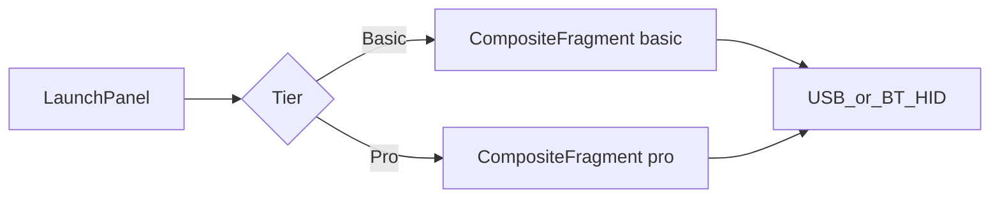

# “Keyboard and Mouse Basic” vs “Pro” — analysis and design

## Is the direction legitimate?

Yes. The current **Keyboard and Mouse** experience is dense by design: multi-page shortcut strips, profile slots, IME sub-compose, split landscape layout, and long-press alternates are powerful but overload working memory for first-time users. Renaming the existing experience **Keyboard and Mouse Pro** and offering **Keyboard and Mouse Basic** (beginner tier) that reuses the same HID/USB/Bluetooth stack is a standard product pattern (progressive disclosure) and fits this codebase: most complexity lives in [`CustomKeyboardView.java`](Openterface_KeyMod_Android/app/src/main/java/com/openterface/keymod/CustomKeyboardView.java) and [`CompositeFragment.java`](Openterface_KeyMod_Android/app/src/main/java/com/openterface/fragment/CompositeFragment.java), not in the transport layer.

## Basic sub-mode: Keyboard (authoritative layout)

**Constraints (your spec):**

- **Landscape only**, **one** layout option: **full-screen keyboard** (no split keyboard + center touchpad, no portrait variant for this sub-mode).
- **No Pro “top menu”**: omit the swipeable favorites row and multi-page fixed shortcut strip. **Row 1** is a **utility + mode row**: app chrome, **explicit Basic sub-mode switches** (Touchpad / NumPad / IME), spare **TBC** keys, **Target OS**, **connection** — not the Pro shortcut strip.

**Row map (full-size style + utilities):**

| Row | Keys (left → right) |
|-----|---------------------|
| **1** | App **menu / sidebar** · **Submode: Touchpad** · **Submode: NumPad** · **Submode: IME** · *TBC* · … · *TBC* · **Target OS** (selector / indicator) · **Connection** indication |
| **2** | **Esc** · **F1** · **F2** · **F3** · **F4** · **F5** · **F6** · **F7** · **F8** · **F9** · **F10** · **F11** · **F12** |
| **3** | `` ` `` · `1` · `2` · `3` · `4` · `5` · `6` · `7` · `8` · `9` · `0` · `-` · `=` · **Bksp** |
| **4** | **Tab** · **Q** · **W** · **E** · **R** · **T** · **Y** · **U** · **I** · **O** · **P** · `[` · `]` · `\` |
| **5** | **Caps** · **A** · **S** · **D** · **F** · **G** · **H** · **J** · **K** · **L** · `;` · `'` · **Enter** |
| **6** | **Shift** · **Z** · **X** · **C** · **V** · **B** · **N** · **M** · `,` · `.` · `/` · **Shift** |
| **7 (mac)** | **Control** · **Option** · **Command** · **Space** · **Command** · **Option** · **←** · **↓** · **↑** · **→** |
| **7 (Win / Linux)** | **Ctrl** · **Win** · **Alt** · **Space** · **Alt** · **List** · **Ctrl** · **↓** · **↑** · **→** |

**Shift labels and corner hints (Basic Keyboard — visual only, US QWERTY shift layer):**

These are **static small glyphs** (typically **top-right** on each keycap), not long-press **popup character pickers**. They teach what **Shift + key** produces; behavior still sends standard HID chords. Host software keyboard layout may differ; document US assumption like Pro.

- **Row 3** (` `` ` `` … `=` · Bksp): each key shows its **shift alternate** as a **top-right label**, left → right:
  **~** · **!** · **@** · **#** · **$** · **%** · **^** · **&** · **\*** · **(** · **)** · **\_** · **+** · *(Bksp: optional hint or blank)*  
  Mapping: `` ` ``→`~`, `1`→`!`, … `0`→`)`, `-`→`_`, `=`→`+`.

- **Rows 4–6** — **Top-right corner** on the base key shows the **shifted** character (same placement style as Pro **`keyCornerHint`** / corner glyph drawing in [`CustomKeyboardView`](Openterface_KeyMod_Android/app/src/main/java/com/openterface/keymod/CustomKeyboardView.java)):
  - **`[`** → **`{`** · **`]`** → **`}`** · **`\`** → **`|`**
  - **`;`** → **`:`** · **`'`** → **`"`**
  - **`,`** → **`<`** · **`.`** → **`>`** · **`/`** → **`?`**

- **Letters (Q–P, A–L, Z–M)**: Optional subtle **Shift** hints are **not** required for Basic unless you want parity with row 3; default is **hints only on the keys above** to stay clean.

- **Contrast with “no popups”**: Basic still **excludes** letter-key **popup alternate grids**; **fixed corner labels** for punctuation and row 3 are **in scope** and align with a **physical keyboard** mental model.

**Design notes for implementation:**

- **Row 1 sub-mode keys**: **Local navigation within Basic** (`KEYBOARD` / `TOUCHPAD` / `NUMPAD` / `IME`); **active** sub-mode highlighted. Default entry: **Keyboard**. Optional explicit **“Keyboard”** return via a TBC slot if testing shows users get stuck off the typing surface.
- **Row 7 switching**: Entire bottom row swaps from **mac** to **Win/Linux** table using existing **Target OS** preference (same approach as Pro keyboard labels / scan codes). **List** = Windows **Menu / Application** key (context menu); map to the HID the app already uses for that role on PC targets.
- **Win/Linux row 7 vs Mac**: Your Win/Linux spec ends with **↓ ↑ →** but **no ←** (Mac row includes full arrows). Treat as **spec gap** — implementation should likely add **←** for parity or confirm intentional omission.
- **Row 1 “TBC”**: F-keys now occupy **row 2**; TBC slots are free for e.g. **brightness**, **screenshot**, **“…”** overflow.
- **Shift labels**: Implement row 3 + punctuation corner hints with **theme-aligned** secondary/muted color (see **Basic tier — UI and theming**); reuse Pro corner-hint layout constants where possible.
- **No long-press character popup grids** on **letter** keys in Basic; **fixed** shift corner hints on row 3 and listed punctuation only (see **Shift labels and corner hints** above).
- **CompositeFragment**: Basic **Keyboard** → **landscape** · **`DisplayMode.KEYBOARD`** · **not** `SPLIT`. **NumPad** → **portrait** numpad layout. **Touchpad** / **IME** → see sections below.

## Basic sub-mode: NumPad (authoritative layout)

**Constraints:**

- **Portrait (vertical) only**, **full-screen** (aligned with earlier Basic intent: numpad is a phone-thumb layout).
- **Row 1** identical to Basic Keyboard **row 1** (same keys, same **horizontal scroll** behavior when needed) so sub-mode switching stays consistent across Basic surfaces.

**Row map (navigation + numpad cluster):**

| Row | Keys (left → right) |
|-----|---------------------|
| **1** | App **menu / sidebar** · **Submode: Touchpad** · **Submode: NumPad** · **Submode: IME** · *TBC* · … · *TBC* · **Target OS** · **Connection** indication |
| **2** | **Prt Sc** · **Scr Lk** · **Pause** · **Home** · **End** |
| **3** | **Pg Up** · **Num Lock** · **`/`** · **`*`** · **`-`** |
| **4** | **Pg Dn** · **7** · **8** · **9** · **`+`** |
| **5** | **Ins** · **4** · **5** · **6** · **`+`** |
| **6** | **Del** · **1** · **2** · **3** · **Enter** |
| **7** | *TBC* · **00** · **0** · **`.`** · **Enter** |

**Design notes for implementation:**

- **Large `+` and `Enter`**: Rows 4–5 both show **`+`**; rows 6–7 both show **Enter** — match a **physical extended numpad** using **tall / double-height keys** (spanning rows in `GridLayout` or merged cells), not two independent small keys unless UX prefers that.
- **00**: Send **double zero** or **two Keypad 0 events**; confirm host expectations in QA.
- **Row 7 TBC**: Reserve for **comma** (locale numpad), **Tab**, or **equals** on keypad.
- Reuse or extend existing numpad / navigation HID paths in [`CustomKeyboardView`](Openterface_KeyMod_Android/app/src/main/java/com/openterface/keymod/CustomKeyboardView.java) / key maps where keys already exist for Pro.

## Basic sub-mode: Touchpad (authoritative layout)

**Constraints:**

- **Portrait (vertical) only**, **full-screen** (same tier as Basic Keyboard; no Pro composite chrome except what you place in row 1).
- **Top key area** (fixed height strip): same logical keys as Basic Keyboard **row 1** — **menu / sidebar** · **Submode: Touchpad** · **Submode: NumPad** · **Submode: IME** · *TBC* · … · *TBC* · **Target OS** · **connection**. The strip **scrolls horizontally** when content overflows (e.g. `HorizontalScrollView` + `LinearLayout`, or horizontal `RecyclerView`), so narrow phones do not squash key targets.

**Main pointer + scroll region (below top strip):**

- **Width ratio** (left → right): **vertical scroll strip** (wheel up/down gestures) **:** **main touchpad** (cursor movement) = **1 : 5** — i.e. scroll strip occupies **1/6** of total width, pointer area **5/6**. Place the scroll strip on the **left** (per your spec); mirror for RTL locales only if you add explicit RTL support later.
- Reuse existing [`TouchPadView`](Openterface_KeyMod_Android/app/src/main/java/com/openterface/keymod/TouchPadView.java) for the large pane; the **scroll strip** is a sibling view (dedicated vertical drag → `RELATIVE` wheel reports or existing scroll pipeline — align with how Pro/gamepad already emits wheel if present).

**Mouse buttons (below pointer region):**

- Three buttons in one row: **left** · **middle** · **right** (same semantics as existing bundled mouse buttons in composite / touchpad help flows).

**Vertical height ratios (portrait stack):**

Interpret your **1 : 5 : 2** as the three major vertical bands:

| Band | Weight | Contents |
|------|--------|----------|
| **Top** | **1** | Horizontally scrollable row-1 keys |
| **Middle** | **5** | Left scroll strip + main touchpad (same row, 1:5 width split) |
| **Bottom** | **2** | Left / middle / right mouse buttons row |

Use `LinearLayout` weights or `ConstraintLayout` **vertical** chains with `layout_height="0dp"` + `layout_weight` so the ratio holds across devices. If you instead meant **only** “touchpad block vs button row” = **5:2** with the **1** reserved for something else, adjust during implementation — the table above is the default plan reading.

**Implementation notes:**

- **Basic Touchpad** is a **dedicated layout** (e.g. `fragment_basic_touchpad.xml`) inflated when `composite_tier == BASIC` and `BasicSubMode == TOUCHPAD`, or a single `CompositeFragment` branch that hides `CustomKeyboardView` and shows this root — avoid reusing portrait “BOTH” numpad+tiny-touchpad proportions.
- **Submode: Touchpad** in the top row shows **selected** state when this surface is visible; tapping **NumPad** / **IME** swaps the full-screen body while keeping the same top strip component for consistency.
- **Scroll strip UX**: vertical drag = wheel; optional inertia; haptics consistent with [`TouchPadHaptics`](Openterface_KeyMod_Android/app/src/main/java/com/openterface/keymod/util/TouchPadHaptics.java) / existing touchpad feedback.

## Basic sub-mode: IME (authoritative layout)

**Intent:**

- Same **behavior** as **Pro** “IME capture / sub-compose” (multiline host-bound text, **Compose** vs **Direct HID** toggle, **Send** pipeline, **Clear**, snapshot **Undo**, **Touchpad** affordance such as pop-out or focus-friendly control) — but **without any shortcut / favorites / fixed-strip area** above the editor.
- **Portrait and landscape** (match Pro IME capture: both orientations; reuse `WindowInsets` / bottom IME padding patterns already used in [`CompositeFragment`](Openterface_KeyMod_Android/app/src/main/java/com/openterface/fragment/CompositeFragment.java) and [`CustomKeyboardView`](Openterface_KeyMod_Android/app/src/main/java/com/openterface/keymod/CustomKeyboardView.java) for `imeCaptureEdit` / split IME host).

**Vertical stack (top → bottom):**

1. **Row 1 (chrome)** — Same as other Basic sub-modes: **menu / sidebar** · **Submode: Touchpad** · **Submode: NumPad** · **Submode: IME** · *TBC* · … · *TBC* · **Target OS** · **Connection**. Horizontally **scrollable** when needed.

2. **Long text field** — Multiline **`EditText`** (or equivalent) that consumes **most of the vertical space** between row 1 and the toolbar. Use **`layout_height="0dp"`** + **large `layout_weight`** (or `ConstraintLayout` vertical bias) so it **grows/shrinks** with orientation and remaining space; keep **scroll inside** the field for long paste. Mirror Pro’s **capture / sub-compose** text behavior, not a second app-specific strip.

3. **Toolbar row** — Same **actions** as Pro’s IME / sub-compose toolbar (wire to existing handlers where possible):
   - **Touchpad** — Same as Pro (e.g. pop-out touchpad or show pointer control; reuse [`PopOutTouchPadDialog`](Openterface_KeyMod_Android/app/src/main/java/com/openterface/keymod/util/PopOutTouchPadDialog.java) / existing toolbar button behavior).
   - **Toggle Compose vs Direct send** — Same as Pro’s **compose vs direct HID** mode (`imeSubComposeModeToggle` semantics).
   - **Undo** — Same as Pro’s **undo** for the text field (your message said “redo for the text field clear”; interpret as **Undo** after clear / restore snapshot — align with Pro **`imeCaptureUndoButton`**; confirm copy in strings).
   - **Clear** — Same as Pro **`imeCaptureClearButton`**.
   - **Send** — Same as Pro **`imeCaptureSendButton`** / `ImeTextForwarder` send path.

4. **System IME** — Reserved **bottom** region: when the soft keyboard is shown, apply **`WindowInsetsCompat.Type.ime()`** padding (or the same root-padding approach Pro uses) so the text field + toolbar stay usable; **no** `CustomKeyboardView` letter grid in this sub-mode (only system keyboard for character entry).

**Design notes for implementation:**

- **Layout**: Prefer a dedicated **`fragment_basic_ime.xml`** (or `BasicImePanel` included from `CompositeFragment`) that **omits** Pro-only rows (`imeCaptureShortcutsRow`, expanded strip, profile hub). **Do not** set `shortcutsStripOnly`; simply **inflate a thinner tree** so maintenance stays “Pro IME minus strip” rather than many runtime `GONE` flags.
- **State**: Reuse **one** `EditText` + prefs for compose/direct and undo snapshot if Pro already stores them on the same prefs keys; avoid duplicating two editors unless lifecycle forces a split.
- **Submode: IME** on row 1 shows **selected** when this surface is active; switching to **Keyboard** returns to the full hardware-style layout.

## Basic tier — UI and theming (all four sub-modes)

**Product direction:** Every Basic surface (**Keyboard**, **NumPad**, **Touchpad**, **IME**) should feel **simplistic, clean, and sleek** — fewer visual layers than Pro, but **not** a separate visual language: same app identity, spacing discipline, and **color system** as the rest of KeyMod.

**Theme and colors (must align with application settings):**

- Resolve colors from the **active app theme**, not ad-hoc hex in Basic-only XML. Use [`ThemeManager`](Openterface_KeyMod_Android/app/src/main/java/com/openterface/keymod/ThemeManager.java) (`getColorPrimary`, container / surface helpers, `PREF_THEME_COLOR_FAMILY`, light–dark / follow-system prefs) and **theme attributes** (`?attr/colorPrimary`, `?attr/colorSurface`, `?attr/colorOnSurface`, etc.) so **General → theme** changes (accent family, light/dark) apply instantly to Basic.
- **Selected sub-mode** (row 1: Touchpad / NumPad / IME) and **focused** states: use **primary / accent** from theme; unselected chrome: **surface / outline** tokens consistent with Pro’s keyboard chrome.
- **Avoid** hardcoding `R.color.*` for accents unless they are the **same** `theme_accent_*` resources already tied to the color family (see `ThemeManager` mapping). Prefer **`ContextThemeWrapper`** / correct `android:theme` on inflated Basic roots so `?attr/*` resolves.

**Layout and component consistency:**

- **Shared row 1** across all four sub-modes: **identical height**, horizontal padding, icon/text scale, and scroll behavior so switching sub-modes does not “jump” the chrome.
- **Keyboard / NumPad keys**: Reuse or mirror **`CustomKeyboardView`** key rendering / padding so keycaps, corner radius, and pressed states match Pro keyboard **where intentional**; Basic may use slightly larger touch targets but same **stroke, shadow, and label** conventions.
- **Touchpad**: Neutral **surface** for pad + scroll strip; **accent** only for active scroll drag or optional subtle edge; mouse buttons match existing touchpad button styling from composite (same drawable/tint pipeline if applicable).
- **IME**: **`TextInputLayout` / Material `EditText`** (or match Pro IME field styling line-for-line), toolbar as a **single slim row** of icon buttons with **`?attr/colorControlNormal`** / primary tint on active; dividers use **`?attr/dividerVertical`** (or project equivalent).

**Sleek / clean checklist:**

- Generous **whitespace**, aligned grids, **no** decorative clutter Basic does not need.
- **One** elevation level for chrome vs content (avoid stacked shadows).
- Respect **dynamic type** / font scale where the rest of the app does; keep row 1 icons readable at small widths (scroll rather than shrink below min touch target).

**QA:** After theme change in Settings, snapshot **all four** Basic sub-modes in light and dark to confirm no stray colors.

## How it already maps to the code (important discovery)

[`CompositeFragment`](Openterface_KeyMod_Android/app/src/main/java/com/openterface/fragment/CompositeFragment.java) already has an internal `DisplayMode { BOTH, KEYBOARD, TOUCHPAD, SPLIT }` and orientation-specific behavior:

- **Landscape**: `normalizeDisplayModeForOrientation()` forces combined layouts toward **SPLIT** (split keyboard + center touchpad) or **KEYBOARD** (keyboard-only, touchpad hidden). See `cycleDisplayMode()` / `applyDisplayMode()` around lines 1294–1370.
- **Portrait “numpad”**: **KEYBOARD** mode shows the compact grid with `setShowExtraPortraitKeys(true)` and keeps a **small touchpad band above** the numpad (not touchpad-only).
- **`DisplayMode.TOUCHPAD`**: `applyDisplayMode()` can hide the keyboard and show touchpad-only (`touchpadSection` visible, `keyboardView` gone), **but `cycleDisplayMode()` never assigns `TOUCHPAD`** — only `BOTH`, `KEYBOARD`, and `SPLIT` appear in transitions. So **full-screen touchpad in portrait is mostly latent today**; your “Touchpad sub-mode” is both a UX win and a small wiring fix.

[`CustomKeyboardView`](Openterface_KeyMod_Android/app/src/main/java/com/openterface/keymod/CustomKeyboardView.java) already has knobs that overlap your “simple typing” intent, e.g. `KEYBOARD_ALTERNATES_HINTS_ENABLED` / `keyboardAlternatesHintsEnabled` (long-press alternates vs repeat, hints hidden). A beginner mode would likely add a **single higher-level flag** (or launch-tier) that sets several of these behaviors together rather than asking users to find Fn combinations.

## Critique and ways to design it better

**1) Orientation rules — prefer guidance over hard failure**

Locking **Keyboard → landscape**, **Touchpad/Numpad → portrait** matches thumb ergonomics and your current layout strengths, but a **hard lock** (black screen or no input) when rotated the “wrong” way will feel broken. Better:

- **Soft lock**: keep the sub-mode, show a compact banner: “Rotate to landscape for full keyboard” with optional one-tap “Switch to Touchpad” if they stay in portrait.
- Optionally **auto-switch** sub-mode on rotate using a predictable mapping (e.g. portrait → Touchpad, landscape → Keyboard) with a one-time toast so users learn the pairing.

**2) Sub-mode discovery (row 1 vs extra chrome)**

Your **row 1** keys (**Touchpad / NumPad / IME**) largely replace a separate **bottom tab bar** for Basic. Still consider: (a) a **one-line hint** on first launch (“Use the top row to switch touchpad, numpad, or type-to-send”); (b) user-facing label for IME key **“Type & send”** while the keycap might stay compact. Pro can keep the edge pill / dense cycling.

**3) Basic vs Pro keyboard (checklist beyond the row map)**

The table above is the **positive** spec for Basic. For **Pro**, keep today’s strip, profiles, IME sub-compose, split landscape, and long-press alternates.

- **Basic out**: multi-page shortcut strip, profile hub slots, **DISPLAY** strip mode cycling, long-press **popup character grids** on letters (unless you later add one narrow “symbols” key).
- **Edge case**: **Accents / symbols** — with no popups, document that users switch to **Basic “Type & send”** sub-mode or **Pro** for rare characters.

**4) “IME Mode” naming**

On Android, “IME” reads as “the system keyboard.” If this sub-mode is really “type in a box, then send text to the host,” consider user-facing strings like **“Type & send”** or **“Compose”** (you already have [`MODE_COMPOSE`](Openterface_KeyMod_Android/app/src/main/java/com/openterface/keymod/LaunchPanelActivity.java) as a separate launch card — align naming so users are not confused by two different “compose” concepts).

**5) Launch panel structure**

[`LaunchPanelActivity`](Openterface_KeyMod_Android/app/src/main/java/com/openterface/keymod/LaunchPanelActivity.java) currently exposes one **Keyboard & Mouse** card ([`activity_launch_panel.xml`](Openterface_KeyMod_Android/app/src/main/res/layout/activity_launch_panel.xml)). Clean options:

- **A)** Two cards: **Keyboard & Mouse Basic** (default) and **Keyboard & Mouse Pro** (current composite).
- **B)** One card → short **“Basic vs Pro”** choice sheet before `MainActivity`, storing tier in prefs.

Defaulting new installs to **Basic** while honoring “remember my mode” for upgrades avoids surprising power users.

**6) Implementation shape (when you build it)**

- Add a **tier** or **surface enum** (e.g. `composite_tier = BASIC | PRO`) passed via intent from the launch panel, persisted like `lastMode` in [`LaunchPanelActivity`](Openterface_KeyMod_Android/app/src/main/java/com/openterface/keymod/LaunchPanelActivity.java).
- **Pro tier**: keep current [`CompositeFragment`](Openterface_KeyMod_Android/app/src/main/java/com/openterface/fragment/CompositeFragment.java) behavior.
- **Basic tier**: same fragment (recommended) or thin wrapper, but:
  - **Keyboard** sub-mode: **landscape full-screen** per **Keyboard** table (rows 1–7, row 7 OS branch); **no** Pro strip; **not** `SPLIT`.
  - **NumPad** sub-mode: **portrait full-screen** per **NumPad** table; shared scrollable **row 1** component with Keyboard/Touchpad/IME.
  - **Touchpad** sub-mode: **portrait** — scrollable row 1, **5:1** pointer vs left scroll strip, **1:5:2** vertical weights, **L/M/R**; `DisplayMode.TOUCHPAD` + wheel strip HID.
  - **IME** sub-mode: **row1** + **weighted `EditText`** + **Pro-equivalent toolbar** (no shortcut area) + **system IME** insets; dedicated XML or branch; reuse send/undo/clear/toggle/touchpad from [`CustomKeyboardView`](Openterface_KeyMod_Android/app/src/main/java/com/openterface/keymod/CustomKeyboardView.java) / [`ImeTextForwarder`](Openterface_KeyMod_Android/app/src/main/java/com/openterface/keymod/util/ImeTextForwarder.java).
  - **Row 1** custom keys: dispatch to `BasicSubMode` (`KEYBOARD`, `TOUCHPAD`, `NUMPAD`, `IME`) → `CompositeFragment` visibility / orientation prompts / IME capture.
  - [`CustomKeyboardView`](Openterface_KeyMod_Android/app/src/main/java/com/openterface/keymod/CustomKeyboardView.java) (or split views): **Basic_Keyboard** vs **Basic_NumPad** vs **Basic_IME** layout resources; Pro strip suppressed on Basic Keyboard; all Basic XML / programmatic colors go through **theme attrs** / [`ThemeManager`](Openterface_KeyMod_Android/app/src/main/java/com/openterface/keymod/ThemeManager.java) (see **Basic tier — UI and theming**).
- **Strings/docs**: rename Pro strings; add **Basic** strings; update [`USER_GUIDE.md`](Openterface_KeyMod_Android/docs/USER_GUIDE.md) with a **Basic vs Pro** table including the row map summary for Basic Keyboard.

## Summary verdict

- **Concept**: Legitimate; **Basic Keyboard** = row1 + **F-row** + number row through **Caps** + **Shifts** + **OS-specific row 7**. **Basic NumPad** = row1 + **Prt Sc / nav / full numpad** rows with **tall + / Enter** handling. **Basic Touchpad** unchanged (scrollable row1, **5:1** strip, **1:5:2** vertical bands, L/M/R). **Basic IME** = **Pro IME stack minus shortcut strip** (row1 + big text + same toolbar + system IME).
- **Biggest engineering gaps**: (1) **Basic Keyboard** 7-row layout + Target OS row swap; (2) **Basic NumPad** portrait grid + merged keys; (3) **`fragment_basic_touchpad`** + wheel; (4) **`fragment_basic_ime`** (or branch) + inset-safe **EditText** + toolbar parity with Pro; (5) **`TOUCHPAD`** entry from Basic.
- **Product gaps**: **Row 1 TBC**; **Win/Linux row 7 ←**; **00** semantics; **1:5:2** Touchpad; **rotate UX**; **IME toolbar copy** (“Undo” vs “redo” wording); **theme QA** on all four Basic surfaces after Settings theme change.
