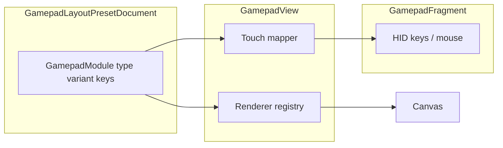

# Gamepad modules: taxonomy, framework, and roadmap (merged)

## Reference glossary (user-facing and engineering)

Use this vocabulary consistently in **strings**, **preset export comments**, and **USER_GUIDE / FAQ**. External reference images are illustrative only; implementation is in-app art + behavior.

### Directional input — D-pad

Formal names: **D-pad** (Directional Pad), directional button, direction cross; older engineering term **hat switch** (still used in HID discussion).

| Variant (product) | Description |
|-------------------|-------------|
| Cross D-pad | Standard Nintendo-style connected cross |
| Disc D-pad | Circular pivot disc (e.g. Saturn-style) |
| Split D-pad | Segmented independent directions |
| Floating D-pad | Visually elevated / separated pad body |
| Clicky D-pad | Tactile feedback (haptics + optional click animation) |
| Pivot D-pad | Rocking central pivot (axis-dominant input) |

**Framework mapping:** one module type **`DPAD`** with required **`dpadVariant`** enum (`cross`, `disc`, `split`, `floating`, `clicky`, `pivot`). Replaces the interim `WASD_CROSS` string (remove constant; **cross** variant = current connected cross behavior and art).

### Analog input — thumbstick

Preferred terms: **analog stick**, **thumbstick**; less precise: joystick.

**Subcomponents (docs / advanced settings copy only on phone):** thumb cap, stem, gimbal assembly, sensor (potentiometer vs Hall-effect — **cosmetic/educational** on device), L3/R3 press.

| Variant | Notes |
|---------|--------|
| Concave stick | Dished cap (draw) |
| Convex stick | Rounded cap (draw) |
| Hall-effect stick | Label / theme only unless hardware exposes it |
| Low-profile stick | Smaller cap + reduced travel draw |
| C-stick | Secondary stick sizing + offset defaults (e.g. GameCube-style) |

**Framework mapping:** keep `STICK_KEY` / `STICK_MOUSE` as **behavior**; add `stickVisualVariant` for draw-only unless input curve changes (e.g. low-profile dead zone tuning later).

### Face buttons — four-button clusters

Terms: **face buttons**, **action buttons**, **primary buttons**, **right-side button cluster**.

| Layout family | Buttons | UX note |
|---------------|---------|--------|
| Nintendo | A/B/X/Y diamond; colors/history; confirm/cancel vs Xbox reversed | Template anchors + labels |
| Xbox | ABXY diamond, different positions | Same |
| PlayStation | **Symbol buttons** (Triangle, Circle, Cross, Square) | Labels + positions |

**Framework mapping:** start with **layout templates** that place existing `BUTTON` modules (up to 20) with correct anchors/labels; optional later `FACE_CLUSTER` single module if atomic move/scale is required.

### Shoulder and trigger controls (future modules)

- **Bumpers / shoulder (digital):** LB/RB, L1/R1 — map to new `BUTTON` roles or `SHOULDER` module type.
- **Triggers (analog/digital):** LT/RT, L2/R2 — variants: analog pressure, digital, hair trigger, adaptive (adaptive = haptics + copy only on phone).

Schema reserve: `triggerVariant`, `triggerAnalog` boolean, optional pressure curve id.

### Controller stick **layout** (geometry, not a drawable module)

Important for **preset templates** and marketing copy:

| Term | Meaning |
|------|--------|
| Symmetrical layout | Both sticks on horizontal line (PlayStation style) |
| Asymmetrical / offset analog layout | Xbox / Switch Pro offset |

**Framework mapping:** optional `LayoutGlobals.stickLayoutTemplate` or `presetTemplateId` (`symmetrical`, `offset`, `parallel` synonym for symmetrical) — affects **default anchors** when user applies a template, not per-stick type.

### Arcade / fight stick (deferred milestone)

Terms: arcade stick / fight stick, **lever** (arcade joystick), **pushbuttons** (Sanwa/Seimitsu style). Distinct HID and UX surface from handheld gamepad modules — **out of scope** for the first framework phase; document in glossary and backlog.

### Premium / modern terms

- **Back paddles / rear paddles** — programmable rear inputs (Xbox Elite). Defer module type until product HID spec exists; glossary only initially.

### Touchpad

Already a first-class module (`TOUCHPAD`). Align naming with DualShock/DualSense **touch surface** in docs; behavior unchanged in taxonomy work.

---

## Current implementation inventory (codebase)

| Id role | JSON `type` | Draw / touch entry |
|---------|-------------|-------------------|
| `stick_left` | `STICK_KEY`, `STICK_MOUSE`, `DPAD` (+ `dpadVariant`) | [`GamepadView.drawDynamicSimpleLayout`](app/src/main/java/com/openterface/keymod/GamepadView.java), [`GamepadFragment`](app/src/main/java/com/openterface/fragment/GamepadFragment.java) |
| `stick_right` | `STICK_KEY`, `STICK_MOUSE` | Same |
| `button_*` | `BUTTON` | `drawRetroFaceButton` |
| `touchpad_<n>` | `TOUCHPAD` | `drawTouchpadModule` |
| `mouse_btn_*` | `MOUSE_BUTTON` | Face button draw path |

Constants: [`GamepadLayoutPresetConstants.java`](app/src/main/java/com/openterface/keymod/gamepad/GamepadLayoutPresetConstants.java). Schema: [`GamepadLayoutPresetDocument.GamepadModule`](app/src/main/java/com/openterface/keymod/gamepad/GamepadLayoutPresetDocument.java).

---

## Framework improvements (configurable + solid UX)

### 1. Schema (recommended)

- Bump **`schemaVersion` to 3** when introducing optional fields (Gson: absent field = default).
- On **`GamepadModule`:** nullable `dpadVariant`, `stickVisualVariant`; future `triggerVariant` / `shoulderRole`.
- On **`LayoutGlobals`:** optional `stickLayoutTemplate` (`symmetrical` | `offset` | `parallel`) for template presets only.
- **`GamepadLayoutPresetUpgrader`:** v2 → v3 rewrite `WASD_CROSS` → `DPAD` with `dpadVariant=cross` for any bundled or saved docs in repo; validation rejects `WASD_CROSS` after migration pass (pre-launch — no end-user alias layer).

### 2. Code structure

- Replace monolithic `drawDynamicSimpleLayout` branches with **registry**: `(type, variant?) → Renderer` (small package under `gamepad/render/` or inner classes).
- **Touch mapper** interface per D-pad variant (cross vs split rects vs disc sectors vs pivot axis) producing the same normalized output the fragment already consumes where possible.
- **Fragment** stays HID-oriented; variants that only change draw do not touch `sendAnalogInput` / key reports.

### 3. UX

- **Add module / canvas menus:** grouped sections (Directional, Thumbstick, Face, Surface, Mouse, *future: Shoulders*).
- **Long-press module:** sections for Behavior, **D-pad style**, **Stick look**, keys.
- **Apply template:** one tap sets anchors + optional `stickLayoutTemplate` for symmetrical vs offset starter layouts.

---

## Phased delivery (updated)

1. **Glossary + string renames** — D-pad, analog thumbstick, face/symbol buttons, bumpers/triggers, stick layout terms; align menus and dialogs.
2. **Schema v3 + upgrader** — optional variant fields; validation allows only implemented enum values.
3. **Renderer refactor** — behavior parity; wire `dpadVariant` / `stickVisualVariant` with defaults = current art.
4. **D-pad variants** — cross (existing), split, disc, pivot; floating/clicky as visual + haptic on shared base.
5. **Stick visuals** — concave/convex/low-profile/C-stick; Hall = copy only.
6. **Face templates** — Nintendo / Xbox / PlayStation anchor+label packs.
7. **Shoulders & triggers** — new types or extended `BUTTON` metadata + draw paths.
8. **Arcade / paddles** — separate milestone after gamepad schema stabilizes.

---

## Locked product decisions (iteration)

- **Preset JSON:** canonical **`DPAD`** + **`dpadVariant`**; remove **`WASD_CROSS`** from code and schema (pre-launch, elegance over backward compatibility).
- **Face layouts:** ship **templates-only** first (Nintendo / Xbox / PlayStation anchor packs); defer **`FACE_CLUSTER`** single-module type until atomic cluster editing is required.

---

## Diagram: preset module → renderer → touch → HID

