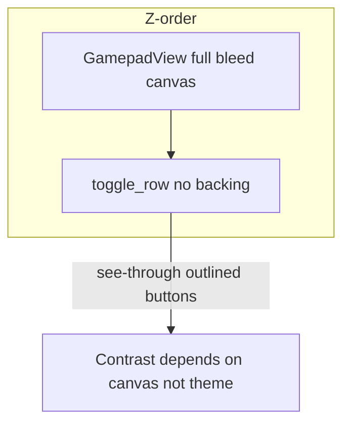

# Gamepad toolbar: contrast vs canvas background

## What the code is doing today

In [`fragment_gamepad.xml`](app/src/main/res/layout/fragment_gamepad.xml):

- The root uses [`ThemeOverlay.KeyMod.Gamepad`](app/src/main/res/values/themes.xml) (Material 3 **dark** tokens).
- [`GamepadView`](app/src/main/java/com/openterface/keymod/GamepadView.java) is **full-screen** under the overlays (`FrameLayout` order: gamepad first, then chrome).
- [`toggle_row`](app/src/main/res/layout/fragment_gamepad.xml) is a plain `LinearLayout` with **no `android:background`**. Toolbar controls are mostly **outlined** `MaterialButton`s with transparent fills, so the **user’s canvas** (fill color, pattern, or image) is visible **through** the row.
- Icon, stroke, and preset label colors come from **fixed theme attributes** (e.g. `textColorSecondary`, `colorOutline`, `colorPrimary`), not from the canvas.

So the issue is structural: **theme assumes a dark “chrome plane,” but the actual pixels behind the row are whatever the user picked for the gamepad.**

## Option A — Dynamic colors from canvas (“resilient”)

**Idea:** Infer whether the background is light or dark, then switch toolbar text/icon/stroke (or full theme slice) between light and dark palettes.

**Signals you could use (increasing cost / fragility):**

1. **Solid fill only** — If `layoutDoc.layout.backgroundFillArgb` (and prefs) is set, compute **relative luminance** and pick a “toolbar on light” vs “toolbar on dark” token set. **Reasonable** when there is no image.
2. **Pattern / default gradient** — Treat as mid/dark unless you sample; heuristics only.
3. **Bitmap** — Would need **sampling** (e.g. region under the toolbar after layout, or thumbnail + dominant color). **Expensive**, async, and **noisy** on photos or game art; easy to flicker when panning/zooming the background.

**Downsides:** More code paths, re-apply on every background change (gallery pick, clear, RGB, pattern, preset switch, viewport), and you still need a **fallback** when sampling is ambiguous.

## Option B — Keep chrome simple: fixed “pill strip” (opaque / tonal)

**Idea:** Stop depending on the canvas for contrast: give **`toggle_row` a dedicated background** (e.g. `MaterialCardView` or `LinearLayout` + `shape` with `colorSurfaceContainer` / `colorSurfaceContainerHigh`, optional **elevation** or **88% opacity** surface), and keep using **existing M3 dark tokens** for icons, strokes, and text on that strip.

**Pros:** Predictable accessibility, small diff (mostly layout + maybe padding), no sampling, no coupling to `GamepadView` paint order beyond “strip sits above canvas.” Same idea as a **top scrim** in video players.

**Cons:** The row reads as a **floating bar** over the canvas rather than glass; that is usually acceptable for controls.

## Option C — Fully fixed filled neutral buttons

**Idea:** Every control is a solid gray/black pill with fixed white/black icons.

**Pros:** Maximum independence from canvas.

**Cons:** Fights current **Material 3** outlined + **primary edit** checked state you already added ([`gamepad_edit_toggle_*`](app/src/main/res/color/)); more custom drawables; harder to stay aligned with app accent and future theme tweaks.

## Recommendation

**Prefer Option B (opaque or semi-opaque surface behind `toggle_row`)** as the default product choice: **best effort-to-reward**, matches “resilient” without inventing a second theme engine.

Option A is only worth it if you **explicitly** want an edge-to-edge glass look **and** can scope it (e.g. **solid fill + pattern only**, default to dark strip when a bitmap is present).

Option C only if you want a **deliberately non-Material** game skin.

## If you implement Option B later (concise hook points)

- Layout: wrap [`toggle_row`](app/src/main/res/layout/fragment_gamepad.xml) content in a `MaterialCardView` / rounded container with `app:cardBackgroundColor` or `android:background` using `?attr/colorSurfaceContainer` (and small horizontal `margin` + vertical `padding` so it does not touch screen edges).
- Optionally mirror the same treatment for [`gamepad_chrome_bar`](app/src/main/res/layout/fragment_gamepad.xml) for menu + Bluetooth consistency.
- No change required to [`applyGamepadToolbarTopInsets`](app/src/main/java/com/openterface/fragment/GamepadFragment.java) if you only wrap **inside** the same `toggle_row` id or update the code to target the new root id once.

This plan is **analysis only**; no implementation until you choose B (or A with narrowed scope).
