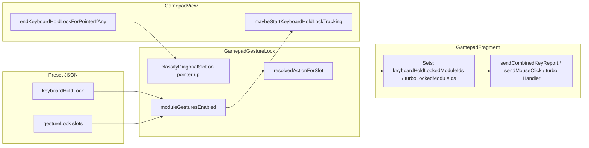

# Gamepad turbo and hold-lock: settings and behavior review

## Where settings live (preset JSON)

Per-module fields on [`GamepadLayoutPresetDocument.GamepadModule`](app/src/main/java/com/openterface/keymod/gamepad/GamepadLayoutPresetDocument.java):

- **`keyboardHoldLock`** (`Boolean`): When `true`, enables the gesture system for that module together with **implicit defaults** for missing diagonal slots (see below). Valid only on **`BUTTON`**, **`SHOULDER`**, **`TRIGGER`**, **`MOUSE_BUTTON`** (enforced in `validateOrThrow`).
- **`gestureLock`**: Optional object with four slots: `upLeft`, `upRight`, `downLeft`, `downRight`. Each slot is a [`GestureLockSlot`](app/src/main/java/com/openterface/keymod/gamepad/GamepadLayoutPresetDocument.java) with `action` and, for two action types only, `hidKey` / `modifierMask`.

**Allowed `action` values** ([`GamepadLayoutPresetConstants`](app/src/main/java/com/openterface/keymod/gamepad/GamepadLayoutPresetConstants.java)):

| Action | Meaning (high level) |
|--------|----------------------|
| `none` | No latch from this diagonal |
| `hold_lock` | Latch **module’s normal output** (key and/or mouse button) held down |
| `turbo` | Latch **auto-repeat pulse** for that module’s normal output |
| `key_hold` | Latch a **different** HID key (+ optional modifiers) |
| `key_turbo` | Turbo pulse that **different** key |

**Defaults when `keyboardHoldLock: true` and a slot is omitted from JSON** ([`GamepadGestureLock.resolvedActionForSlot`](app/src/main/java/com/openterface/keymod/gamepad/GamepadGestureLock.java)): only **`upRight` → `hold_lock`** and **`upLeft` → `turbo`**. Other diagonals resolve to `none` unless explicitly set in `gestureLock`.

**Validation highlights** ([`GamepadGestureLock.validateGestureLockOnModule`](app/src/main/java/com/openterface/keymod/gamepad/GamepadGestureLock.java)):

- `gestureLock` must contain at least one non-`none` action **or** `keyboardHoldLock` must be true.
- **`key_hold` / `key_turbo` are forbidden on `MOUSE_BUTTON`**.
- `hidKey` / `modifierMask` are **only** allowed on `key_hold` / `key_turbo`; `key_*` requires `hidKey` in 1–255.

**Example** (explicit diagonals, no `keyboardHoldLock` on the same module): [`gamepad/minecraft_java.json`](gamepad/minecraft_java.json) `button_a` uses `gestureLock` with e.g. `downLeft: turbo`, `upLeft: hold_lock`—valid because at least one slot is non-`none`.

## Runtime UX (touch → latch)

- **Gesture enablement**: [`GamepadGestureLock.moduleGesturesEnabled`](app/src/main/java/com/openterface/keymod/gamepad/GamepadGestureLock.java) is true if `keyboardHoldLock` **or** any non-`none` `gestureLock` action exists.
- **Touch handling**: [`GamepadView`](app/src/main/java/com/openterface/keymod/GamepadView.java) calls `maybeStartKeyboardHoldLockTracking` when the pressed module has gestures enabled. On pointer up, [`endKeyboardHoldLockForPointerIfAny`](app/src/main/java/com/openterface/keymod/GamepadView.java) either:
  - **Diagonal commit**: uses `GamepadGestureLock.classifyDiagonalSlot` (min radius **9 dp**, cancel beyond **200 dp**) and `resolvedActionForSlot`, then [`KeyboardHoldLockListener.onGestureLockActionCommitted`](app/src/main/java/com/openterface/keymod/GamepadView.java) (implemented in [`GamepadFragment`](app/src/main/java/com/openterface/fragment/GamepadFragment.java)).
  - **Popup path**: [`BasicHoldLockPopup(true)`](app/src/main/java/com/openterface/keymod/basic/BasicHoldLockPopup.java) (“gamepad relaxed” radii) only when `diagonalMode` is false—but `diagonalMode` is set from `GamepadGestureLock.moduleUsesDiagonalGestureCommit`, which is currently **identical** to `moduleGesturesEnabled` ([`GamepadGestureLock.java` lines 60–61](app/src/main/java/com/openterface/keymod/gamepad/GamepadGestureLock.java)). So for any module that actually starts tracking, **`diagonalMode` is always true**, and the popup branch in `showHoldLockPopupForPointer` is effectively unused. The in-code comment on `GamepadModule` still mentions “legacy vertical up/down” when `gestureLock` has no actions; **today’s behavior for `keyboardHoldLock`-only modules is diagonal swipe on lift** (defaults on up-left / up-right only), not the radial popup.

## Latch semantics in `GamepadFragment`

- **Hold lock (`hold_lock` / `key_hold` / mouse hold)**: Module id added to `keyboardHoldLockedModuleIds`; optional alternate HID stored in `gestureHoldAlternateHid` for `key_hold`.
- **Turbo (`turbo` / `key_turbo`)**: Module id added to `turboLockedModuleIds`; optional alternate HID in `gestureTurboAlternateHid` for `key_turbo`. A main-thread handler toggles phase every **`TURBO_PULSE_PERIOD_MS = 70`** ([`GamepadFragment.java` ~134](app/src/main/java/com/openterface/fragment/GamepadFragment.java)) and drives keyboard pulses plus mouse button pulses where applicable (`applyTurboMousePulsePhase`, `keyboardHoldLatchedMouseButtonMask`).
- **Unlock**: If a module is already latched, the next **press+release** on that module clears latch state (`pendingKeyboardHoldUnlockTap` in the button press/release listeners, ~761–812 in `GamepadFragment`). Turbo wins the **badge** if both sets ever overlapped on the same id (`syncKeyboardHoldLockVisuals` overwrites with turbo last).
- **Disconnect / layout change**: Latches cleared in bulk (e.g. `releaseAllGamepadInputState` ~6159+).

## In-app editing

[`GamepadFragment`](app/src/main/java/com/openterface/fragment/GamepadFragment.java) exposes a **keyboard hold lock** switch and gesture rows (`bindGestureLockSpinnerRows`, ~3488+ and ~4331+) so authors can set the same fields without hand-editing JSON.

## Gaps / consistency notes (for a future pass, not required now)

- **[`docs/USER_GUIDE.md`](docs/USER_GUIDE.md)** “Gamepad Mode” section does not yet document `keyboardHoldLock` / `gestureLock` / turbo vs hold-lock UX.
- **Naming**: `keyboardHoldLock` now means “gestures enabled” more than “keyboard only”; defaults include turbo on **up-left**.
- **Tests**: [`GamepadGestureLockTest`](app/src/test/java/com/openterface/keymod/gamepad/GamepadGestureLockTest.java) and [`GamepadLayoutPresetDocumentTest`](app/src/test/java/com/openterface/keymod/gamepad/GamepadLayoutPresetDocumentTest.java) cover defaults and validation; they are the best spec for authors.

No code changes are implied by this review unless you want follow-ups (e.g. align `moduleUsesDiagonalGestureCommit` with `moduleUsesDiagonalGestures` to restore vertical popup for `keyboardHoldLock`-only modules, refresh USER_GUIDE, or make turbo period configurable).

---

## Follow-up: accidental hold_lock / turbo on tap (sensitivity)

### Problem

Diagonal commit runs on **pointer up** using only **displacement** from down to up ([`GamepadGestureLock.classifyDiagonalSlot`](app/src/main/java/com/openterface/keymod/gamepad/GamepadGestureLock.java): **~9 dp** minimum radius, **200 dp** cancel). There is **no minimum dwell time**, so a quick tap with a small skew can still exceed 9 dp in an up-left / up-right sector and latch turbo or hold_lock instead of behaving like a clean tap.

### Opinion on “press 0–1 s, then swipe”

A **configurable minimum press duration** (dwell / “arm” time, **0–1000 ms** with **0 = current behavior**) is a strong fit:

- **Fast taps** (gameplay): total touch time is short → treat release as **normal button only**, never classify diagonals for latch.
- **Intentional gesture**: user holds briefly, then drags diagonally and releases → classify as today.

Implementation sketch: extend [`GamepadView.HoldLockTracking`](app/src/main/java/com/openterface/keymod/GamepadView.java) with `downUptimeMillis` (or `event.getDownTime()`). In `endKeyboardHoldLockForPointerIfAny`, when `t.diagonalMode` and you would classify a slot and commit a non-`none` action, **guard** with `if (eventTime - downTime < configuredThresholdMs) skip commit** (treat as no gesture; let normal press/release through—verify `suppressButtonRelease` stays false so HID tap still completes).

**Edge cases to handle in design**

- **Threshold = 0**: identical to today.
- **Threshold > 0**: On release before threshold, do **not** call `onGestureLockActionCommitted`; ensure `suppressButtonRelease` is false so [`releasePointerComponent`](app/src/main/java/com/openterface/keymod/GamepadView.java) still delivers `onButtonRelease` if a press was already sent.
- **Long press still works**: If the module uses long-press for config, ensure thresholds do not conflict (usually long-press is longer than gesture dwell, e.g. 400–600 ms vs 150–300 ms gesture arm).

### Optional second knob: distance sensitivity

Expose a scale factor on **`DIAGONAL_R_MIN_DP`** (e.g. 0.7×–3×) so “strict” users need a **longer** diagonal stroke before commit. This complements time: time stops accidental **quick** skew; distance stops accidental **small** deliberate drags. Can ship as one “gesture sensitivity” slider that adjusts both, or two separate settings.

### Where to store the preference

**Chosen approach: both** — a **global default** in SharedPreferences (so casual users have one slider), plus an **optional per-preset override** in layout JSON (e.g. on `GamepadLayoutPresetDocument.LayoutGlobals` or `Meta`) so packs like Minecraft can ship stricter/weaker gestures without forcing everyone’s global default. Resolution order at runtime: **preset override if present and valid, else global, else built-in default (0 ms = current behavior)**.

### Likely code touchpoints

- **Preference**: e.g. extend [`GamepadPreferenceKeys`](app/src/main/java/com/openterface/keymod/gamepad/GamepadPreferenceKeys.java) + gamepad settings UI fragment if one exists, or gamepad overflow menu.
- **Runtime**: [`GamepadView`](app/src/main/java/com/openterface/keymod/GamepadView.java) `HoldLockTracking` + `endKeyboardHoldLockForPointerIfAny` (and pass `MotionEvent.getEventTime()` for the releasing pointer into the end path if not already available).
- **Tests**: unit tests on `classifyDiagonalSlot` unchanged; add small tests or instrumentation-style checks for “release before dwell → no listener call” if you introduce a testable helper.

### What not to rely on alone

Increasing only `DIAGONAL_R_MIN_DP` globally hurts users who **want** quick diagonal flicks; a **user-tunable** (or preset-tunable) combination of **dwell + distance** is more robust than a single hardcoded constant tweak.
