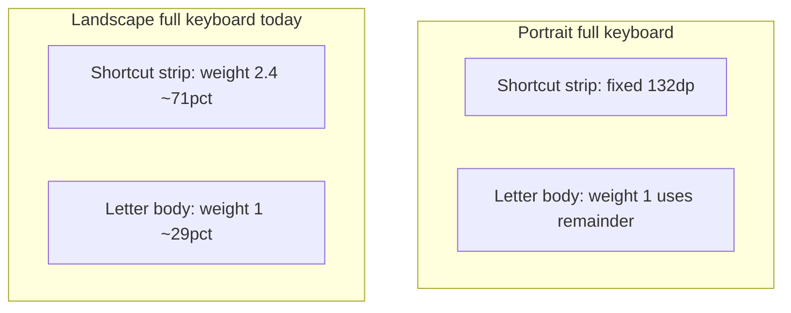

# Fix KM Pro landscape keyboard strip vs QWERTY overlap

## What’s going wrong

In [`CustomKeyboardView.updateKeyboard()`](app/src/main/java/com/openterface/keymod/CustomKeyboardView.java), the macro / Shortcut Hub area is built by [`addTopFunctionRows()`](app/src/main/java/com/openterface/keymod/CustomKeyboardView.java). The letter rows go into `kmProLetterKeyboardBody` with `layout_height=0` and `layout_weight=1`.

Inside `addTopFunctionRows`, the strip container’s height is chosen like this (simplified):

- **Portrait, full keyboard** (`!shortcutsStripOnly && splitPart == SPLIT_NONE`): fixed height = [`@dimen/compose_shortcut_strip_height`](app/src/main/res/values/dimens.xml) (**132dp**), `weight=0` — QWERTY gets **all remaining** height.
- **Landscape (and other cases)**: `layout_height=0` with `weight = TOP_PANEL_TOTAL_WEIGHT` (**2.4**), while the letter body still has **weight 1**. That allocates roughly **71%** of [`CustomKeyboardView`](app/src/main/java/com/openterface/keymod/CustomKeyboardView.java) height to the 3-row strip and **~29%** to the entire landscape QWERTY stack — rows become illegible and appear to sit “under” / through the strip, matching your screenshot.

[`CompositeFragment`](app/src/main/java/com/openterface/fragment/CompositeFragment.java) in landscape keyboard-only mode hides the touchpad and shows the full keyboard with `setShortcutsStripOnly(false)` and `setShowExtraPortraitKeys(false)` — so this weighted path is exactly the KM Pro landscape “keyboard” layout users see.



## Recommended fix (minimal, aligned with portrait)

**Change `addTopFunctionRows` so that whenever we render the full built-in keyboard** (`!shortcutsStripOnly && splitPart == SPLIT_NONE`), the top strip uses the **same fixed-height path as portrait**, regardless of orientation.

Concretely, widen this condition:

```java
if (!isLandscape(getContext()) && !shortcutsStripOnly && splitPart == SPLIT_NONE) {
```

to:

```java
if (!shortcutsStripOnly && splitPart == SPLIT_NONE) {
```

and keep the `else` branch for cases that still need proportional weights (e.g. `shortcutsStripOnly` early-return does not use this; split halves use `splitPart != SPLIT_NONE` and do not call `addTopFunctionRows` from the same path — unchanged).

**Why this is safe**

- Landscape already defines [`compose_shortcut_strip_height`](app/src/main/res/values-land/dimens.xml) as **108dp** (slightly shorter than portrait), so the fixed-height path automatically picks a sensible landscape strip size from resources.
- Split mode and compose “strip only” flows are not driven by this branch for the same `splitPart == SPLIT_NONE` full-keyboard case in the problematic scenario.

## Validation

- Rotate to **landscape**, KM Pro **Keyboard** submode, **Full** (keyboard-only): macro grid should occupy a **bounded** band at the top; QWERTY rows below should have **normal** vertical spacing (no clipping / “double layer”).
- **Portrait** regression: unchanged strip height behavior.
- **Split** landscape: smoke-test (top panel is hosted separately; ensure no accidental layout change if any code path still hits `addTopFunctionRows` with `splitPart == SPLIT_NONE` — grep before shipping).

## Optional follow-up (only if still tight on very small landscape heights)

If a device is still vertically constrained after the fix, consider a second pass: wrap letter rows in a vertical `ScrollView` with a sensible minimum row height, or slightly reduce `compose_shortcut_strip_height` in `values-land` — not required for the primary bug.
