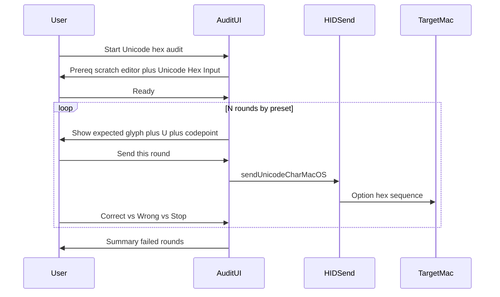

# macOS: Unicode Hex “排查” — preset rounds (穷尽 16 键)

## Product intent

- Validate **Unicode via Option+hex on the target Mac** using a **small fixed list** of `sendUnicodeCharMacOS` calls (each = one U+XXXX, same HID path as production [`HidTextKeystrokeSender.sendUnicodeCharMacOS`](app/src/main/java/com/openterface/keymod/util/HidTextKeystrokeSender.java)).
- User watches the **connected Mac’s** focused text field and confirms the **expected character** each round.
- Offer **two presets** (product can default to one, or show a short chooser):
  - **Preset A — 4 rounds (minimal):** 六 / 西 / 京 / β — fewest confirmations; **CJK** on three rounds may need local fonts (tofu → show U+xxxx in copy).
  - **Preset B — 6 rounds (language-neutral):** symbols below — **not tied to locale** for reading the *expected* character name; glyphs are widely available in common Latin/system fonts (still show U+xxxx for accessibility).
- **Scope:** Both presets’ hex-key unions still **exhaust `0–9` and `a–f`** (16 keys). Does **not** test Option+**G–Z**; optional sweep only if needed.

## Robustness reassessment (“solid” testing)

**What this tool proves (strong)**

- **Same code path as production Unicode send** on macOS: each round is `sendUnicodeCharMacOS` only—no parallel HID implementation to drift out of sync.
- **Complete coverage of Unicode Hex Input’s symbol set:** for each preset, the union of characters in `%04x` across all rounds equals **`0123456789abcdef`** (unit-testable). Any failure to produce the expected glyph after a round implies at least one **Option+hex key** in that round’s sequence did not behave as hex entry (hijack, wrong IME, focus loss, or transport issue).
- **Preset B additionally stresses leading zeros** (`00d7`, `00a9`, `00bf`), a common edge case for “will my four-digit entry behave when the code point is BMP low page?”.

**What it does not prove (document in UI / support)**

- **Non-hex Option keys (G–Z, punctuation)** still may hijack shortcuts in other layouts; this audit is **not** a full Mac keyboard shortcut matrix.
- **End-to-end reliability under faults:** USB drop, sleep, or app backgrounding mid-sequence—mitigate with **connection check** before each send (reuse the same gate as compose send), **cancel**, and clear error copy.
- **User observation errors:** mitigate with large **expected glyph + U+xxxx**, optional **Retry** on a round, and **Preset B** as the default recommendation for fewer font/locale surprises (Preset A remains for minimal taps where CJK fonts exist).

**Hardening checklist (spec)**

- Prereq copy: **scratch document**, **Unicode Hex Input** selected, **caret in the target field**; warn against Mail/IDE production buffers.
- Before first HID: verify **connected** + **target OS is macos** (hide audit entry otherwise).
- Per round: **Send** is explicit (no auto-fire on dialog open).
- On failure: log **preset id, round index, code point**; offer **Retry** and **Copy report**.
- Optional: after a failed round, suggest **new line or clear** if the Mac buffer might have absorbed partial input (rare with standard Unicode Hex commit; keep as troubleshooting bullet).

**Default preset (product):** Prefer **Preset B** as the default first-run experience for **solid, language-neutral** verification; offer **Preset A** as “Fewer steps (CJK glyphs)” in the audit chooser.

## Entry point: “Unicode entry on the target” dialog

The string [`compose_send_warning_unicode_info_title`](app/src/main/res/values/strings.xml) (“Unicode entry on the target”) is the **title** of a **nested** `MaterialAlertDialog` created when the user taps the Unicode **(i)** control in [`ComposeSendWarningDialog`](app/src/main/java/com/openterface/keymod/util/ComposeSendWarningDialog.java) (see `unicodeInfoButton.setOnClickListener`, today only `setPositiveButton(android.R.string.ok, null)`).

**Required UX**

- Add a **second action beside OK** on that same dialog: e.g. **Test Unicode hex path** (final string TBD / l10n).
- **Layout:** use `MaterialAlertDialogBuilder.setNeutralButton` (or `setNegativeButton` per platform button order) **in addition to** `setPositiveButton(OK)` so OK remains dismiss; the new button **starts the audit flow** (dismiss the info dialog first, then show `BottomSheet` / `DialogFragment` for the N-round wizard). If Material stacks buttons vertically on small phones, both still appear on this **same** info surface—acceptable; avoid moving entry only to the tabbed page unless we duplicate the title.
- **Visibility:** show the audit button **only when `targetOs` is `macos`** (same `targetOsForHint` already used for `unicodeHostSetupHint`). For Windows/Linux/other, **omit** the button (or show disabled + short reason)—audit HID is macOS-specific.
- **Wiring:** mirror existing compose patterns: caller supplies a runnable/callback with access to `ConnectionManager` if the dialog cannot reach it directly (extend `show(...)` overloads similarly to `onSendWithUnicodeHostEntry`).

## Preset B — six symbol rounds (与语言无关)

Implementation uses lowercase `%04x` strings: `2318`, `23ce`, `00d7`, `00a9`, `2465`, `00bf`.

| 轮次 | 输入 (hex) | 输出 (期望) | Code point | 说明 |
| -- | -- | -- | -- | -- |
| 1 | `2318` | ⌘ | U+2318 | PLACE OF INTEREST SIGN（常见显示为「⌘」形符号） |
| 2 | `23ce` | ⏎ | U+23CE | RETURN SYMBOL |
| 3 | `00d7` | × | U+00D7 | MULTIPLICATION SIGN |
| 4 | `00a9` | © | U+00A9 | COPYRIGHT SIGN |
| 5 | `2465` | ⑥ | U+2465 | CIRCLED DIGIT SIX |
| 6 | `00bf` | ¿ | U+00BF | INVERTED QUESTION MARK |

**Tradeoff:** **6** user confirmations after ready (vs **4** for Preset A), in exchange for **locale-neutral** expected glyphs and generally **better out-of-the-box rendering** than CJK for global users.

### Preset B — 穷尽说明 (coverage proof)

Union of hex characters across `2318`, `23ce`, `00d7`, `00a9`, `2465`, `00bf`:

- Digits **0–9:** 0 (`00d7`, `00a9`, `00bf`), 1 (`2318`), 2 (`2318`, `23ce`, `2465`), 3 (`2318`, `23ce`), 4 (`2465`), 5 (`2465`), 6 (`2465`), 7 (`00d7`), 8 (`2318`), 9 (`00a9`).
- Letters **a–f:** a (`00a9`), b (`00bf`), c (`23ce`), d (`00d7`), e (`23ce`), f (`00bf`).

So Preset B also **fully exercises** the same **16** Unicode-hex keys; only the **number of rounds** differs from Preset A.

## Preset A — four rounds (最少轮次)

Implementation uses **code points** (formatter emits **lowercase** `%04x`, e.g. `516d`, `897f`, `4eac`, `03b2`).

| 轮次 | 输入 (hex) | 输出 (期望) | Code point | Option+键序列 (与 `%04x` 一致) |
| -- | -- | -- | -- | -- |
| 1 | `516d` | 六 | U+516D | `5` `1` `6` `d` |
| 2 | `897f` | 西 | U+897F | `8` `9` `7` `f` |
| 3 | `4eac` | 京 | U+4EAC | `4` `e` `a` `c` |
| 4 | `03b2` | β | U+03B2 | `0` `3` `b` `2` |

## Preset A — 穷尽说明 (coverage proof)

Union of all **hex digits** typed across the four sends (read as lowercase hex strings):

- From round 1: `5,1,6,d`
- From round 2: `8,9,7,f`
- From round 3: `4,e,a,c`
- From round 4: `0,3,b,2`

**Digits `0–9`:** 0,1,2,3,4,5,6,7,8,9 — each appears at least once.  
**Letters `a–f`:** a,b,c,d,e,f — each appears at least once.

So **16 keys** used in Unicode Hex Input are fully exercised in **4 user confirmations** (plus one “ready” gate).  
(If you list digits alone as “0 1 3 4 5 6 8 9”, note that **2** and **7** are covered in rounds **2** and **4**—the full set is still all ten digits.)

## Reality check (engineering)

- **No auto-detection:** pass/fail is **user-judged** on the Mac screen.
- **Prerequisite (mandatory in copy):** TextEdit (or similar) **plain** scratch document, input source **Unicode Hex Input**, window focused—same as before. Wrong input source → wrong result; copy should say this is **misconfiguration**, not necessarily “Unicode send broken”.
- **Font / CJK (Preset A):** 六、西、京 need CJK fonts; β is common. If tofu appears, UI can show **U+516D** etc. for comparison via Character Viewer.
- **Preset B:** ⑥ (enclosed alphanumerics) and ⌘-like U+2318 can still vary by font; keep **U+xxxx** on screen next to the glyph hint.
- **Built-in vs hijack:** If a round fails (wrong app, no character, beep), record **which round** and optionally **which key in the sequence** after narrowing with **Retry** or a **single-key fallback** for that round only.

## HID / transport design

- Each round: **`sendUnicodeCharMacOS(codePoint, connectionManager)`** for the active preset’s `int[]` only—**no second HID path**.
- **Delays / cancel:** same as broader audit plan (background thread, `AtomicBoolean`, dwell between sub-reports if needed).

## UX: guided flow

- Buttons per round: **Send**, **Looks correct**, **Wrong / nothing**, **Stop audit**.
- **Report:** e.g. `Failed: round 2 (U+897F, 西)` or `Failed: round 3 (U+00D7, ×)` + Keyboard Shortcuts reminder.

## Optional: outside the 16 hex keys

- If we must detect **Option+Q** etc. when **not** in hex mode, keep a **separate optional** “US layout Option sweep” or G–Z list—**out of default v1** now that the default audit is **preset-based (4 or 6 rounds)** on the 16 hex keys.

## Code touchpoints

| Area | Responsibility |
|------|------------------|
| Small **`MacUnicodeHexAudit`** (or similar) | Two presets: `int[]` A and B, labels per code point, `sendUnicodeCharMacOS`, cancel |
| **UI host** | Prereq, preset choice (or default), N steps, summary |
| **[`ComposeSendWarningDialog`](app/src/main/java/com/openterface/keymod/util/ComposeSendWarningDialog.java)** | Unicode **(i)** nested dialog: **OK + Test** buttons; `targetOs == macos` gating; callback into audit host |
| **Caller(s) of `ComposeSendWarningDialog.show`** | Pass audit-start callback + `ConnectionManager` / activity scope as needed |
| **Strings / l10n** | Round titles, expected characters, prerequisites |

## Tests

- **Unit:** Parameterized over **Preset A** and **Preset B** code-point arrays: expand `String.format(Locale.ROOT, "%04x", cp)` per element and assert the **character union** equals all of `0123456789abcdef`.
- **Unit:** Array lengths **4** and **6**; spot-check first/last code points per preset.

## Out of scope (default)

- Auto-reading macOS shortcut tables.
- **Default** audit does **not** require Option+**QWERTY…** non-hex keys; optional extension only. **Preset** choice trades **4 vs 6** rounds for CJK-minimal vs locale-neutral symbols.

## Success criteria

- User discovers the tool from **Unicode entry on the target** without leaving that help context: **second button beside OK** on the nested info dialog (**macOS only**).
- After **prereq + N rounds** (N=4 or 6 by preset), user has either **confirmed** full **0–9 / a–f** Unicode hex path or a **short report** of which round failed.
- Copy distinguishes **wrong input source / font** from **likely hijack or HID failure**.
- **Unit tests** lock **coverage invariants** for both presets; manual QA once on real Mac + Unicode Hex Input.
