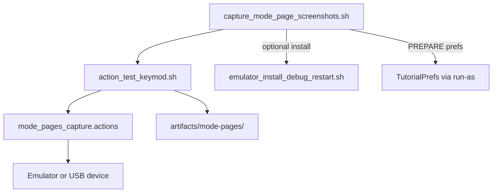

# Automated mode-page screenshot capture

## Context

The testing repo already has the right building blocks:

- [`Openterface_KeyCmd_Android_testing/scripts/action_test_keymod.sh`](Openterface_KeyCmd_Android_testing/scripts/action_test_keymod.sh) — adb runner with `ORIENTATION`, `SCREENSHOT`, `TAP_REL`, `WAIT`, logcat, artifact dirs.
- [`Openterface_KeyCmd_Android_testing/scripts/capture_readme_i18n_screenshots.sh`](Openterface_KeyCmd_Android_testing/scripts/capture_readme_i18n_screenshots.sh) — wrapper pattern (install → run action file → output under `artifacts/`).
- [`Openterface_KeyCmd_Android_testing/scripts/actions/readme_i18n_capture.actions`](Openterface_KeyCmd_Android_testing/scripts/actions/readme_i18n_capture.actions) — example Welcome + KM flows using fractional taps.

App behavior that shapes the flow:

| Screen | How to reach it | Orientation notes |
|--------|-----------------|-------------------|
| Welcome | `LaunchPanelActivity` with `show_panel=true` bypasses “remember choice” auto-skip ([`LaunchPanelActivity.java`](Openterface_KeyCmd_Android/app/src/main/java/com/openterface/keymod/LaunchPanelActivity.java) L85–92) | `fullSensor`; lock via adb `user_rotation` |
| KM Basic Keyboard | `MainActivity` + `launch_mode=keyboard_mouse` + `kb_mouse_initial_submode=keyboard` | App forces **landscape** in keyboard submode ([`KeyboardMouseFragment.java`](Openterface_KeyCmd_Android/app/src/main/java/com/openterface/fragment/KeyboardMouseFragment.java) L244–246) |
| KM Basic Touchpad | same with `touchpad` | App **locks portrait** (ignores landscape lock) |
| KM Basic NumPad | same with `numpad` | `FULL_SENSOR` — landscape works |

Intent extras (already used by the app):

- `show_panel` (boolean) on Welcome
- `launch_mode` = `keyboard_mouse`
- `kb_mouse_initial_submode` = `keyboard` | `touchpad` | `numpad` ([`KeyboardMouseFragment.EXTRA_INITIAL_SUBMODE`](Openterface_KeyCmd_Android/app/src/main/java/com/openterface/fragment/KeyboardMouseFragment.java))

`MainActivity` is `android:exported="false"` in [`AndroidManifest.xml`](Openterface_KeyCmd_Android/app/src/main/AndroidManifest.xml). On **debug emulator images**, `adb shell am start -n com.openterface.keymod/.MainActivity ...` usually still works (shell `START_ANY_ACTIVITY`). If it fails on a physical retail device, the action file will fall back to Welcome → tap **Start** (same heuristic as readme capture: `TAP_REL 0.5 0.88`) plus tab taps for submodes.



## Deliverables

### 1. Extend `action_test_keymod.sh` (small, reusable)

Add helper functions and three new action verbs (document in header comment):

| Command | Behavior |
|---------|----------|
| `LAUNCH_WELCOME` | `force-stop` → `am start -n …LaunchPanelActivity --ez show_panel true` |
| `LAUNCH_KM_BASIC keyboard\|touchpad\|numpad` | `force-stop` → `am start -n …MainActivity --es launch_mode keyboard_mouse --es kb_mouse_initial_submode <submode>`; on failure (optional env `ACTION_TEST_KM_USE_TAPS=1`), run tap fallback |
| `PREPARE_CAPTURE` | Debug-only: `run-as com.openterface.keymod` writes `TutorialPrefs.xml` with `tutorial_shown_v2=true` so first-run overlay does not cover screenshots; optional `LaunchPanelPrefs` `rememberChoice=false` for cleaner Welcome |

Also fix the default sibling path typo while touching the file:

- `Openterface_KeyMod_Android` → `Openterface_KeyCmd_Android` (matches real repo name; same fix in [`capture_readme_i18n_screenshots.sh`](Openterface_KeyCmd_Android_testing/scripts/capture_readme_i18n_screenshots.sh) install script reference: use existing [`emulator_install_debug_restart.sh`](Openterface_KeyCmd_Android/scripts/emulator_install_debug_restart.sh) instead of non-existent `keymod_install_debug_restart.sh`).

### 2. New action file: `scripts/actions/mode_pages_capture.actions`

Six shots with stable filenames (your list):

```text
# 1 Welcome portrait
ORIENTATION portrait
LAUNCH_WELCOME
WAIT 2
SCREENSHOT 01-welcome-portrait

# 2 Welcome landscape
ORIENTATION landscape
LAUNCH_WELCOME
WAIT 2
SCREENSHOT 02-welcome-landscape

# 3 KM Basic Keyboard landscape (app may auto-rotate)
ORIENTATION landscape
LAUNCH_KM_BASIC keyboard
WAIT 2.5
SCREENSHOT 03-km-basic-keyboard-landscape

# 4 KM Basic Touchpad portrait
ORIENTATION portrait
LAUNCH_KM_BASIC touchpad
WAIT 2.5
SCREENSHOT 04-km-basic-touchpad-portrait

# 5 KM Basic NumPad portrait
ORIENTATION portrait
LAUNCH_KM_BASIC numpad
WAIT 2.5
SCREENSHOT 05-km-basic-numpad-portrait

# 6 KM Basic NumPad landscape
ORIENTATION landscape
LAUNCH_KM_BASIC numpad
WAIT 2.5
SCREENSHOT 06-km-basic-numpad-landscape
```

Comment block at top: re-tune `TAP_REL` fallbacks if `LAUNCH_KM_BASIC` fails; record tabs with [`record_emulator_actions.py`](Openterface_KeyCmd_Android_testing/scripts/record_emulator_actions.py) per [`BEHAVIOR_RECORDING.md`](Openterface_KeyCmd_Android_testing/scripts/BEHAVIOR_RECORDING.md).

### 3. New wrapper: `scripts/capture_mode_page_screenshots.sh`

Mirror [`capture_readme_i18n_screenshots.sh`](Openterface_KeyCmd_Android_testing/scripts/capture_readme_i18n_screenshots.sh):

- **Usage:** `./scripts/capture_mode_page_screenshots.sh [device_serial]`
- **Options:** `--skip-install`, `-h`
- **Default serial:** `emulator-5554` (override for phone)
- **Install:** call `KEYMOD_APP_REPO/scripts/emulator_install_debug_restart.sh` unless `--skip-install`
- **Prep:** `PREPARE_CAPTURE` via runner or inline once before action file
- **Run:** `ACTION_TEST_SKIP_INITIAL_LAUNCH=1`, `ACTION_TEST_ARTIFACT_ROOT=$ROOT_DIR/artifacts/mode-pages/<timestamp>`, `ACTION_TEST_VERBOSE=1`
- **Print** artifact path and file list on success

No locale loop (unlike readme i18n) — single English pass unless you later add a `--locales` flag.

### 4. Optional short doc snippet

Add a “Mode page screenshots” section to [`BEHAVIOR_RECORDING.md`](Openterface_KeyCmd_Android_testing/scripts/BEHAVIOR_RECORDING.md) with one copy-paste command block (keeps discovery next to existing automation docs).

## Usage (after implementation)

```bash
cd Openterface_KeyCmd_Android_testing
./scripts/capture_mode_page_screenshots.sh emulator-5554
# or quick replay without reinstall:
./scripts/capture_mode_page_screenshots.sh --skip-install emulator-5554
```

Manual replay:

```bash
export ACTION_TEST_SKIP_INITIAL_LAUNCH=1
export ACTION_TEST_ARTIFACT_ROOT=/tmp/mode-pages
./scripts/action_test_keymod.sh run scripts/actions/mode_pages_capture.actions emulator-5554
```

## Risks and mitigations

| Risk | Mitigation |
|------|------------|
| `am start` to non-exported `MainActivity` fails | Document `ACTION_TEST_KM_USE_TAPS=1`; tap Start + submode tabs (record once on your resolution) |
| Tutorial / mode-guide overlay | `PREPARE_CAPTURE` + extra `WAIT`; optional single `TAP_REL` on Skip if pref write fails |
| Keyboard submode fights portrait `ORIENTATION` | Expect auto-landscape; screenshot after `WAIT 2.5` |
| Touchpad ignores landscape | Shot #4 uses portrait only (matches product behavior) |
| Emulator resolution ≠ phone | Re-record tab/Start taps with `record_emulator_actions.py --emit-rel` |

## Out of scope (unless you ask later)

- Espresso/UI Automator (resource-id based; more stable across devices)
- Debug manifest `exported=true` for `MainActivity` (only if shell launch proves unreliable on your phone)
- JPEG conversion / copying into app `demo/` folders (can mirror readme script’s `sips` step if needed)
