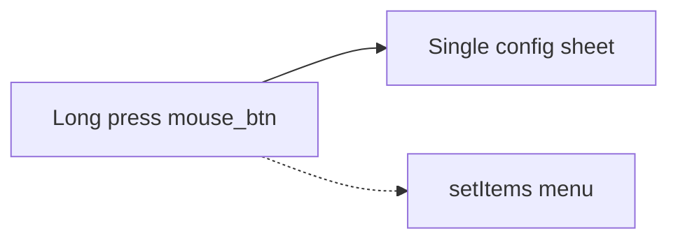

# Unify mouse button long-press into one config sheet

## Problem

[`showLongPressMenu`](Openterface_KeyMod_Android/app/src/main/java/com/openterface/fragment/GamepadFragment.java) adds list entries for `gamepad_menu_mouse_btn_module_size`, optional `gamepad_menu_touchpad_mouse_btn_size`, Duplicate, and Remove, then shows **`setItems`** — the screenshot menu. Choosing "Button size…" calls [`showMouseButtonModuleSizeDialog`](Openterface_KeyMod_Android/app/src/main/java/com/openterface/fragment/GamepadFragment.java), which is already a proper sheet but is a **second step** and uses [`appendGamepadModuleSheetFooter`](Openterface_KeyMod_Android/app/src/main/java/com/openterface/fragment/GamepadFragment.java) with **`onDuplicate = null`**, so Duplicate only exists in the list.

Touchpad long-press is separate (`componentId` is a touchpad module); it can keep offering **All touchpad mouse buttons size…** via [`showTouchpadMouseButtonsLayoutSizeDialog`](Openterface_KeyMod_Android/app/src/main/java/com/openterface/fragment/GamepadFragment.java) unchanged.

## Approach

1. **Early exit in `showLongPressMenu`**  
   After `moduleId` / `componentName` / `hasKeyMapping` are computed (same place as today), if [`mouseButtonForComponentId(componentId)`](Openterface_KeyMod_Android/app/src/main/java/com/openterface/fragment/GamepadFragment.java) is non-null, call a single method (e.g. `showMouseButtonModuleConfigSheet(componentId)`) and **return** — do not add the mouse-related strings to `opts` or show the list for that case.

2. **Extend the existing mouse sheet implementation**  
   Refactor `showMouseButtonModuleSizeDialog` into `showMouseButtonModuleConfigSheet` (or keep the old name as a thin wrapper):

   - **Title**: use [`R.string.gamepad_component_mouse_button`](Openterface_KeyMod_Android/app/src/main/res/values/strings.xml) ("Mouse button") so it matches the current list title tone; keep section copy for size from existing strings (`gamepad_mouse_btn_size_pct`, etc.).
   - **Body** (unchanged blocks): module id, name, color, per-module scale `SeekBar`, hold-lock `MaterialSwitch`.
   - **When** [`GamepadLayoutDocEditor.hasTouchpad(layoutDoc)`](Openterface_KeyMod_Android/app/src/main/java/com/openterface/keymod/gamepad/GamepadLayoutDocEditor.java): add a second section (section `TextAppearance` + `SeekBar`) bound to `layoutDoc.layout.touchpadMouseButtonScale`, mirroring the logic in `showTouchpadMouseButtonsLayoutSizeDialog` (progress `+ 50` / 100f, max 150, default 1.0f).
   - **Footer**: [`appendGamepadModuleSheetFooter`](Openterface_KeyMod_Android/app/src/main/java/com/openterface/fragment/GamepadFragment.java) with `moduleIdForRemove = m.id`, **`onDuplicate`** = non-null when [`GamepadLayoutDocEditor.canDuplicateModule(m.id, layoutDoc)`](Openterface_KeyMod_Android/app/src/main/java/com/openterface/keymod/gamepad/GamepadLayoutDocEditor.java) (same lambda pattern as touchpad resize: commit edits then `applyGamepadModuleDuplicateResult(duplicateModule(...), dialog)`).
   - **Reset**: extend current reset to also reset `touchpadMouseButtonScale` and the global seek’s progress when that section is present; then `syncGamepadViewFromDoc()`.
   - **Done**: commit name, `m.scale`, `m.keyboardHoldLock`, and if the global seek exists, `layoutDoc.layout.touchpadMouseButtonScale`; then `applyLayoutDocFromMemory()` and dismiss.

3. **Cleanup `handleLongPressMenuChoice`**  
   Remove the `gamepad_menu_mouse_btn_module_size` branch (or leave it as dead code — prefer removal since nothing will emit that choice after step 1). Keep `gamepad_menu_touchpad_mouse_btn_size` for touchpad long-press.

4. **Strings**  
   Reuse existing `gamepad_touchpad_mouse_btn_size_title` / `gamepad_mouse_btn_size_pct` for the inlined global row; only add a new string if a clearer subsection label is needed.

## Files to touch

- [`Openterface_KeyMod_Android/app/src/main/java/com/openterface/fragment/GamepadFragment.java`](Openterface_KeyMod_Android/app/src/main/java/com/openterface/fragment/GamepadFragment.java) — `showLongPressMenu`, mouse sheet method, `handleLongPressMenuChoice`.

## Verification

- Long-press a touchpad L/M/R mouse control: one dialog with size sliders (two when a touchpad module exists), hold lock, Remove / Reset / Duplicate (when allowed) / Done — no intermediate list.
- Long-press touchpad surface: still shows touchpad menu including standalone "All touchpad mouse buttons size…" if desired.
- Duplicate and Remove behave like other module sheets (`confirmRemoveGamepadModule` with parent dialog).
