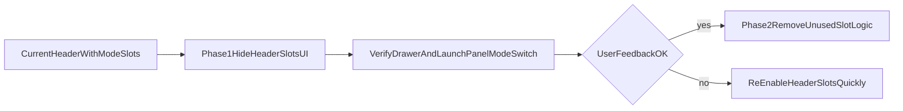

# Remove Header Mode Buttons Analysis

## What Exists Today
- The three buttons are header slots in [`/Users/billywang/project/openterface/Openterface_KeyMod_Android/app/src/main/res/layout/activity_main.xml`](/Users/billywang/project/openterface/Openterface_KeyMod_Android/app/src/main/res/layout/activity_main.xml) (`header_mode_slot_1/2/3`).
- Their default mapping (KM Basic, Presentation, Gamepad) and user-remapping behavior are controlled by [`/Users/billywang/project/openterface/Openterface_KeyMod_Android/app/src/main/java/com/openterface/keymod/util/TopModeShortcutPrefs.java`](/Users/billywang/project/openterface/Openterface_KeyMod_Android/app/src/main/java/com/openterface/keymod/util/TopModeShortcutPrefs.java).
- Main click handling and UI refresh are in [`/Users/billywang/project/openterface/Openterface_KeyMod_Android/app/src/main/java/com/openterface/keymod/MainActivity.java`](/Users/billywang/project/openterface/Openterface_KeyMod_Android/app/src/main/java/com/openterface/keymod/MainActivity.java) (`setupHeaderModeSlotButtons`, `onHeaderModeSlotClicked`, `refreshHeaderModeSlotButtons*`).
- The hamburger/drawer still contains mode navigation entries in [`/Users/billywang/project/openterface/Openterface_KeyMod_Android/app/src/main/res/layout/nav_menu.xml`](/Users/billywang/project/openterface/Openterface_KeyMod_Android/app/src/main/res/layout/nav_menu.xml).

## Product Impact (If Removed)
- **Pros**
  - Reduces header crowding and visual complexity near the hamburger cluster.
  - Removes duplicated navigation (same destinations already available via drawer and launch panel).
  - Simplifies mental model if users should switch modes from one canonical place (drawer).
- **Cons**
  - Loses one-tap cross-mode switching when header is visible (especially in KM Pro/Presentation contexts).
  - Hides a power-user feature: long-press remapping of top slots.
  - May reduce discoverability of non-default modes unless drawer labels remain prominent.

## Technical Risk Assessment
- **Low risk** if scope is strictly header buttons only:
  - `MainActivity.handleLaunchMode(...)` and fragment routing remain intact.
  - Drawer mode entries and launch-panel entry points continue to work.
- **Medium UX risk**:
  - Existing users accustomed to quick switching may feel friction (extra tap via hamburger).
- **Low regression risk** for persistence:
  - Old `TopModeShortcutPrefs` values can remain unused without functional breakage.

## Recommended Direction
- Remove only the header slot UI first (do not touch mode routing logic).
- Keep all drawer mode entries unchanged as the primary switch mechanism.
- Keep `switchToLaunchMode(...)` and existing `handleLaunchMode(...)` flows untouched to avoid behavioral regressions.
- Optionally retain slot-pref code temporarily for rollback safety, then clean up in a second pass once UX is validated.

## Safe Rollout Strategy

## Validation Checklist (Post-change)
- Confirm all drawer entries still open correct fragments (KM Basic, Presentation, Gamepad, others).
- Confirm app startup `launch_mode` intents still route correctly.
- Confirm no header layout overflow/regression in portrait and landscape.
- Confirm no accessibility regression in top app bar content descriptions.

## Decision
- This is a reasonable simplification and technically safe **if implemented as a UI-only removal first** with existing routing kept intact.