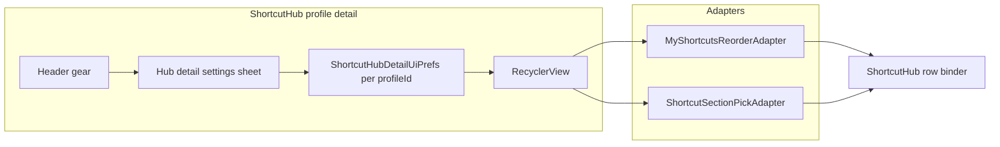

# Shortcut Hub: card view and Hub display settings

## Current behavior (baseline)

- Profile detail in [ShortcutHubFragment.java](file:///Users/billywang/project/openterface/Openterface_KeyMod_Android/app/src/main/java/com/openterface/fragment/ShortcutHubFragment.java) switches between `my_shortcuts_recycler` (Favorites + drag reorder via [MyShortcutsReorderAdapter.java](file:///Users/billywang/project/openterface/Openterface_KeyMod_Android/app/src/main/java/com/openterface/keymod/MyShortcutsReorderAdapter.java)) and `browse_shortcuts_recycler` (categories / flat catalog via [ShortcutSectionPickAdapter.java](file:///Users/billywang/project/openterface/Openterface_KeyMod_Android/app/src/main/java/com/openterface/keymod/ShortcutSectionPickAdapter.java)). Both use [ShortcutFavoriteRowViews.bindFavoriteStripRow](file:///Users/billywang/project/openterface/Openterface_KeyMod_Android/app/src/main/java/com/openterface/keymod/util/ShortcutFavoriteRowViews.java) on [dialog_row_top_strip_favorite_compact.xml](file:///Users/billywang/project/openterface/Openterface_KeyMod_Android/app/src/main/res/layout/dialog_row_top_strip_favorite_compact.xml), which always shows **name + chord** at 14sp / 12sp—**independent** of row-1 strip [TopShortcutDisplayModePrefs](file:///Users/billywang/project/openterface/Openterface_KeyMod_Android/app/src/main/java/com/openterface/keymod/prefs/TopShortcutDisplayModePrefs.java) (those prefs are wired in [KmProSettingsFragment.java](file:///Users/billywang/project/openterface/Openterface_KeyMod_Android/app/src/main/java/com/openterface/fragment/KmProSettingsFragment.java) and [fragment_km_pro_settings.xml](file:///Users/billywang/project/openterface/Openterface_KeyMod_Android/app/src/main/res/layout/fragment_km_pro_settings.xml)).

## Product decisions (encoded in the plan)

- **Per-profile layout and display**: Persist by `ShortcutProfile.id` so KiCAD can stay in card + hybrid while Default stays list + name/chord. Use the same `ShortcutProfiles_v2` SharedPreferences file as [ShortcutProfileManager](file:///Users/billywang/project/openterface/Openterface_KeyMod_Android/app/src/main/java/com/openterface/keymod/ShortcutProfileManager.java) with stable string keys (e.g. `hub_detail_layout_<profileId>`, `hub_detail_display_<profileId>`), **not** new Gson fields on `ShortcutProfile`, to avoid import/export and migration churn.
- **Hub vs strip**: Hub display mode affects **only** Shortcut Hub profile detail lists/cards. Strip continues to use `TopShortcutDisplayModePrefs` (avoids surprising users who cycle DISPLAY on the keyboard). Optional later: a single “Match strip DISPLAY” checkbox in Hub settings.
- **Hybrid**: Fourth mode for Hub only: **if** the shortcut has a usable icon (drawable id or emoji per existing [ShortcutFavoriteRowViews.resolveShortcutIconRes](file:///Users/billywang/project/openterface/Openterface_KeyMod_Android/app/src/main/java/com/openterface/keymod/util/ShortcutFavoriteRowViews.java) / `isEmojiIcon`), treat **icon as primary**; **else** show **chord** as primary (better for “no icon” work panels) with **name** as a smaller secondary line (or the inverse if you prefer name-first—pick one and keep it consistent in implementation).

## UX and UI

1. **Header gear** on the profile detail chrome in [fragment_shortcut_hub.xml](file:///Users/billywang/project/openterface/Openterface_KeyMod_Android/app/src/main/res/layout/fragment_shortcut_hub.xml) (same row as Back / Reset / Add), opening a **Hub detail settings** surface:
   - **Layout**: `MaterialButtonToggleGroup` — **List** (current) vs **Card** (work mode).
   - **Display**: same three-way pattern as KM Pro (**Name / Icon / Chord**) **plus** **Hybrid**, with short summary text mirroring [km_pro_settings_section_strip_display_summary](file:///Users/billywang/project/openterface/Openterface_KeyMod_Android/app/src/main/res/values/strings.xml) but scoped to “this profile in Shortcut Hub”.
   - Implementation style: prefer a **ModalBottomSheet** or small **DialogFragment** (reuses Material toggles, matches “gear opens setup” without a second full-screen stack). Close saves prefs and calls `refreshShortcutsGrid()` + adapter `notifyDataSetChanged()`.

2. **List mode (default)**: Keep current behavior—dense rows, drag handles, bookmark/edit/remove unchanged—best for browsing and editing.

3. **Card mode**:
   - New row layout(s), e.g. `item_shortcut_hub_card.xml` (and optionally a wrapper row that still hosts bookmark/edit/drag like today).
   - **Larger typography** (e.g. primary 18–20sp, secondary 13–14sp) and comfortable vertical padding / min touch height (~64dp+).
   - **RecyclerView**: `GridLayoutManager` with **span 2** on normal phones; optionally **span 3** when `smallestScreenWidthDp >= 600` for tablet / side-by-side. Same `ItemTouchHelper` reorder path as today for Favorites and category tabs (verify `SimpleCallback` with `LEFT|RIGHT` if horizontal reorder is needed—typically vertical-only is enough for grid with column-major order).
   - **Controls in card mode**: Keep bookmark / edit / drag-handle but tune placement (e.g. top-right stack or overlay) so cards stay visually clean.

4. **Binding logic**: Add something like `ShortcutFavoriteRowViews.bindHubRow(View row, Shortcut s, String targetOs, int hubDisplayMode, boolean isCardLayout)` (or a dedicated `ShortcutHubRowBinder`) that sets visibility/text sizes for primary vs secondary according to mode:
   - **NAME**: name prominent, chord secondary (or hidden if clutter).
   - **ICON**: large centered icon/emoji; name or chord as small caption (if no icon, same fallback as hybrid).
   - **CHORD**: chord prominent, name secondary.
   - **HYBRID**: rule above.

   Keep existing `bindFavoriteStripRow` for strip/catalog compact rows to avoid regressions in [StripCatalogGridAdapter](file:///Users/billywang/project/openterface/Openterface_KeyMod_Android/app/src/main/java/com/openterface/keymod/preset/StripCatalogGridAdapter.java) and bottom sheets.

5. **Adapters**: Extend [MyShortcutsReorderAdapter](file:///Users/billywang/project/openterface/Openterface_KeyMod_Android/app/src/main/java/com/openterface/keymod/MyShortcutsReorderAdapter.java) and [ShortcutSectionPickAdapter](file:///Users/billywang/project/openterface/Openterface_KeyMod_Android/app/src/main/java/com/openterface/keymod/ShortcutSectionPickAdapter.java) with `setHubLayoutMode` / `setHubDisplayMode` (or pass through constructor + setters) so `onCreateViewHolder` inflates list vs card layout and `onBindViewHolder` calls the new binder. [ShortcutHubFragment.refreshShortcutsGrid](file:///Users/billywang/project/openterface/Openterface_KeyMod_Android/app/src/main/java/com/openterface/fragment/ShortcutHubFragment.java) already centralizes visibility and `ItemTouchHelper` attachment—after prefs change, **swap `LayoutManager`** (Linear vs Grid), update adapter mode, `notifyDataSetChanged()`.

## New types / prefs helper

- New class e.g. `com.openterface.keymod.prefs.ShortcutHubDetailUiPrefs` with:
  - `LAYOUT_LIST` / `LAYOUT_CARD`
  - `DISPLAY_NAME`, `DISPLAY_ICON`, `DISPLAY_CHORD`, `DISPLAY_HYBRID` (ints + clamp)
  - `readLayout(Context, profileId)` / `writeLayout`, `readDisplay`, `writeDisplay`
- Defaults: **list** + **hybrid** or **name** (product call: default **list + name** preserves current visual density closest to today’s always-name+chord row).

## Strings and accessibility

- Add strings in [strings.xml](file:///Users/billywang/project/openterface/Openterface_KeyMod_Android/app/src/main/res/values/strings.xml) (title, section headers, mode labels, summaries, gear CD) and mirror key entries in [values-b+zh+Hant/strings.xml](file:///Users/billywang/project/openterface/Openterface_KeyMod_Android/app/src/main/res/values-b+zh+Hant/strings.xml) for parity with existing Shortcut Hub entries.
- Card tap/long-press behavior stays aligned with current `RowInteraction` (run shortcut / action menu).

## Testing checklist (manual)

- Per-profile: set KiCAD card + hybrid, Default list—switch profiles and confirm persistence.
- Favorites: reorder in list and card; run shortcut; remove favorite; edit from card.
- Category browse: bookmark add/remove; category reorder drag when enabled; flat profile (no categories) path.
- Rotation / multi-window: grid span updates if implemented via configuration.

## Optional follow-ups (out of initial scope)

- Apply the same layout/display prefs to [MyShortcutsReorderBottomSheet](file:///Users/billywang/project/openterface/Openterface_KeyMod_Android/app/src/main/java/com/openterface/keymod/MyShortcutsReorderBottomSheet.java) for consistency.
- Add `MODE_HYBRID` to the physical strip (`CustomKeyboardView` + `TopShortcutDisplayModePrefs`) if you want one global “smart cap” everywhere.

