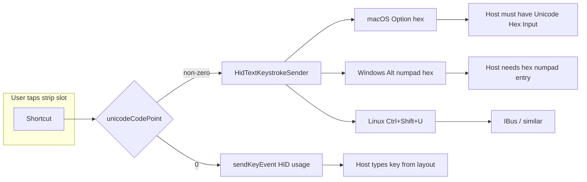

# Rows 2–3 strip profiles: why many “do not work”

## What the code actually does

**Two dispatch paths** (see [ShortcutHubFragment.java](file:///Users/billywang/project/openterface/Openterface_KeyMod_Android/app/src/main/java/com/openterface/fragment/ShortcutHubFragment.java) `executeShortcut` / `executeUnicodeShortcut`, and [CustomKeyboardView.java](file:///Users/billywang/project/openterface/Openterface_KeyMod_Android/app/src/main/java/com/openterface/keymod/CustomKeyboardView.java) around `sendStripUnicodeShortcut`):

1. **`unicodeCodePoint == 0`** — sends `modifiers` + `keyCode` as a normal keyboard HID press/release via `ConnectionManager.sendKeyEvent` (CH9329 keyboard packet).
2. **`unicodeCodePoint != 0`** — ignores `keyCode` for output and runs [HidTextKeystrokeSender.send](file:///Users/billywang/project/openterface/Openterface_KeyMod_Android/app/src/main/java/com/openterface/keymod/util/HidTextKeystrokeSender.java) with `allowUnicode=true`, which for code points `> 0x7E` emits **OS-specific “type this code point” key sequences** using `sendRawHIDReport` (Option+hex on macOS, Alt+numpad+hex on Windows, Ctrl+Shift+U hex Enter on Linux)—**not** a single HID “character”.

So the user’s intuition is half right: **plain HID does not carry arbitrary Unicode**, but the app already works around that for Unicode slots **if** the host is configured for that input method.

## Built-in profile semantics ([Rows23StripProfileBuiltins.java](file:///Users/billywang/project/openterface/Openterface_KeyMod_Android/app/src/main/java/com/openterface/keymod/preset/Rows23StripProfileBuiltins.java))

| Profile | `unicodeCodePoint` | What the host receives |
|--------|-------------------|-------------------------|
| **Symbols** | Always `0` | **Decorative glyphs only**; docstring states factory HID for every slot (e.g. star keycap sends **F7** `0x40`, snowflake digits send **7–0**, etc.). Typed text **will not match** the emoji-like labels. |
| **Math** | Always `0` | Same idea: only **page 0 row 2 base** is aligned (Shift+digits → `!@#$%^&`). Fn row and most other cells send **F-keys / digits / punctuation**, not ∑∫∂√π. |
| **Box & Lines**, **Latin Extended**, **Arrows**, **Currency** | Non-zero on almost all slots | **Unicode hex entry path**; requires correct **Target OS** in app prefs **and** host setup (Unicode Hex Input on macOS, `EnableHexNumpad` on Windows, IBus-style Ctrl+Shift+U on typical Linux). |

The file header at lines 10–17 documents this explicitly.

## Why this feels “broken”

1. **Expectation vs design (Symbols / Math)** — Users assume the glyph is what gets typed; the implementation is a **themed skin** over standard keys. That is intentional but easy to misread.
2. **Unicode profiles without host setup** — If hex input is not enabled (or layout differs), **nothing sensible appears** even though HID traffic is sent.
3. **Wrong Target OS** — `HidTextKeystrokeSender` branches on `target_os` in prefs; wrong OS → wrong chord sequence.
4. **Possible edge case** — Symbols/Math use HID usages **0xE0, 0xE1, 0xE2, 0xE3** for some “modifier” row slots (USB usage page 0x07: left Ctrl / Shift / Alt / GUI). Those are normally carried in the **modifier byte**, not always as standalone key-array usages; behavior may be **host- or firmware-dependent**. Worth validating on a real host if those specific slots misbehave.

## Documentation gap

[docs/USER_GUIDE.md](file:///Users/billywang/project/openterface/Openterface_KeyMod_Android/docs/USER_GUIDE.md) covers the fixed strip and Target OS for **labels** on Page 1, but does **not** explain Shortcut Hub strip built-ins, cosmetic vs Unicode modes, or **required host configuration** for Unicode strip profiles. [docs/KEYBOARD_ALTERNATES.md](file:///Users/billywang/project/openterface/Openterface_KeyMod_Android/docs/KEYBOARD_ALTERNATES.md) already describes the Unicode path for long-press alternates—same mechanism.

## Recommended follow-ups (only if you want product/code changes later)

- **Docs**: Add a “Shortcut Hub → Rows 2–3 strip profiles” subsection: Symbols/Math = skin vs output; Unicode profiles = host hex setup + Target OS.
- **In-app UX**: Short disclaimer when selecting a Unicode-heavy built-in, or a link to help (optional toast or info row in Shortcut Hub).
- **QA**: Manually verify slots using `0xE0`–`0xE3` as keycodes on Windows/macOS/Linux; if unreliable, remap those slots to send modifiers via the modifier bitmask pattern used elsewhere in the app.

No code changes are required to “fix HID support”—the limitation is **by design** plus **host prerequisites** for Unicode slots.

## Practical utility (product reality)

For a **generic “KeyMod as USB keyboard into arbitrary target”** scenario, the assessment “often useless for what the labels promise” is **reasonable**:

- **Symbols / Math** — The device *does* send HID; output is **ordinary keys** (digits, F-keys, etc.), not the decorative glyphs. So for “I need that character on screen,” it is **misleading**, not a transparent symbol keyboard.
- **Box & Lines / Latin / Arrows / Currency** — The device only emits **key chords** that ask the **host OS and IME** to interpret hex entry. On locked-down, minimal, or unknown targets (BIOS, installer, wrong keyboard layout, no hex entry, remote session quirks), **those characters often will not appear** even though the link works.

So: **KeyMod is not failing to “output Unicode over HID”** in the sense of a missing driver; **standard USB HID keyboard class cannot carry arbitrary code points**. The app’s Unicode path is a **best-effort software convention** on the host, not a hardware guarantee. Anything that would feel like “always type exactly this glyph on any target” would require **non–keyboard-class** behavior (e.g. host-side agent, different protocol, or preconfigured hosts)—outside current CH9329 keyboard emulation scope.
