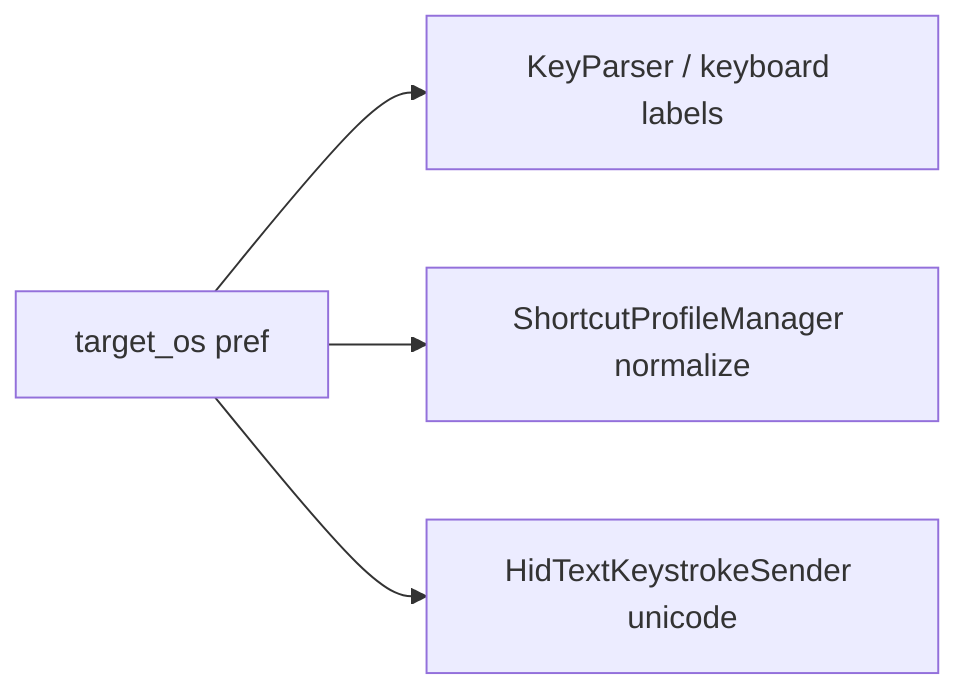
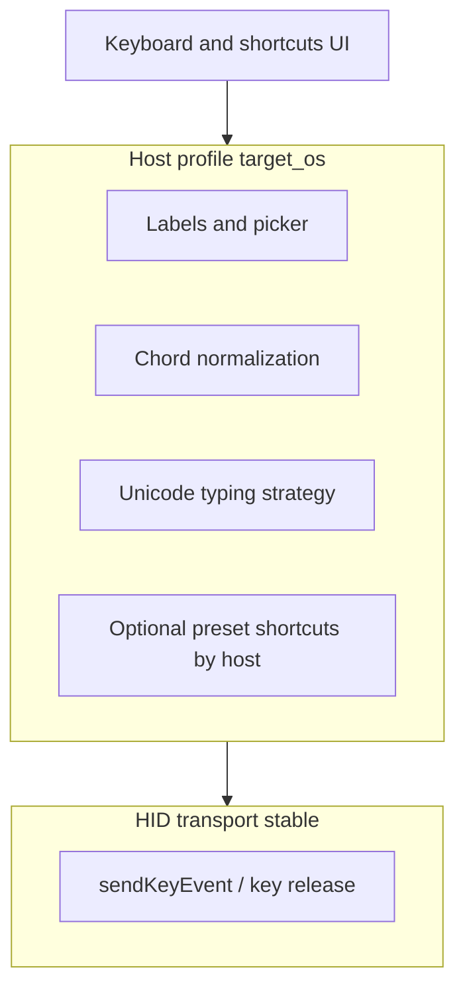

# Target OS: add Android / iOS?

## What Target OS does today

The preference [`target_os`](Openterface_KeyMod_Android/app/src/main/java/com/openterface/keymod/MainActivity.java) is **`macos` | `windows` | `linux`**. It is not “what phone the app runs on”; it is **what computer you are driving over HID**.

It affects:

- **On-screen modifier label** (Cmd vs Win vs Super) in [`CustomKeyboardView.applyTargetOsLabels`](Openterface_KeyMod_Android/app/src/main/java/com/openterface/keymod/CustomKeyboardView.java).
- **Shortcut chord labels** in [`KeyParser.toLabelForTargetOs`](Openterface_KeyMod_Android/app/src/main/java/com/openterface/keymod/util/KeyParser.java) and related display in [`ShortcutFavoriteRowViews`](Openterface_KeyMod_Android/app/src/main/java/com/openterface/keymod/util/ShortcutFavoriteRowViews.java), [`CreateShortcutBottomSheet`](Openterface_KeyMod_Android/app/src/main/java/com/openterface/keymod/CreateShortcutBottomSheet.java), etc.
- **macOS-only modifier normalization** (Ctrl treated like Cmd when alone) in [`ShortcutProfileManager.normalizeModifiersForTargetOs`](Openterface_KeyMod_Android/app/src/main/java/com/openterface/keymod/ShortcutProfileManager.java).
- **Unicode text via HID** (compose / AltGr style) in [`HidTextKeystrokeSender.send`](Openterface_KeyMod_Android/app/src/main/java/com/openterface/keymod/util/HidTextKeystrokeSender.java) — desktop branches only.
- **UI**: header picker [`showTargetOsPickerDialog`](Openterface_KeyMod_Android/app/src/main/java/com/openterface/keymod/MainActivity.java), [`dialog_target_os_picker.xml`](Openterface_KeyMod_Android/app/src/main/res/layout/dialog_target_os_picker.xml), [`VoiceInputFragment`](Openterface_KeyMod_Android/app/src/main/java/com/openterface/fragment/VoiceInputFragment.java) OS buttons, strings in [`values/strings.xml`](Openterface_KeyMod_Android/app/src/main/res/values/strings.xml) and translations.

## HID vs shortcuts: elegant split (mobile target from Android controller)

Your scenario: **controller** = phone running KeyMod; **target** = another mobile device (Android or iOS) connected over the same HID path you use for desktops. Handle it by **not conflating wire format with host UX**.

### Layer 1 — HID transport (mostly unified)

At the USB HID keyboard layer you still send **standard usage codes and modifier bits** (Left Ctrl / Shift / Alt / GUI, etc.). Android and iOS as **USB hosts** generally interpret those like any external keyboard for basics (letters, arrows, Enter, Tab, GUI+key combinations where the OS defines them).

- **Elegance**: one code path in `ConnectionManager` / key send: **same HID packets** regardless of whether the host is Windows or an Android tablet, unless you later discover a host-specific quirk that needs a firmware or timing workaround.
- **Implication**: you do **not** need a separate “HID protocol” per mobile OS for ordinary keys; you need **correct reports**, not a second wire format.

### Layer 2 — Host semantics (where `target_os` belongs)

This is what your current `target_os` already drives: **how the user thinks about keys**, not how electrons differ.

| Concern | Role of target profile |
|--------|-------------------------|
| Modifier chrome (Win / Cmd / Super / Meta) | Label + icon mapping only |
| Shortcut **labels** in UI (`KeyParser`, hub, create-shortcut) | Human-readable chord for that host |
| **Chord deduplication** (`normalizeModifiersForTargetOs`) | e.g. macOS Ctrl vs Cmd equivalence |
| **Unicode / long text** via HID (`HidTextKeystrokeSender`) | Compose / AltGr-style paths are **desktop-shaped**; mobile hosts often need **simpler or different** strategy (e.g. fall back to “ASCII + warn” or “same as Linux” until validated) |

### Layer 3 — Shortcuts (saved chords vs OS conventions)

- **User-defined shortcuts** (HID key + modifiers you store): already **host-agnostic at send time**; they are “whatever the target OS does with that chord.” The target profile affects **collision rules** and **display**, not the raw HID tuple.
- **Built-in / suggested shortcuts** (if you ship presets): here mobile **does** diverge from desktop. An elegant approach is **tag presets with `supportedHosts`** (e.g. `desktop`, `android`, `ios`) or separate small preset bundles, so you do not lie that “desktop Excel shortcuts” apply on iPhone.

### Concrete profile behavior (recommended defaults)

- **`android` (target is Android phone/tablet)**  
  - **HID**: unchanged.  
  - **Labels**: treat GUI as **Super** or **Meta** (closest to user mental model; aligns with Linux branch in spirit).  
  - **Normalization**: **do not** apply macOS-style lone-Ctrl → Cmd; keep modifiers literal.  
  - **Unicode**: start with **Linux or “simple”** path or explicit **mobile fallback** after device testing.

- **`ios` (target is iPhone/iPad as keyboard host)**  
  - **HID**: unchanged.  
  - **Labels**: **iPad** often matches **Cmd / Option** language → can **reuse macOS-style** strings in `KeyParser` for the GUI/Alt row while still sending standard HID.  
  - **Normalization**: optional **same as macOS** only if you want consistent chord matching with Apple-style naming; validate against real iPad + external keyboard behavior.  
  - **Unicode**: **do not assume** macOS compose works; use tested fallback (often conservative: ASCII-focused or shared path with simplest working method).

- **Single `mobile` profile** (if you want less surface area)  
  - One picker row; internally map to one **unicode strategy** + one **label style** (e.g. “Meta + Alt”) and document that iPad users who want Cmd/Opt wording should pick **iOS** once split.

### Why this stays maintainable

You avoid scattering `if (mobile)` across every key send. Instead you centralize **host policy** in one place (today: string + switches in several classes; tomorrow: a small `TargetHostSpec` with fields `modifierLabels`, `unicodeMode`, `normalizeModifiers`) and keep **HID send** dumb. New mobile quirks (timing, missing keys) land in **transport helpers** or **host spec**, not in every shortcut.

## Recommendation

**Add Android and/or iOS only if** you have a concrete use case where users regularly control those devices over the same HID path as today’s desktops *and* you need correct **labels** and/or **Unicode typing** behavior for that host. Otherwise **do not add** yet: extra picker entries without distinct behavior confuse users (“which do I pick for my tablet?”).

**Android (tablet/phone as HID host)**  
Often behaves like a **USB PC keyboard** for basic keys; many shortcuts differ from desktop. A dedicated `android` value can make sense if you want labels like **Meta** (or platform-accurate names) and, later, Android-specific Unicode or shortcut presets. Until then, **Linux** is a rough stand-in for “non-mac, non-Windows” HID labeling for some users.

**iOS (iPad with external keyboard / rare phone setups)**  
System shortcuts are closer to **macOS-style names** (Cmd, Option) for many iPad apps, but the **Unicode / text-input path** is not the same as macOS desktop. A dedicated `ios` target is mainly useful for **labeling and docs**; HID codes are still standard. You might map `ios` similarly to **macOS** in `KeyParser` / keyboard chrome and only diverge where you prove different behavior is needed.

**Lighter alternative**  
One **`mobile`** (or **Generic**) option that reuses one existing code path (e.g. same HID as `linux` or `macos`) plus clear user-facing copy, instead of two new OSes—unless product clearly needs both Android and iOS naming.

## If you decide to add them (implementation scope)

Touch points are already grep-visible: extend every `macos` / `windows` / `linux` branch in **MainActivity** (icon + picker), **CustomKeyboardView**, **VoiceInputFragment**, **KeyParser**, **CreateShortcutBottomSheet**, **ShortcutProfileManager** (if iOS should normalize like macOS), **HidTextKeystrokeSender** (unicode strategy per mobile OS or explicit “fall back to X”), **ShortcutHubFragment** if any OS-specific UI, **strings** + **drawables** + **dialog_target_os_picker.xml**, and **all `values-*` locales**.

**Risk**: claiming “iOS” or “Android” support without testing real devices (OTG, hub, iPad keyboard) can create support burden; validate one path and document limitations.

## Bottom line

- **Yes, add** when you commit to **tested** mobile-host behavior and distinct UX (labels and/or typing).
- **No / defer** when your hardware story is still **desktop-first**; users can keep using the closest existing desktop target until you have requirements.
- **Prefer one “Mobile” target** over two new OSes unless you truly need different semantics for Android vs iOS.
