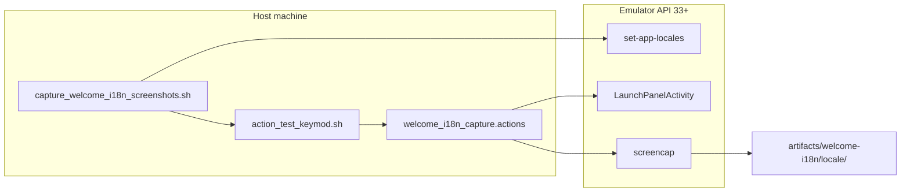

# Welcome screen i18n screenshot automation

## Context

The testing repo already has a working screenshot pipeline:

| Piece | Role |
|-------|------|
| [`Openterface_KeyCmd_Android_testing/scripts/action_test_keymod.sh`](Openterface_KeyCmd_Android_testing/scripts/action_test_keymod.sh) | `ORIENTATION`, `WAIT`, `SCREENSHOT`, fractional taps |
| [`Openterface_KeyCmd_Android_testing/scripts/capture_readme_i18n_screenshots.sh`](Openterface_KeyCmd_Android_testing/scripts/capture_readme_i18n_screenshots.sh) | Loops locales via `cmd locale set-app-locales`, installs app, runs an action file |
| [`Openterface_KeyCmd_Android_testing/scripts/actions/readme_i18n_capture.actions`](Openterface_KeyCmd_Android_testing/scripts/actions/readme_i18n_capture.actions) | Full README flow; **only portrait welcome** today (`SCREENSHOT demo-welcome-mode-selection` then navigates away) |

The welcome screen is [`LaunchPanelActivity`](Openterface_KeyCmd_Android/app/src/main/java/com/openterface/keymod/LaunchPanelActivity.java) with separate layouts: [`layout/activity_launch_panel.xml`](Openterface_KeyCmd_Android/app/src/main/res/layout/activity_launch_panel.xml) and [`layout-land/activity_launch_panel.xml`](Openterface_KeyCmd_Android/app/src/main/res/layout-land/activity_launch_panel.xml).



## Gaps to close

1. **Welcome landscape** — not captured anywhere today.
2. **Wrong app-repo defaults** in existing capture script — points at `../Openterface_KeyMod_Android` and `keymod_install_debug_restart.sh`, but the real repo/script are [`Openterface_KeyCmd_Android`](Openterface_KeyCmd_Android) and [`emulator_install_debug_restart.sh`](Openterface_KeyCmd_Android/scripts/emulator_install_debug_restart.sh).
3. **Welcome may be skipped** if `LaunchPanelPrefs.rememberChoice` is true ([`LaunchPanelActivity.onCreate`](Openterface_KeyCmd_Android/app/src/main/java/com/openterface/keymod/LaunchPanelActivity.java) lines 85–91). Automation should launch with `--ez show_panel true` (same extra used from the nav drawer in `MainActivity`).

## Implementation plan

### 1. New minimal action file

Create [`Openterface_KeyCmd_Android_testing/scripts/actions/welcome_i18n_capture.actions`](Openterface_KeyCmd_Android_testing/scripts/actions/welcome_i18n_capture.actions):

```text
# Requires caller on LaunchPanelActivity (ACTION_TEST_SKIP_INITIAL_LAUNCH=1).
ORIENTATION portrait
WAIT 2
SCREENSHOT demo-welcome-mode-selection

ORIENTATION landscape
WAIT 2
SCREENSHOT demo-welcome-mode-selection-landscape

ORIENTATION portrait
```

- Keeps existing portrait filename `demo-welcome-mode-selection` for README parity.
- Adds `demo-welcome-mode-selection-landscape` for the land layout.
- Ends in portrait so the next locale iteration starts from a known rotation.

### 2. New top-level capture script

Create [`Openterface_KeyCmd_Android_testing/scripts/capture_welcome_i18n_screenshots.sh`](Openterface_KeyCmd_Android_testing/scripts/capture_welcome_i18n_screenshots.sh) modeled on `capture_readme_i18n_screenshots.sh` but:

- **Action file**: `welcome_i18n_capture.actions`
- **Output**: `artifacts/welcome-i18n/<locale>/`
- **Locales (default)**: `en zh-CN zh-TW zh-HK es fr de ja` (same BCP-47 mapping as existing `locale_to_tag`)
- **CLI**: `--skip-install`, `--locales en,ja`, `--no-jpeg`, `-h`, optional device serial (default `emulator-5554`)
- **Launch** (each locale, after `set-app-locales` + `force-stop`):

```bash
adb shell am start -n com.openterface.keymod/.LaunchPanelActivity --ez show_panel true
```

- **Install** (unless `--skip-install`): call `emulator_install_debug_restart.sh` from `KEYCMD_APP_REPO` (new env name; keep `KEYMOD_APP_REPO` as deprecated alias for one release)
- **JPEG**: optional `sips` conversion (same as README script)
- **Reset**: clear per-app locales to `[]` when done

**Usage example** (document in script header):

```bash
cd Openterface_KeyCmd_Android_testing
./scripts/capture_welcome_i18n_screenshots.sh
./scripts/capture_welcome_i18n_screenshots.sh --locales en,de --skip-install emulator-5554
```

**Prerequisites** (documented): API 33+ emulator, `adb` in PATH, debug app buildable from sibling app repo.

### 3. Small shared helper (optional but recommended)

Extract duplicated logic from the two capture scripts into [`Openterface_KeyCmd_Android_testing/scripts/lib/i18n_capture_common.sh`](Openterface_KeyCmd_Android_testing/scripts/lib/i18n_capture_common.sh):

- `locale_to_tag`, device/SDK checks, `adb_serial`, locale loop skeleton, JPEG conversion, `launch_launch_panel_with_show_panel`
- Both `capture_readme_i18n_screenshots.sh` and `capture_welcome_i18n_screenshots.sh` source it

This keeps future “mode page” scripts (keyboard, presentation, etc.) to: **new `.actions` file + thin wrapper** that sets `ACTION_FILE` and output dir.

### 4. Fix existing README capture script paths

Update [`capture_readme_i18n_screenshots.sh`](Openterface_KeyCmd_Android_testing/scripts/capture_readme_i18n_screenshots.sh):

- Default `KEYCMD_APP_REPO` → `../Openterface_KeyCmd_Android`
- Install script → `scripts/emulator_install_debug_restart.sh`
- Use `show_panel` launch in the per-locale loop
- **Bonus**: append welcome landscape to [`readme_i18n_capture.actions`](Openterface_KeyCmd_Android_testing/scripts/actions/readme_i18n_capture.actions) *before* the drawer swipe (so full README runs also get land welcome without a second script run)

### 5. Smoke action + docs

- Update [`readme_i18n_smoke.actions`](Openterface_KeyCmd_Android_testing/scripts/actions/readme_i18n_smoke.actions) to include landscape welcome for quick validation.
- Add a short section to [`BEHAVIOR_RECORDING.md`](Openterface_KeyCmd_Android_testing/scripts/BEHAVIOR_RECORDING.md): when to use welcome-only vs full README capture, and how to add another screen (new `.actions` + copy wrapper).

### 6. Extending to more languages later

Default stays on the **8 README locales**. To cover all in-app settings languages (`language_codes` in [`values/arrays.xml`](Openterface_KeyCmd_Android/app/src/main/res/values/arrays.xml): ko, it, ru, pt-BR, zh-Hant), extend `locale_to_tag` and document tags:

| App tag | `set-app-locales` tag |
|---------|------------------------|
| zh-Hant | zh-TW (or zh-HK) |
| pt-BR | pt-BR |
| ko | ko-KR |
| it | it-IT |
| ru | ru-RU |

No app code changes required for v1.

## Verification (manual)

1. Start API 33+ emulator: `emulator-5554`
2. Run welcome capture for one locale:  
   `./scripts/capture_welcome_i18n_screenshots.sh --locales en --skip-install`
3. Confirm `artifacts/welcome-i18n/en/demo-welcome-mode-selection.png` and `...-landscape.png` show translated strings and correct layouts.
4. Repeat with `ja` to spot-check CJK line wrapping in landscape left column.

## Out of scope (follow-ups)

- Capturing **in-app mode UIs** (keyboard, presentation, shortcut hub) — same pattern as README actions; use `record_emulator_actions.py --emit-rel` to author taps per screen.
- Physical phone capture (works if API 33+ and serial passed; emulator remains the documented default for stable resolution).
- CI job — can wire later once artifact paths are stable.
