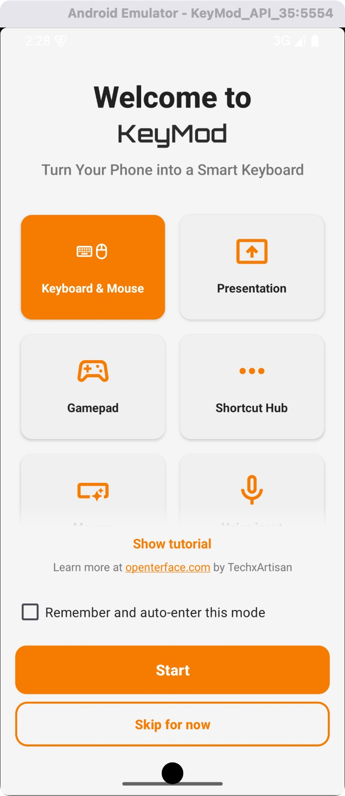
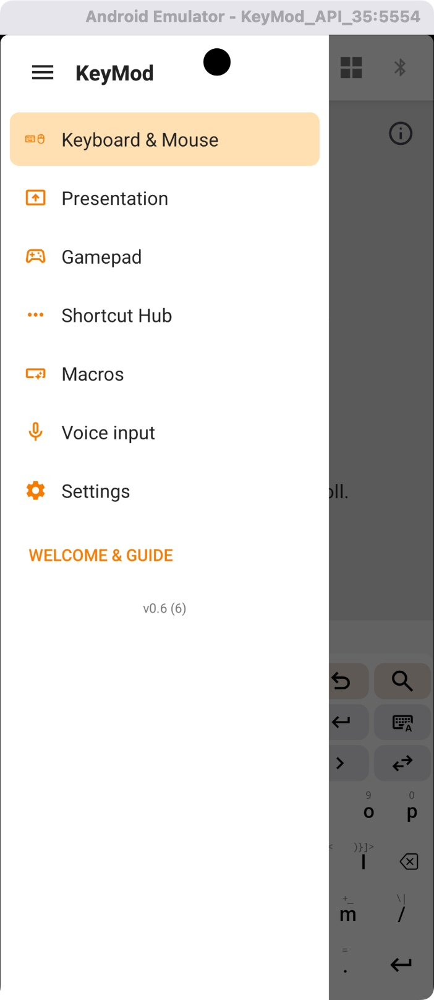
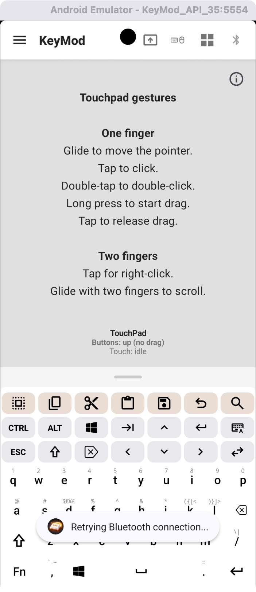
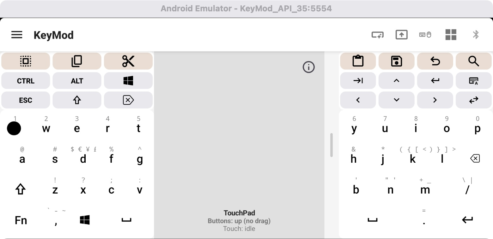
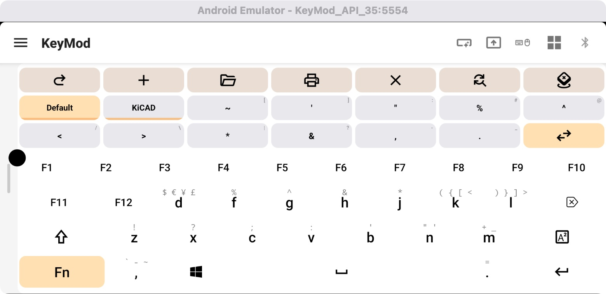
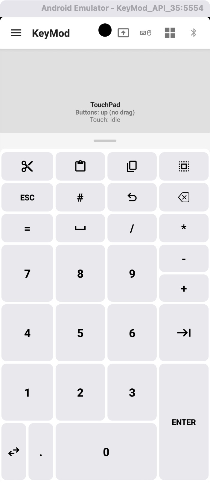
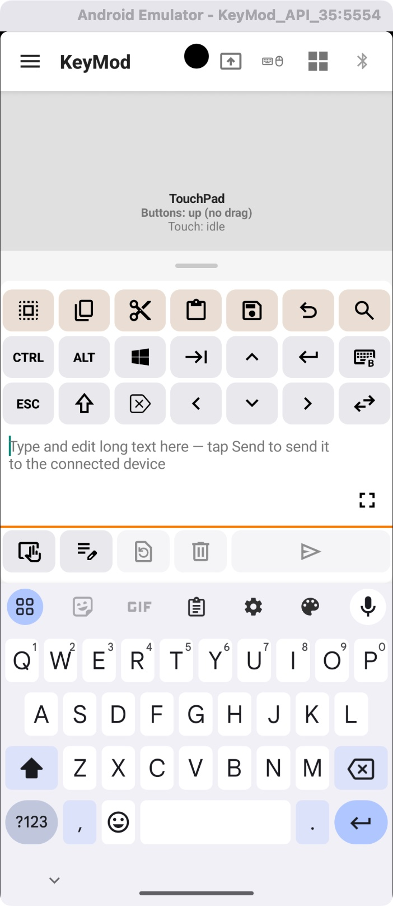
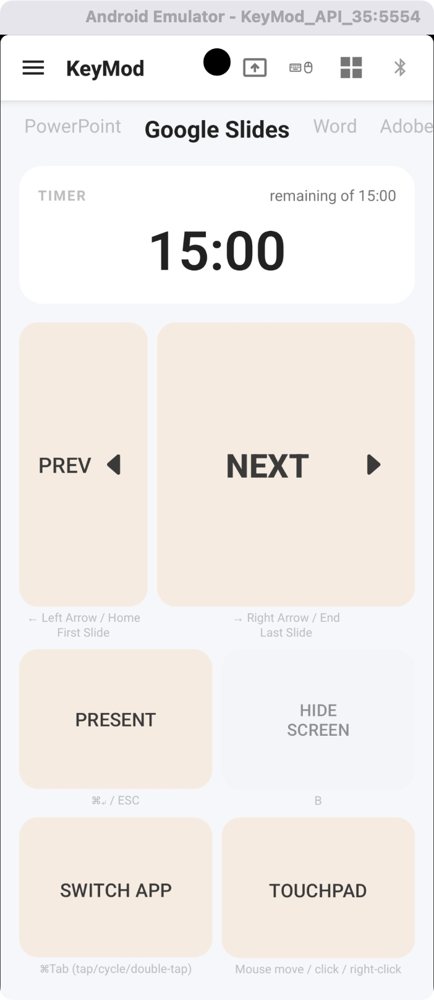
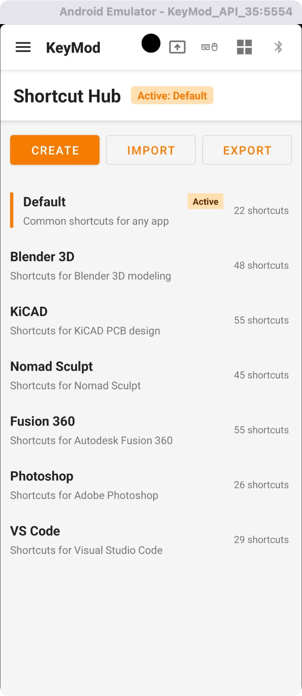
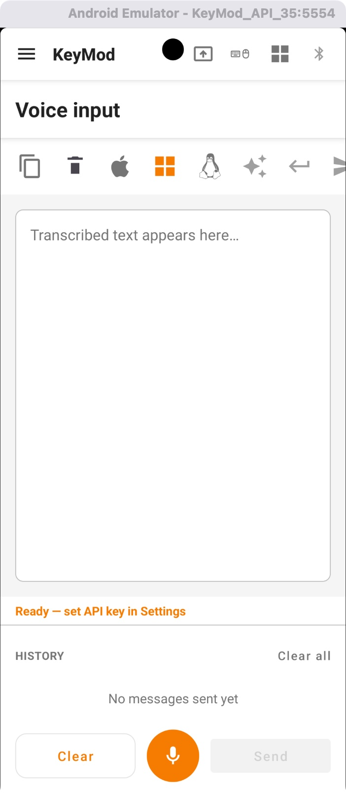

# KeyMod for Android

<p align="center"><strong>README language</strong> · <em>GitHub shows this file by default</em></p>
<p align="center">
<a href="README.md"></a>
<a href="README.zh-CN.md"></a>
<a href="README.zh-TW.md"></a>
<a href="README.zh-HK.md"></a>
<a href="README.es.md"></a>
<a href="README.fr.md"></a>
<a href="README.de.md"></a>
<a href="README.ja.md"></a>
</p>

---

**KeyMod** is the companion Android app for [Openterface KeyMod](https://openterface.com/) — a hardware KVM-style bridge that lets you control a host computer from your phone over **USB** or **Bluetooth**. This repository contains the Java/Android implementation (`com.openterface.keymod`).

- **Requirements:** Android 8.0+ (API 26), USB OTG where you use USB control  
- **Docs:** See [docs/USER_GUIDE.md](docs/USER_GUIDE.md) for connection steps, modes, and shortcuts (English).  
- **Install:** Prebuilt APKs are published via [GitHub Releases](https://github.com/TechxArtisanStudio/Openterface_KeyMod_Android/releases) and [GitHub Actions](https://github.com/TechxArtisanStudio/Openterface_KeyMod_Android/actions) artifacts  

## Features at a glance

| Area | What you get |
|------|----------------|
| **Keyboard & mouse** | Touchpad, full QWERTY, modifiers, editing shortcuts, optional macro rows, numpad-style layouts, and a buffer to compose long text and send it to the host |
| **Presentation** | Presenter-style controls tuned for apps like Google Slides (timer, prev/next, present, black screen, app switch, touchpad) |
| **Shortcut Hub** | Profiles of shortcuts for creative and dev tools (e.g. Blender, KiCAD, Photoshop, VS Code) with create/import/export |
| **Gamepad, macros, voice** | Additional modes from the same shell (see the in-app drawer and user guide) |

## Screenshots

Assets live in [`demo/`](demo/). On GitHub, width is set with HTML so phone screenshots stay readable without stretching full page width; landscape shots use a larger width.

### Welcome and navigation

<table>
<tr>
<td align="center" valign="top" width="50%">
<b>Welcome — pick a mode</b><br/>
<small>Keyboard &amp; mouse, presentation, gamepad, shortcut hub, and more.</small><br/><br/>

</td>
<td align="center" valign="top" width="50%">
<b>Navigation drawer</b><br/>
<small>Switch modes, macros, voice, and settings.</small><br/><br/>

</td>
</tr>
</table>

### Keyboard & mouse

<table>
<tr>
<td align="center" valign="top" colspan="2">
<b>Portrait — touchpad gestures + keyboard</b><br/>
<small>Gesture help above the custom keyboard (status toasts may show if no device is connected).</small><br/><br/>

</td>
</tr>
<tr>
<td align="center" valign="top" width="50%">
<b>Landscape — split keyboard + touchpad</b><br/><br/>

</td>
<td align="center" valign="top" width="50%">
<b>Landscape — macro row + profiles</b><br/>
<small>e.g. Default / KiCAD.</small><br/><br/>

</td>
</tr>
<tr>
<td align="center" valign="top" width="50%">
<b>Portrait — touchpad + keypad</b><br/><br/>

</td>
<td align="center" valign="top" width="50%">
<b>Portrait — long-text compose + Send</b><br/><br/>

</td>
</tr>
</table>

### Presentation

<p align="center">
<b>Google Slides</b> — timer and large controls (other apps in the top strip).<br/><br/>

</p>

### Shortcut Hub

<p align="center">
<b>Shortcut Hub</b> — profiles and shortcut counts.<br/><br/>

</p>

### Voice input

<p align="center">
<b>Voice input</b> — transcript area, targets, history, mic (configure API key in Settings; see user guide).<br/><br/>

</p>

## Building from source

Open the project in Android Studio (Giraffe or newer recommended) or build from the command line:

```bash
./gradlew assembleDebug
```

Debug APK output path follows the usual Gradle layout under `app/build/outputs/apk/`.

## Upstream

Hardware and product context: [TechxArtisan — Openterface](https://openterface.com/).
