# **Terminal** — Quick Start

**Terminal** lets you connect directly to a target computer's SSH command line through your phone — via USB or Bluetooth, through Openterface hardware.

---

## 1. Enter Terminal Mode

From the bottom navigation bar, tap **Terminal**, or select Terminal on the launch page.

* **Example (Bottom navigation + launch page)**

  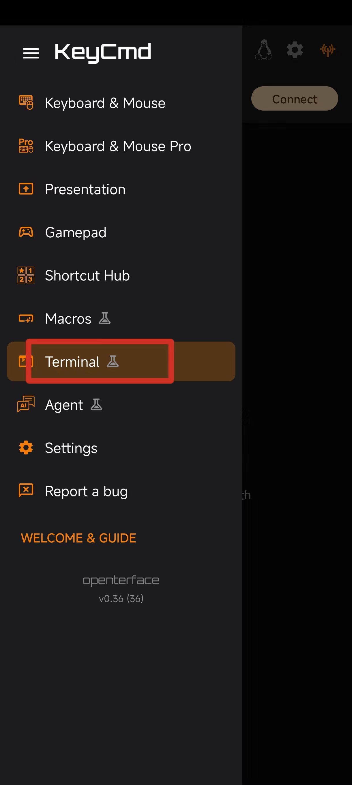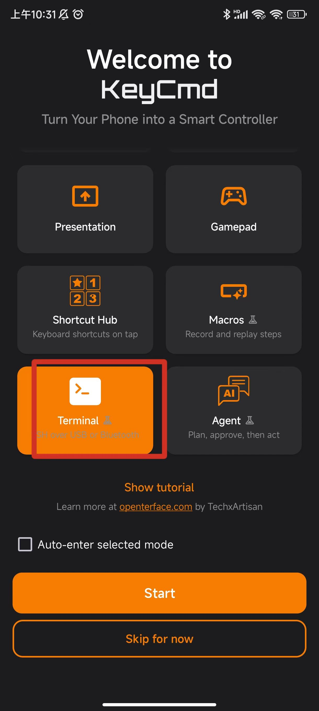

---

## 2. Getting Started

What you need to prepare for using Terminal:

### A. Hardware Connection

> Setup flow: Connect phone to Openterface hardware → Enter Terminal mode → Configure SSH Profile → Establish connection

1. Connect your phone to the Openterface hardware, ensuring USB or Bluetooth connection is active.

* **Hardware connection successful**

  >  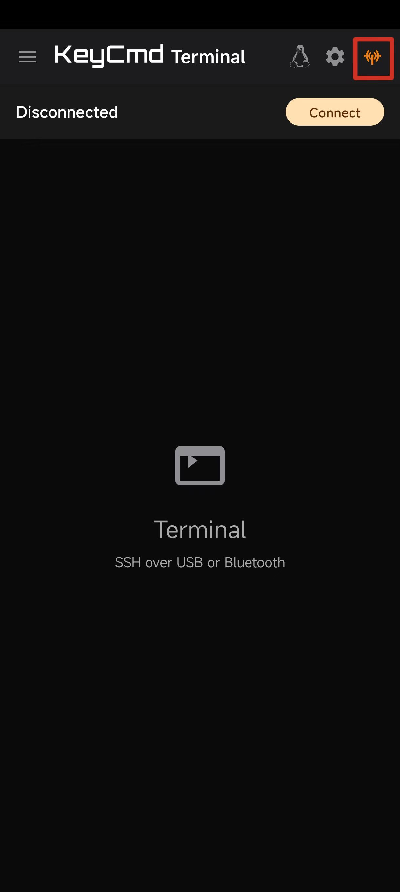

### B. First-time SSH Profile Configuration

Terminal stores target computer login information through Credentials. How to access the Credentials interface:

**Method 1: Via top settings icon**

1. After entering Terminal mode, tap the **Settings icon** (gear icon) in the **top title bar**.
2. Enter the Credentials management page, tap **Add Profile** to add a new configuration.

* **Example (Settings icon to Credentials interface)**

  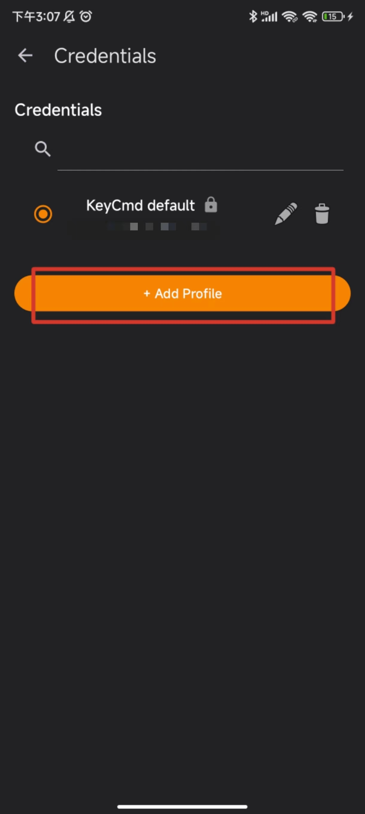

**Method 2: Via connection dialog**

1. Tap the **Connect** button inside the Terminal interface.
2. On first use (with no Profile), you'll see the **Add Profile** button. Tap it to enter the Credentials configuration page (same interface as shown above).

* **Example (Connect to Credentials interface)**

  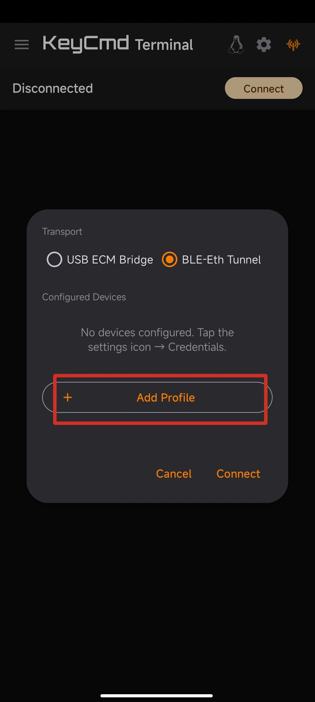

How to add a configuration after entering the Credentials interface:

1. On the Credentials interface, tap the **Add Profile** button to open the configuration interface, where you can add your **SSH configuration**:

* **Example (Add Profile + basic interface)**

  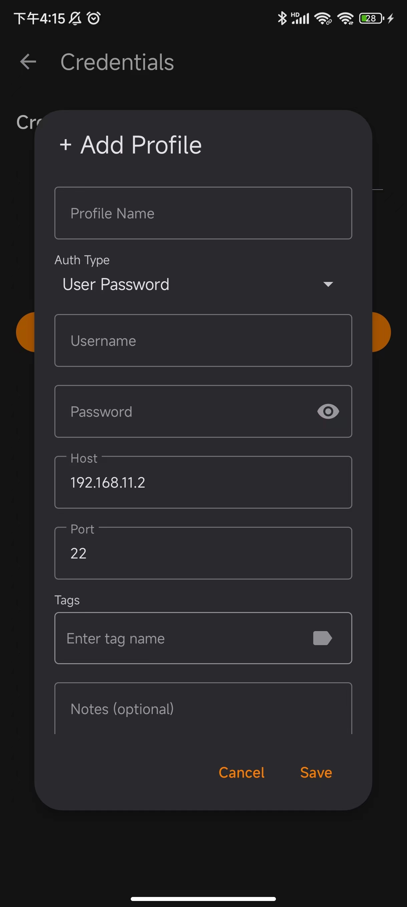

**Specific Credentials information filling**, operations are as follows:

1. Fill in the device information for your SSH connection

   Manually fill in **Profile Name** (customizable), **Username**, **Password** — these three fields.

   Host defaults to 192.168.11.2, Port defaults to 22 — default configuration, users can keep or modify as needed.

   By default, User Password authentication is used. For SSH Key authentication, continue with the following operations.

* **Example (Fill in basic three fields + default two fields)**

  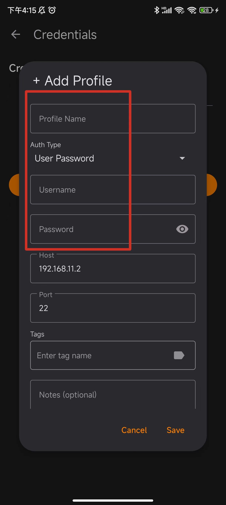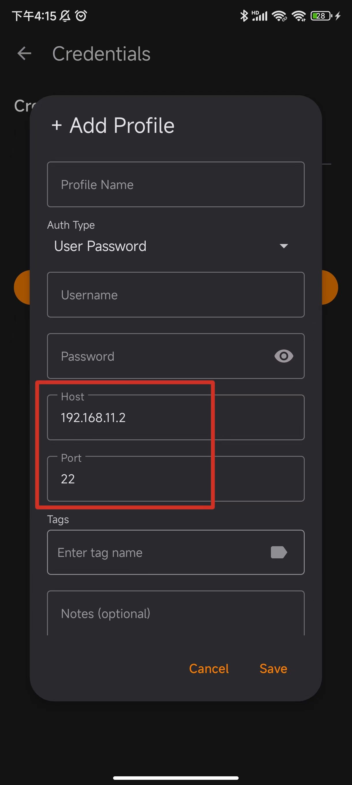

For **SSH Key configuration**:

1. Tap the **dropdown icon** on the right side of the User Password row, a popup will appear
2. In the popup, you can switch to SSH Key configuration

* **Example (Tap dropdown icon + switch to SSH Key configuration)**

  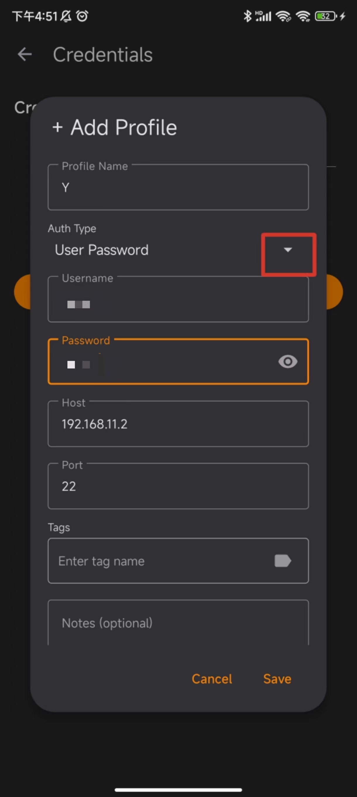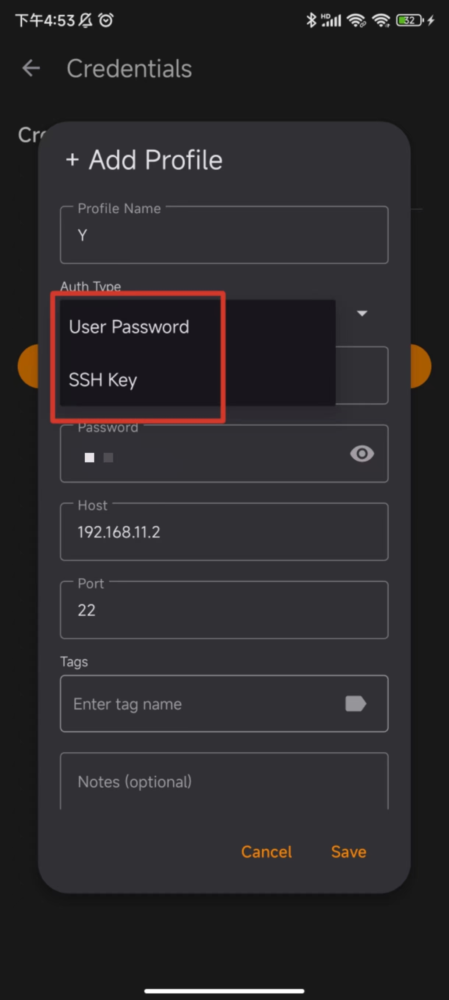

3. When configuring SSH Key, the Password field shows "No key set". Tap the **key icon** on the right side of that row

* **Example ("No key set" + tap key icon)**

  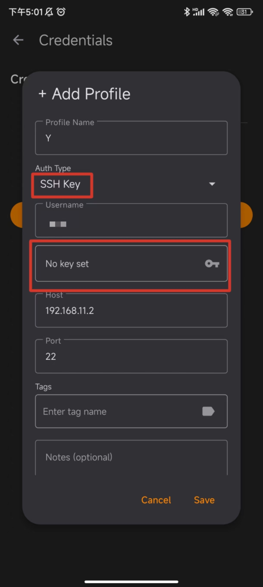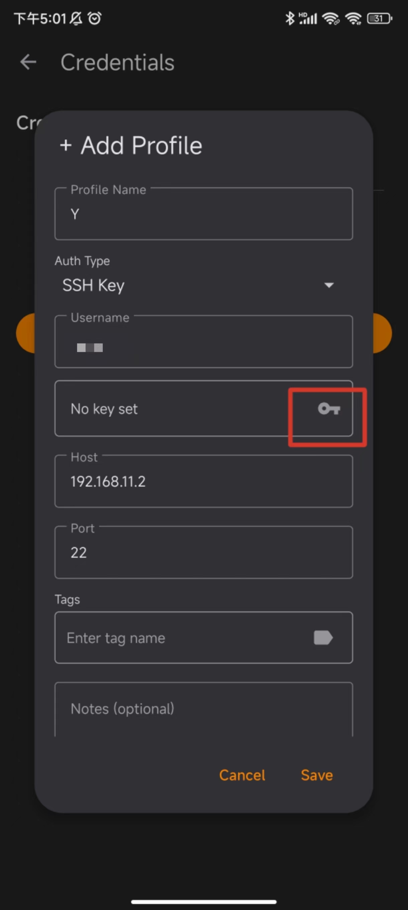

4. After tapping the key icon, three options appear. Choose based on your needs:

   Select **Paste** option, paste your key, then tap the save button at the bottom right of the popup.

   Select **Import from file** option to import a key.

   Select **Generate** to generate a new key, based on your needs.

* **Example (Options popup)**

  > 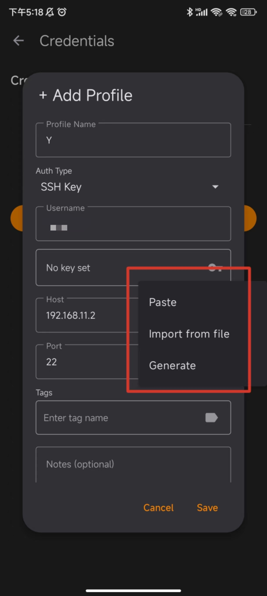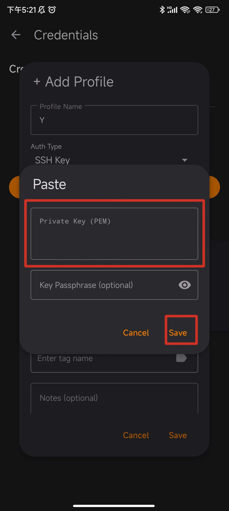
  >
  > After pasting an existing private key, you don't need to proceed with the key generation steps below. Note that the key is not yet saved to the current SSH device configuration at this point. Users who have already pasted their key can skip the Generate key operation introduction.

  **Generate key** specific operations are as follows:

  1. In the Generate Key popup, give the Name a custom name. On the right side of the Algorithm row, there's a dropdown — tap it to see key type options.

  * **Example (Generate Key configuration interface)**

    > 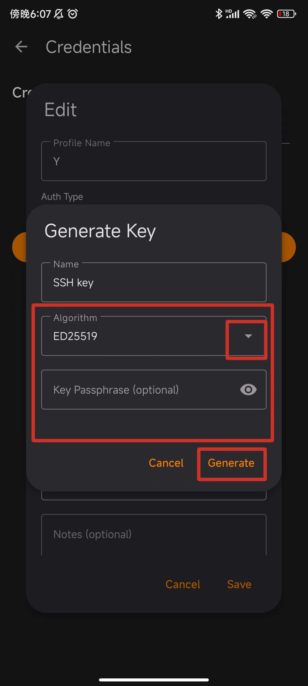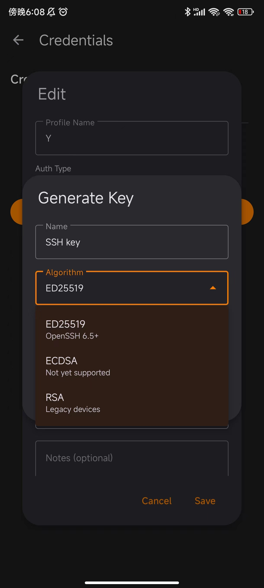

    > Key Passphrase (custom number) is optional. After entering a number, the Rounds (custom number) row will appear. After entering the number, you can tap the **Generate button** to generate the key.
    >
    > The generated key is still not saved at this point, please continue.
    >
    > After generating the key via the Generate button, tap save at the bottom right. It will automatically switch to the Edit Key interface. The generated key is still not saved at this point, please continue.
    >
    > 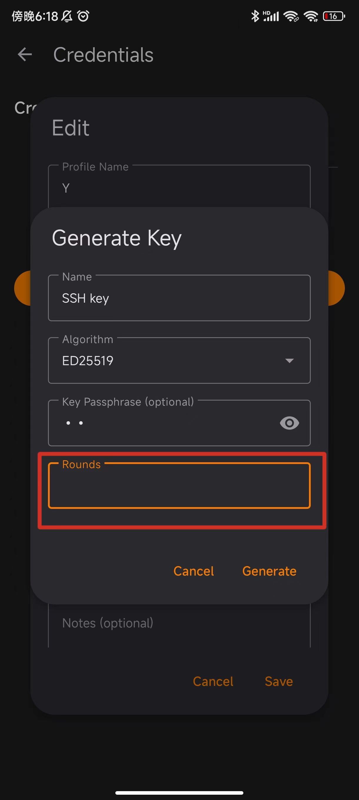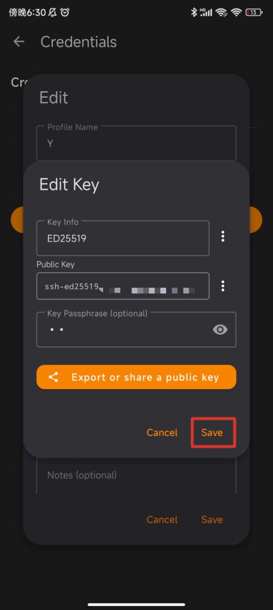

5. Keys added via paste, import, or generation are not yet stored in the current device's SSH Key configuration. You need to tap the **Save** button on the corresponding interface to return to just the Edit interface.

   At this point, **Edit key** and **Delete** options appear below the key.

   After confirming the save, the SSH Key setup for this device is complete. If you need to modify the key later, you can continue reading the following operation steps.

* Example interface (Edit save + new key options)

  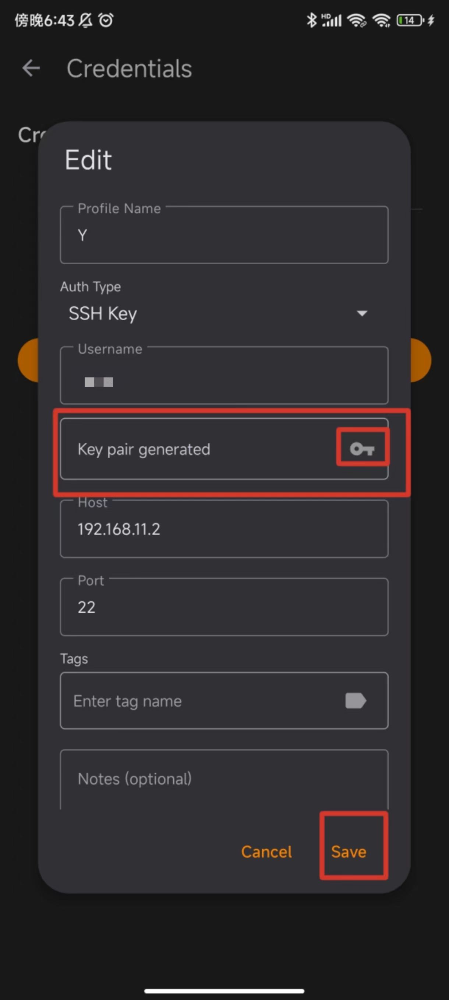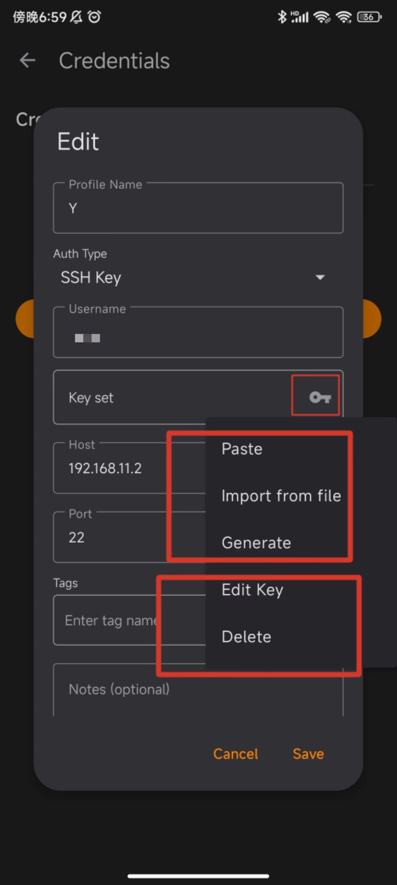

### **C. Modify and Search SSH Profile Configuration**

To edit or delete SSH Key configurations, operations are as follows:

On the Edit Key interface, tap the three dots on the right side of the Key info row or Public Key row to expand the detailed key information. You can also directly copy and paste keys.

* Example (Edit interface + Delete option)

  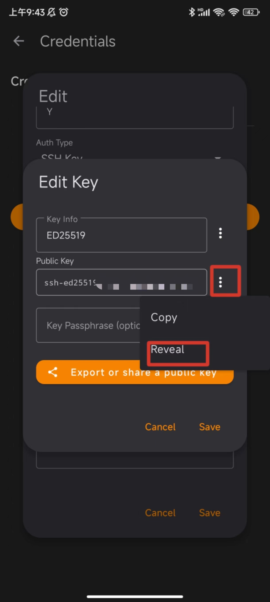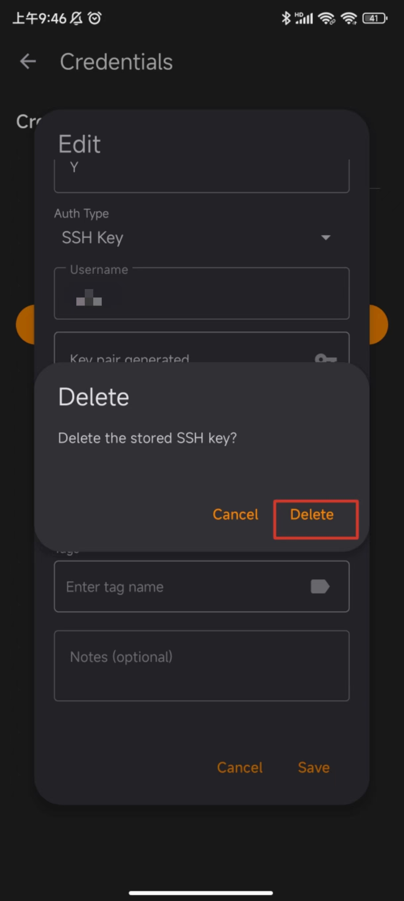

Some basic operations you can perform on configured devices, including tagging, adding notes, and how to quickly search devices:

1. Tap the icon on the right side of the Tags row. By default, there are no tags. Enter the new tag you want to add and press Enter to save. (Optional)

   The lower section has two parts: All tags shows all tags you've added. Tags owned by the current device will be highlighted. You can quickly add or remove tags by tapping existing tags.

   The Selected Tags for this profile row shows a summary of all tags owned by the current device. It's non-interactive and for display only.

   > All tags only shows tags that are currently selected across all devices

   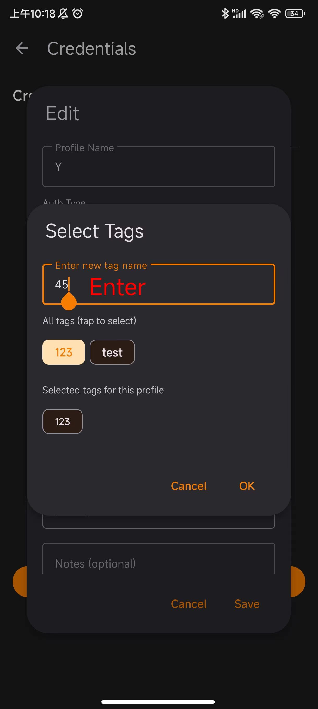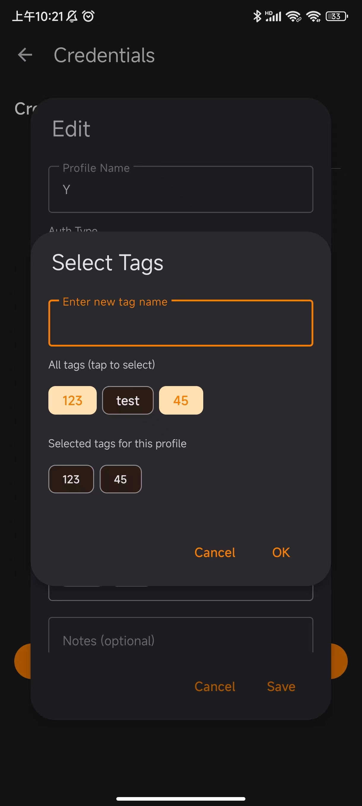

2. After editing, tap OK, then tap Save on the Edit interface. You'll return to the Credentials interface, and the current device will have the corresponding tags added.

   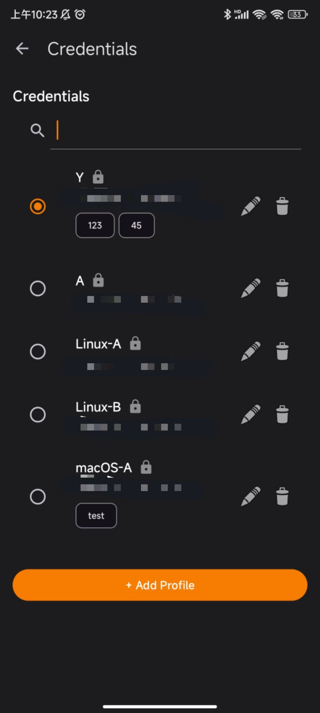

3. On the Credentials interface, you can quickly search for devices using the search bar at the top

   > You can search quickly by device basic information, tags, etc.

   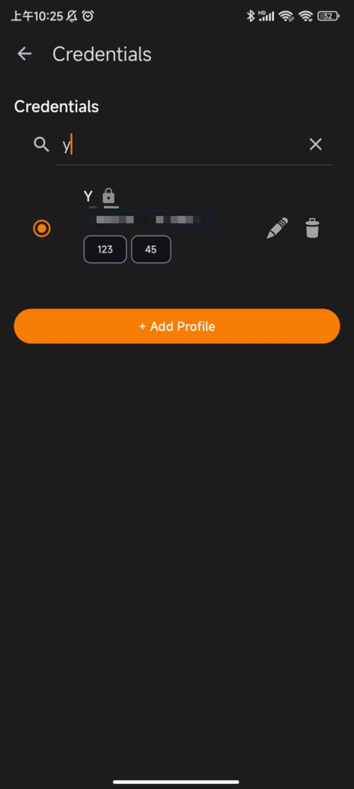

4. Notes can be used to add detailed notes for devices (optional)

---

## 3. Establishing Connection

### Step 1 — Enter Terminal mode (skip if already in Terminal mode)

From the bottom navigation bar, tap **Terminal**, or select Terminal on the launch page.

* **Example (Bottom navigation + launch page)**

  

### Step 1 — Select Profile and connect

1. Tap **Connect** at the top to open the connection dialog.
2. In the **Configured Devices** list, select a Profile (tap to select).
3. Select the transport link: **USB ECM Bridge** or **BLE-Eth Tunnel**.
4. Tap **Connect** to start the connection.

* **Example (Connection dialog)**

  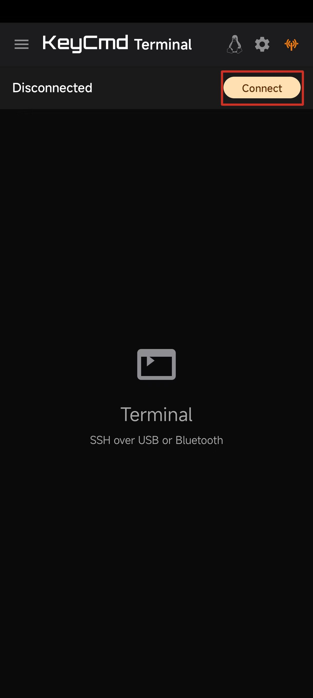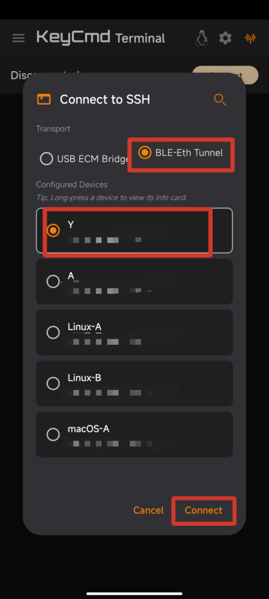

### Step 2 — Start using

After successful connection, you'll see:

- The top status changes to **Connected**, showing the target host and transport link.
- The terminal area displays SSH shell output.
- Tap the terminal area, the custom keyboard automatically pops up (portrait) or displays in split view (landscape).

* **Example (Connection successful)**

  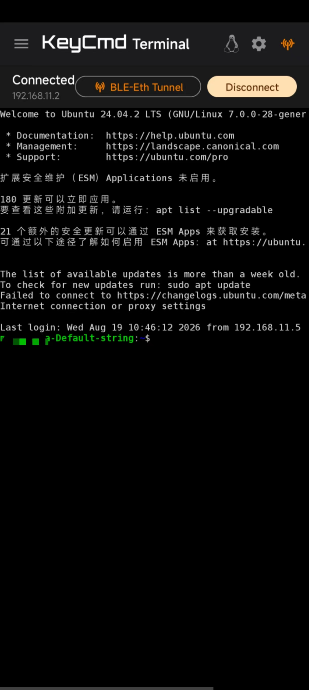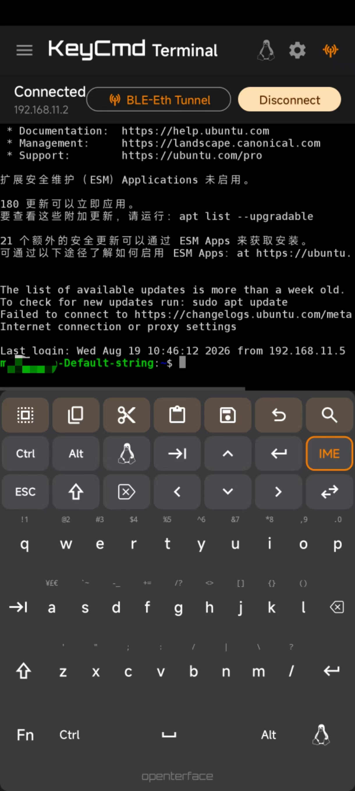

---

## 4. Disconnecting

- **Manual disconnect**: Tap **Disconnect** at the top.
- **Automatic disconnect**: USB unplugged, Bluetooth disconnected, server timeout, etc.

After disconnection, the terminal displays an empty state. You can **Connect** again.

---

## 5. FAQ

**Q: Connection fails with "Authentication failed".**
A: Check the username and password in your Profile. If using SSH key, confirm the public key has been written to the target's `~/.ssh/authorized_keys`.

**Q: Connection timeout "Connection timeout".**
A: Check USB cable or Bluetooth connection. Try `ping 192.168.11.2` to confirm the target is reachable.

**Q: Connection refused "Connection refused".**
A: The target SSH service may not be started, or the port is not 22.

**Q: Keyboard input not responding.**
A: Confirm SSH is connected (top shows `Connected`). Try hiding and showing the keyboard again.

**Q: Keyboard too small in landscape.**
A: Pinch to zoom font size, or tap `Split` / `Full` to switch to full-screen mode.

---

## 6. Next Steps

After getting familiar with the basics, you can also:

- **Manage multiple Profiles**: Long-press a device card to view details or edit.
- **Use SSH keys**: Paste SSH Key for connection
- **Switch to Agent mode**: Agent reuses Terminal's SSH connection to execute commands with natural language.

---
