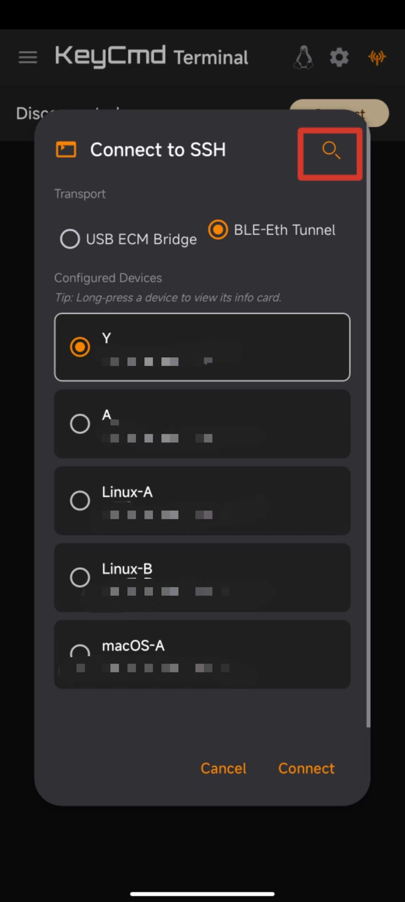
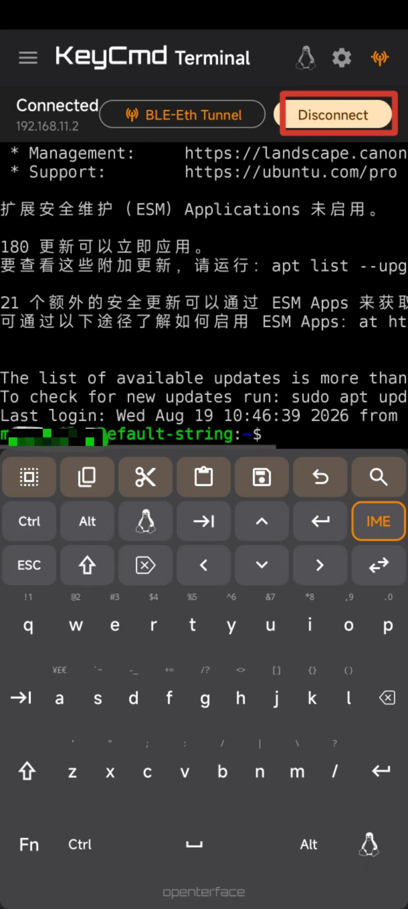

# **Terminal** — 快速上手

**Terminal** 让你直接通过手机连接到目标电脑的 SSH 命令行 —— 通过 USB 或蓝牙，经 Openterface 硬件中转。

---

## 1. 进入 Terminal 模式

从底部导航栏点击 **Terminal**，或在启动页选择 Terminal。

* **操作例图（底部导航 + 启动页）**

  

---

## 2. 开始前的准备

使用 Terminal 需要准备：

### A. 硬件连接

> 配置流程：手机连接 Openterface 硬件 → 进入 Terminal 模式 → 配置 SSH Profile → 建立连接

1. 将手机与 Openterface 硬件连接，确保处于 USB 连接或蓝牙连接状态下。

* **硬件连接成功**

  >  

### B. 第一次配置 SSH Profile

Terminal 通过 Credentials 保存目标电脑的登录信息，如何进入 Credentials 界面：

**方式一：通过顶部设置图标**

1. 进入 Terminal 模式后，点击**顶部标题栏**的 **设置图标**（齿轮图标）。
2. 进入 Credentials（凭据）管理页面，点击 **Add Profile** 添加新配置。

* **操作例图（设置图标进入Credentials界面）**

  

**方式二：通过连接对话框**

1. 点击 Terminal 界面内部的 **Connect** 按钮。
2. 首次使用（无 Profile 时）会看到 **Add Profile** 按钮，点击它进入 Credentials 配置页面，具体界面展示如上。

* **操作例图（通过Connect进入Credentials界面）**

  

进入 Credentials 界面后如何添加配置：

1. 在 Credentials 界面，点击 **Add Profile** 按钮弹出配置界面，你可以添加你的 **SSH 配置** 了：

* **操作例图（Add Profile + 基础操作界面）**

  

**具体的 Credentials 信息填写**，操作如下：

1. 填写你需要进行 SSH 连接的设备信息

   手动填写 **Profile Name**（自定义即可）、**Username**、**Password** 三项。

   Host 默认填入 192.168.11.2，Port 默认填入 22，默认配置，用户可按需保留或修改。

   默认使用 User Password 认证方式，如需 SSH Key 认证，请继续以下操作。

* **操作例图（手动填写基础三项 + 默认填入基础两项）**

  

进行**SSH key配置**：

1. 点击 User Password 所在行右侧的 **下拉图标**，弹出弹窗
2. 可在弹出的弹窗中切换 SSH Key 配置

* **操作例图（点击下拉图标 + 切换 SSH Key 配置）**

  

3. 进行 SSH Key 配置时，原来 Password 提示 "No key set"，点击提示文本所在行的右侧 **密钥图标**

* **操作例图（"No key set" + 点击密钥图标）**

  

4. 点击密钥图标后弹窗三个选项，根据你的具体需求方式进行选择

   选择 **Paste** 选项，粘贴密钥后，完成后点击弹窗右下角保存按钮。

   选择 **Import from file** 选项，导入密钥。

   选择 **Generate**，生成密钥，根据用户需求。

* **操作例图(选项弹窗)**

  > 
  >
  > 用户粘贴已有密钥私钥后，无需再进行后续的生成密钥操作，注意此时密钥未保存到当前 SSH 设备配置中，已经粘贴的用户可跳过 Generate 生成密钥操作步骤介绍。

  Generate，**生成密钥** 具体操作如下：

  1. 在弹出的 Generate Key 界面，Name 为生成的密码命名（自定义），Algorithm 选项所在行的右侧有个下拉选项，点击后弹出生成密钥类型选项。

  * **操作例图（Generate Key 的配置界面）**

    > 

    > Key Passphrase（自定义数字）可选，填入数字后，会弹出 Rounds（自定义数字）行，填入数字后可点击 **Generate 按钮**生成密钥。
    >
    > 当前生成的密钥仍未保存，请继续操作。
    >
    > 通过 Generate 按钮生成密钥后，点击右下角保存，会自动切换 Edit Key 界面，此时生成的密钥仍未保存，请继续操作。
    >
    > 

5. 用户通过粘贴、导入或者生成的密钥，此时暂未存储到当前设备的 SSH Key 配置中，都需要点击对应界面的 **保存** 按钮后只留下 Edit 界面。

   此时密钥下方新增 **Edit key** 和 **Delete** 选项。

   用户确认保存后，到此步设备的 SSH Key 设置结束，如后续要修改密钥，可继续阅读后续的操作步骤介绍。

* 操作界面（Edit保存 + 密钥新增选项）

  

### **C. 修改、查找 SSH profile 配置**

编辑或删除 SSH Key 的配置，操作如下：

Edit Key 界面的 Key info 行、Public Key 行点击右侧三点，能展开密钥的具体信息，也可直接复制粘贴密钥。

* 操作例图（Edit 界面 + Delete 选项）

  

对配置的设备能进行的一些基础操作，打上标签、编写备注和如何快速搜索设备：

1. 点击 Tags 行的右侧图标，当前默认无标签，输入你想添加的新标签，回车保存。（可选）

   下方两部分，All tags 显示你添加的全部标签，当前设备拥有的标签会高亮显示，你可以通过点击已存在标签快速添加或取消标签。

   Selected Tags for this profile 行显示当前设备拥有的全部标签整理，无法操作，仅总结。

   > All tags 只会显示当前所有设备中有选中的标签

   

2. 编辑结束后点击 OK，在 Edit 界面点击保存。此刻回到 Credentials 界面，当前设备已经添加了对应标签

   

3. 在 Credentials 界面可通过最上方的搜索栏快速查找设备

   > 可以通过设备基础信息、标签等快速搜索

   

4. Notes 可以为设备添加详细备注（可选）

---

## 3. 建立连接

### 步骤 1 — 进入 Terminal 模式（如已在 Terminal 模式可跳过）

从底部导航栏点击 **Terminal**，或在启动页选择 Terminal。

* **操作例图（底部导航 + 启动页）**

  

### 步骤 1 — 选择 Profile 并连接

1. 点击顶部 **Connect**，打开连接对话框。
2. 在 **Configured Devices** 列表中选择一个 Profile（点击选中）。
3. 选择传输链路：**USB ECM Bridge** 或 **BLE-Eth Tunnel**。
4. 点击 **Connect** 开始连接。

* **操作例图（连接对话框）**

  

### 步骤 2 — 开始使用

连接成功后，你会看到：

- 顶部状态变为 **Connected**，显示目标主机和传输链路。
- 终端区域显示 SSH shell 输出。
- 点击终端区域，自定义键盘自动弹出（竖屏）或分屏显示（横屏）。

* **操作例图（连接成功）**

  

---

## 4. 断开连接

- **手动断开**：点击顶部 **Disconnect**。
- **自动断开**：USB 拔线、蓝牙断连、服务端超时等。

断开后，终端显示空状态，你可以重新 **Connect**，以及如何快速查找其他设备选取，在点击Connect弹出的连接界面，点击右上角图标快速查找设备。

* **操作例图（右上搜索图标 + 断开连接）**

  

---

## 5. 常见问题

**Q：连接失败，提示 "Authentication failed"。**
A：检查 Profile 中的用户名和密码。如果用 SSH 密钥，确认公钥已写入目标 `~/.ssh/authorized_keys`。

**Q：连接超时 "Connection timeout"。**
A：检查 USB 线或蓝牙连接。尝试 `ping 192.168.11.2` 确认目标可达。

**Q：连接被拒绝 "Connection refused"。**
A：目标 SSH 服务可能未启动，或端口不是 22。

**Q：键盘输入没反应。**
A：确认 SSH 已连接（顶部显示 `Connected`）。尝试隐藏再显示键盘。

**Q：横屏时键盘太小。**
A：双指捏合缩放字体，或点击 `Split` / `Full` 切换全屏模式。

---

## 6. 下一步

熟悉基础后，你还可以：

- **管理多个 Profile**：长按设备卡片查看详情或编辑。
- **使用 SSH 密钥**：粘贴 SSH Key 密钥连接
- **切换到 Agent 模式**：Agent 会复用 Terminal 的 SSH 连接，用自然语言执行命令。

---

