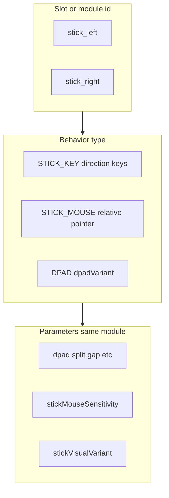

# KeyMod Android - User Guide

> **KeyMod** is the companion Android app for [Openterface KVM-style hardware](https://github.com/TechxArtisanStudio/Openterface_KeyMod_Android) — a bridge that lets you control any computer from your phone via USB or Bluetooth.

---

## 📱 Quick Start

### 1. Install the App

- Download the latest APK from [GitHub Actions](https://github.com/TechxArtisanStudio/Openterface_KeyMod_Android/actions) or [GitHub Releases](https://github.com/TechxArtisanStudio/Openterface_KeyMod_Android/releases)
- Enable **Install Unknown Apps** on your Android device
- Install the APK

> **Requirements:** Android 8.0+ (API 26), Android phone/tablet with USB OTG support

### 2. Choose Your Connection

KeyMod supports two connection methods:

| Method | How | Notes |
|--------|-----|-------|
| **USB** | Connect phone to your Openterface hardware via USB-C | Most reliable, lowest latency |
| **Bluetooth (BLE)** | Pair with your Openterface hardware via Bluetooth | Wireless convenience |

### 3. Select a Mode

On the **Welcome & Guide** screen (first launch or side menu), pick your primary mode. Side navigation matches the same choices.

| Mode | What It Does |
|------|-------------|
| ⌨️ **Keyboard & Mouse** | **Basic** tier: full-screen keyboard without the app’s top header; physical-style layout with row-1 controls (menu, Touchpad / Compose & Send / Num pad, target OS, connection). **No** Shortcut Hub strip rows 1–3 here. |
| ⌨️ **Keyboard & Mouse Pro** | **Pro** tier: the full composite experience (strips, split layouts, IME workflows) in one surface—same as the advanced keyboard + touchpad experience. |
| 🎮 **Gamepad** | Game controller with analog sticks + buttons |
| 📋 **Macros** | Programmable macro sequences |
| ⚡ **Shortcuts** | Pre-built keyboard shortcuts (Ctrl+C, Win+L, etc.) |
| 🎤 **Voice** | Voice-to-keyboard input with AI |
| 🖥️ **Presentation** | Slide/presenter controls for decks |

---

## 🔌 Connection Guide

### USB Connection

1. Connect your phone to your Openterface hardware via USB-C cable
2. Open the app → tap the **connection icon** (top-right) or go to **Settings → General**
3. Tap **USB Connection**
4. Accept the USB permission dialog when prompted
5. Status changes to ✅ **Connected**

### Bluetooth Connection

1. Turn on Bluetooth on your phone
2. Open the app → tap the **connection icon**
3. Tap **Bluetooth Connection**
4. Select your Openterface hardware from the scan results
5. Status changes to ✅ **Connected**

### Auto-Connect

Enable **Auto-connect on startup** in the connection dialog to automatically reconnect to your last-used device when the app launches.

---

## ⌨️ Keyboard Mode

### KM Basic modifier behavior (Settings)

On **Settings → Keyboard & Mouse**, choose how **Ctrl**, **Shift**, **Alt/Option**, and **Win/Cmd** behave on the **Keyboard & Mouse (Basic)** full keyboard:

- **Momentary and long-press chord (default):** A short tap sends that modifier once to the target computer. **Long-press** a modifier and keep your finger on it, then tap other keys to chord (for example long-press **Shift** and tap `1` for `!`). Release the modifier key to stop chording. With **Hold modifier on target while chording** (on by default), the app sends a sustained modifier-down to the target and reapplies it after each chorded key; turn it off in the same settings screen only if the host misbehaves.
- **Sticky modifiers:** Tap a modifier once to latch it (highlighted keys show what is on). Tap again to turn off. Tap **Shift**, then a number or symbol key, for characters such as `!` and `@`.

Changing this setting rebuilds the Basic keyboard; any latched modifiers are cleared.

### Layout

The virtual keyboard provides a **full QWERTY layout** with these sections:

#### Modifier Keys
- **Ctrl** — Control key
- **Alt** — Alt key  
- **Win** — Windows key
- **Cmd** — Command key (Mac)
- **Super** — Super key (Linux)
- **Shift** — Shift (toggle caps)
- **Caps** — Caps Lock toggle
- **Tab** — Tab
- **Esc** — Escape
- **Fn** — Function key toggle

#### Key Sections
- **Letter keys** (QWERTY layout, tap Shift/Caps for uppercase)
- **Number keys** (0-9, with `!@#$%^&*()` on shift)
- **Symbol keys** (~`-_=+[]{}\|;:'",<.>/?)
- **Function keys** (F1-F12)
- **Navigation keys** (Home, End, PgUp, PgDn, Ins, Del)
- **System keys** (PrtSc, ScrLk, Pause)
- **Arrow keys** (Up, Down, Left, Right)
- **Space, Enter, BackSpace**

### Usage Tips

- Hold **modifier keys** (Ctrl, Alt, Win) then tap a letter for combos like `Ctrl+C`
- Tap **Shift** for uppercase or top-row symbols
- Tap **Fn** to access F1-F12 keys
- Tap **?123** to switch to number/symbol layout

### Fixed Shortcut Strip (Top Rows)

In keyboard mode, the fixed shortcut strip uses two rows of keys beneath the swipeable favorites row.

- **Target OS setting** (`Windows`, `Linux`, `macOS`) changes modifier **labels/icons** on the main keyboard and on fixed strip **Page 1** row 2 (Ctrl / Alt / Win or Control / Option / Command).

On **Page 0** of the fixed strip (F‑key / digit row):

- **`Fn` cleared / local Fn off:** row 2 is **F7–F12** and **`=`** (sends equals); row 3 is **F1–F6** and **`Fn`**.
- **`Fn` latched / local Fn on:** row 2 is **`7`** **`8`** **`9`** **`0`** **`+`** **`-`** **`*`**; row 3 is **`1`** **`2`** **`3`** **`4`** **`5`** **`6`**; **`Fn`** still toggles latch.

**Shortcut strip display** (names vs icons vs combo text such as Alt+X) is controlled by the **DISPLAY** key on the **swipeable favorites row**: it appears on the **same page as “Create shortcut”**, immediately **after** that button. Each tap cycles through three modes: shortcut **name**, **icon** (when the shortcut has a drawable icon; otherwise combo text), and **chord** (combo text).

On **Page 1** of the fixed strip (ESC / navigation page), when **local Fn** (row 3 col 7) is on:

- **Row 2** sends **Scroll Lock**, **PrtSc**, **Caps Lock**, **Pause/Break**, **Home**, **PgUp**; the IME toggle key is unchanged.
- **Row 3** sends **Space**, **Bksp**, **Del**, **Insert**, **End**, **PgDn**.  
  Ctrl/Alt/Win positions still support **long‑press** modifier lock using the underlying modifier keys.

On **Page 2** of the fixed strip (**Shortcut Hub**), **local Fn** toggles two full punctuation rows (strip display modes use the row‑1 DISPLAY key after Create, not the fixed strip).

On that page, the **small top‑right corner hints** show the **other local‑Fn latch cap for the same strip column** (slot‑symmetric with the Shortcut Hub strip catalog), not alternate glyphs from a decorative strip skin.

- **Fn off — upper row:** **`(`**, **`)`**, **`[`**, **`]`**, **`:`**, **`#`**, **`@`**
- **Fn off — lower row:** **`/`**, **`\`**, **`|`**, **`?`**, **`-`**, **`_`**, **`Fn`** (toggle)
- **Fn on — upper row:** two **Shortcut Hub profile** slots (**tap** = activate profile, **long‑press** = assign), then **`~`** **`'`** **`"`** **`%`** **`^`**
- **Fn on — lower row:** **`<`** **`>`** **`*`** **`&`** **`,`** **`.`**, **`Fn`**

Shifted glyphs assume a US‑QWERTY‑style host layout; other layouts may produce different characters.

Media keys are not sent as Consumer HID in this app build; use keyboard shortcuts on the host where needed.

---

## 🎮 Gamepad Mode

Virtual game controller with:
- **D-pad** (directional pad)
- **Action buttons** (A, B, X, Y)
- **Shoulder buttons** (L1, R1, L2, R2)
- **Analog sticks** (Left & Right)
- **Start / Select** buttons

> ⚠️ Gamepad HID protocol is under active development. Basic button support is available.

### Module model: slots, behavior, and parameters

Presets are a list of **modules**. Each module is one on-screen control (draw + touch). Think in three layers so “sub-modules” do not feel like mystery types:

1. **Slot / identity (`id`)** — *which* control on the canvas. Thumb modules use the fixed slots **`stick_left`** and **`stick_right`** (plus other module kinds such as buttons and touchpads with their own ids).
2. **Behavior (`type`)** — *what the host receives*: **`STICK_KEY`** (direction keys from a thumb ring), **`STICK_MOUSE`** (relative pointer / “mouse” deltas), **`DPAD`** (digital pad with a **`dpadVariant`** such as cross or split), **`BUTTON`**, **`TOUCHPAD`**, etc. The in-app “mode” choices for sticks map to these types (and for the left slot, D-pad is `DPAD`, not a parallel stick type).
3. **Parameters** — tuning on the **same** module: `dpadVariant`, split gap sliders, `stickMouseSensitivity`, `stickVisualVariant` (mostly look), accent color, size. These are **fields**, not separate module kinds.

The **right** stick can use **`stickMouseSensitivity`** when its type is **STICK_MOUSE** (pointer speed tuning in Configure control).



### Preset vocabulary (schema v6)

Shareable layouts use JSON with a **schema version** (currently **v6**). Useful terms:

| Everyday term | In presets / code |
|---------------|---------------------|
| D-pad, directional pad | Module type **DPAD** on the left slot; **`dpadVariant`** selects cross, split segments, disc, pivot, floating look, or clicky haptics |
| Analog stick / thumbstick | **STICK_KEY** (digital ring) or **STICK_MOUSE** (relative pointer) on **`stick_left`** or **`stick_right`**; optional **`stickVisualVariant`** for cap look (concave, convex, low-profile, C-stick); “Hall effect” is cosmetic only on phone |
| Face / ABXY / symbol buttons | **BUTTON** modules; optional **`layout.faceButtonTemplate`** (`nintendo_diamond`, `xbox_abxy`, `playstation_symbols`) sets anchors and labels |
| Bumpers / triggers | **SHOULDER** and **TRIGGER** modules (ids `shoulder_l` / `shoulder_r`, `trigger_l` / `trigger_r`) with **`hidKey`**; **`triggerVariant`** documents analog vs digital vs hair vs adaptive (adaptive is UI copy only here) |
| Symmetrical vs offset stick layout | **`layout.stickLayoutTemplate`** (`symmetrical`, `offset`, `parallel`) — template metadata, not a drawn control |
| Gyro / tilt aim | Set **`layout.gyroEnabled`** to `true` in the preset: when you are on the gamepad screen and connected, device **gyroscope** samples move the host pointer (small deltas). Disable when not needed to save battery |
| Canvas background (portable JSON) | **`layout.backgroundImageEncoding`** (`base64`), **`layout.backgroundImageMediaType`** (`image/png` / `image/jpeg` / `image/webp`), and **`layout.backgroundImageData`** (raw base64, no `data:` URL). Used when **sharing** a preset so the image travels in one file; after **import**, bytes are saved under app files dir as **`layout.backgroundImageFile`** and embed fields are cleared. Max decoded size about **6 MiB** |

**Engineering synonyms (no extra modules):** hat switch (HID jargon for a D-pad–like switch), silicone dome / tact switch, gimbal, housing — these describe physical hardware, not separate on-screen modules.

---

## ⚡ Shortcuts Mode

Pre-configured keyboard shortcuts for quick access:

### Common Shortcuts
| Shortcut | Action |
|----------|--------|
| Ctrl+C | Copy |
| Ctrl+V | Paste |
| Ctrl+A | Select All |
| Ctrl+X | Cut |
| Ctrl+Z | Undo |
| Ctrl+S | Save |

### Windows Shortcuts
| Shortcut | Action |
|----------|--------|
| Win+Tab | Task View |
| Win+S | Search |
| Win+E | Explorer |
| Win+R | Run Command |
| Win+D | Show Desktop |
| Win+L | Lock PC |

### System Shortcuts
| Shortcut | Action |
|----------|--------|
| Alt+F4 | Close Window |
| Ctrl+Alt+Del | Task Manager |
| Alt+PrtScr | Window Screenshot |

---

## 📋 Macros Mode

Create and save custom key sequences to execute complex actions with a single tap.

### Features
- **Create macros** by recording key sequences
- **Save** macros with custom names
- **Edit** existing macros
- **Delete** macros you no longer need
- **Execute** with one tap

---

## 🎤 Voice Mode

Voice-controlled keyboard input powered by AI:

### Configuration
Go to **Settings → Voice Input** to configure:
- Voice recognition engine
- AI backend settings
- Language preferences

### AI Integration
Go to **Settings → AI Settings** to configure AI model connections for voice-to-command processing.

---

## ⚙️ Settings

Access via the **⚙️ gear icon** on the main screen. Four tabs:

### General
- Connection type (USB / Bluetooth)
- Auto-connect toggle
- Input mode preferences
- Screen orientation settings

### Voice Input
- Voice recognition configuration
- Microphone settings
- Language options

### AI Settings
- AI model configuration
- API endpoint settings
- Model parameters

### History
- View your recent macro executions
- Connection history
- Activity log

---

## 📐 Orientation

KeyMod supports both portrait and landscape modes:
- **Portrait** (2×3 grid) — thumb-friendly for phones
- **Landscape** (3×2 grid) — desktop-style for tablets

The app auto-rotates when you turn your device.

---

## 🔧 Troubleshooting

### App shows "Not Connected"
- Check USB cable is firmly connected
- Try disconnecting and reconnecting
- For Bluetooth: ensure device is discoverable

### USB permission denied
- Go to Android **Settings → Apps → KeyMod → Permissions**
- Enable USB access
- Re-launch the app

### Keys not sending
- Verify connection status is **Connected**
- Try switching modes and back
- Check if the Openterface hardware is powered on

### Bluetooth won't pair
- Turn Bluetooth off and on
- Forget the device and re-pair
- Ensure the Openterface hardware is in pairing mode

---

## 📦 Build from Source

```bash
# Clone the repo
git clone https://github.com/TechxArtisanStudio/Openterface_KeyMod_Android.git
cd Openterface_KeyMod_Android

# Build (requires Java 21, Android SDK 35)
./gradlew assembleDebug

# APK output
ls app/build/outputs/apk/debug/KeyMod-debug.apk

# Install on device
adb install -r app/build/outputs/apk/debug/KeyMod-debug.apk
```

---

## 🏗️ Technical Details

| Detail | Value |
|--------|-------|
| **Package** | `com.openterface.keymod` |
| **Min SDK** | Android 8.0 (API 26) |
| **Target SDK** | Android 15 (API 35) |
| **Version** | 1.0 (code 1) |
| **HID Protocol** | CH9329 UART |
| **USB Serial** | usb-serial-for-android |
| **Bluetooth** | RxAndroidBle 1.19.0 |
| **Connection Modes** | USB / BLE Composite |

### HID Protocol (CH9329)

KeyMod communicates with the target computer using the **CH9329 protocol** over USB serial or BLE:

- **Keyboard**: 5-byte header + 8-byte data + 1-byte checksum (14 bytes total)
- **Mouse**: 5-byte header + 5-byte data + 1-byte checksum (11 bytes total)
- Data is sent in **20-byte chunks** with 10ms delay between chunks
- Supports keyboard (8-key rollover) and relative mouse movement

---

## 🤝 Support

- **GitHub Issues:** [Report bugs](https://github.com/TechxArtisanStudio/Openterface_KeyMod_Android/issues)
- **Community:** [TechxArtisan Discord](https://discord.gg/techxartisan)
- **Openterface Project:** [TechxArtisan Studio](https://github.com/TechxArtisanStudio)

---

## 📄 License

Open source. See the project repository for details.

---

*Last updated: 2026-04-20*
